```mermaid
%%{init: {'theme':'base', 'themeVariables': {'darkMode':true,'background':'#1a1a1a','primaryColor':'#2d2d3d','primaryTextColor':'#f0f0f0','primaryBorderColor':'#8a86ff','lineColor':'#a0a0ff','textColor':'#f0f0f0','mainBkg':'#2d2d3d','secondaryColor':'#3d2d3d','tertiaryColor':'#22323a','clusterBkg':'#222232','clusterBorder':'#555577','edgeLabelBackground':'#1a1a1a','titleColor':'#f0f0f0','nodeBorder':'#8a86ff'}}}%%
flowchart TD
    codemap[codemap]:::orphan
    toc[toc]:::orphan
    classDef foundation fill:#e8e8e8,stroke:#888,color:#222
    classDef core fill:#bde0fe,stroke:#1971c2,color:#000
    classDef orchestration fill:#a5d8ff,stroke:#1971c2,color:#000
    classDef interface fill:#74c0fc,stroke:#1864ab,color:#000
    classDef orphan fill:#fff5f5,stroke:#fa5252,stroke-dasharray:4 4,color:#222
    classDef cycle stroke:#e03131,stroke-width:2px
    click codemap href "scripts/codemap/" "Open codemap"
    click toc href "scripts/toc/" "Open toc"
```

# Architecture — `.dev-knowledge`
<!-- scope: meta -->

> Living document — the **navigation map** of the methodology system. It charts the
> layers, organs, and flows and **points** to the ADRs/protocols that hold the
> doctrine; it never restates doctrine text (resident-copy drift is the failure
> class this repo exists to kill). Fix the map when reality moves; fix the *source*
> when the doctrine moves.
>
> Last updated: `2026-06-07` — six-chapter rewrite to the shipped reality
> (layers · organs · automation axes · distribution · zones · verification mesh),
> superseding the pre-ADR-80 structure (closes [#91]). Prior history:
> `git log --follow ARCHITECTURE.md`.
>
> **How to read this doc (progressive disclosure).**
> - A **Claude Code session** wants the floor first: **Ch1** (where you sit, what you
>   may touch) → **Ch2** (which organ fires when) → **Ch5** (what is frozen). That
>   trio is the minimum grounding before edits.
> - An **audit / conformance run** enters at **Ch6** (the verification mesh +
>   decision flow) and uses **Ch2** as the organ checklist.
> - The **operator** scans **Ch3** (what runs unattended, on what posture) and
>   **Ch4** (what is distributed where, what is still hub-only).
> - **Deep dives leave this map** — every section points to its ADR/protocol. Read
>   the source, not a copy here.

<!-- TOC:START -->
- [Purpose](#purpose-core)
- [Codemap](#codemap-core)
- [Layer Boundaries & Invariants](#layer-boundaries--invariants-core)
- [Authority and governance](#authority-and-governance-core)
- [Organ map](#organ-map)
- [Validators and enforcement (executable, here)](#validators-and-enforcement-executable-here-core)
- [Automation axes](#automation-axes)
- [Distribution and transfer](#distribution-and-transfer)
- [Key conventions & zones](#key-conventions--zones)
- [Verification mesh and decision flow](#verification-mesh-and-decision-flow)
- [Governing ADRs](#governing-adrs)
<!-- generated by toc tool; do not edit by hand -->
<!-- TOC:END -->

## Purpose [CORE]

`.dev-knowledge` is the universal LLM-driven development guide and methodology
framework for all `Dev/` projects. It is **Layer 2** of the ADR-28 three-layer
ecosystem model — passive storage and governance authority, not an execution
engine. It holds operational protocols, ADRs, handoffs, templates, and read-only
validators; it prescribes conventions that child repos (corp-monorepo, ai-council,
corp-ops, corp-sca-time-automation) must follow; it is consulted as context by
Claude Code, Codex, Cursor, and other agents. **Nothing here executes orchestration**
— everything is read, consulted, or passively validated. The six chapters below are
the system as built and ratified through ADR-80.

---

## Codemap [CORE]

The canonical *code*-structure artifact — "what code exists and how does it relate?"
Auto-generated by `python -m scripts.codemap.cli generate . --source-root scripts
--write` (ADR-51 amendment 2026-05-22); **do not hand-edit**. Two nodes
(`scripts/codemap/` and `scripts/toc/` both qualify as Python packages). The
behavioural *organ* map — what fires when — is Ch2, not here.

<!-- CODEMAP:START -->

<!-- generated by codemap tool; do not edit by hand -->
<!-- CODEMAP:END -->

---

## Layer Boundaries & Invariants [CORE]

**Chapter 1 — Layers & authority.** `.dev-knowledge` is **Layer 2** of the ADR-28
ecosystem three-layer model. The model
is a closed loop across three actors — the browser-chat **architect**, the
**operator** (Rob), and the Claude Code **executor**:

```mermaid
%%{init: {'theme':'base', 'themeVariables': {'darkMode':true,'background':'#1a1a1a','primaryColor':'#2d2d3d','primaryTextColor':'#f0f0f0','primaryBorderColor':'#8a86ff','lineColor':'#a0a0ff','textColor':'#f0f0f0','mainBkg':'#2d2d3d','secondaryColor':'#3d2d3d','tertiaryColor':'#22323a','clusterBkg':'#222232','clusterBorder':'#555577','edgeLabelBackground':'#1a1a1a','titleColor':'#f0f0f0','nodeBorder':'#8a86ff'}}}%%
flowchart LR
    L1["Browser chat<br/>architect — analysis & design"]
    OP(["Operator<br/>consent · ratification · scope"])
    L3["Claude Code<br/>executor — Layer 3 work"]
    L2[".dev-knowledge<br/>Layer 2 — passive storage & governance"]

    L1 -->|"prompt / handoff (operator pastes = consent)"| OP
    OP -->|"ratified prompt"| L3
    L3 -->|"handoff → git commit"| L2
    L2 -->|"read / pull as context"| L3
    L2 -.->|"prescribes (read-only)"| L3
    L3 -->|"reflection → new browser chat"| L1

    classDef analysis fill:#bde0fe,stroke:#1971c2,color:#000
    classDef storage fill:#e8e8e8,stroke:#888,color:#222
    classDef execution fill:#a5d8ff,stroke:#1971c2,color:#000
    classDef gate fill:#fff3bf,stroke:#c79e00,color:#222

    class L1 analysis
    class L2 storage
    class L3 execution
    class OP gate
```

**Authority chain.** The architect proposes; the **operator is the consent gate**
(the architect never executes — the operator pasting a prompt into Claude Code *is*
the act of consent; ESSENTIALS "Architect → operator channel-discipline"); the
executor acts only inside the ratified scope. **Ratification bandwidth is the scarce
resource** the whole system economizes — every protocol that compresses context
(handoff bundles, the methodology floor, valves) exists to spend less of it.

**Invariants** (binding; → ADR-28, ADR-36, ADR-39, ADR-41):
1. **Layer 2 never executes.** No script here orchestrates actions in, or drives
   state changes in, another repo.
2. **Validators are read-only on siblings.** `scripts/` only reads, checks, reports;
   the cross-repo `audit.py run` reads each sibling read-only and writes **only**
   into `.dev-knowledge` (ADR-36, ADR-69).
3. **Prescriptive authority.** PLAYBOOK + ADRs bind child repos; children may not
   locally override them (ADR-31; see Authority below).
4. **Append-only files are never edited** — `LESSONS.md`, `logs/TOKEN-LOG.md`
   accept only appends (ADR-29, ADR-39).
5. **Dated artifacts are immutable** — ADRs, transcripts, handoffs, audits are
   superseded by a new file or in-file marker, never edited in place (Ch5).

| Ecosystem layer | This repo's role |
|---|---|
| Layer 1 — browser chat (architect) | external — analysis & design |
| **Layer 2 — `.dev-knowledge`** | **this repo** — passive storage, governance, prescription |
| Layer 3 — projects (executor) | external — corp-monorepo, ai-council, corp-ops, corp-sca-time-automation |

---

## Authority and governance [CORE]

Per **ADR-31**, `.dev-knowledge` is the **binding source of cross-repo prescriptions**
(Authority model 1B — *prescriptive with conformance audit*). The operator is the
ratification authority; the hub is the prescription authority; enforcement is
out-of-band and read-only.

- **Ratification, not adjudication.** On technical proposals the operator rules on
  *constraints, priority, scope* — not technical correctness; cross-repo review
  authority is asymmetric (ADR-63). The architect surfaces trade-offs; the operator
  picks (ESSENTIALS "Architect routing for technical proposals").
- **Enforcement model.** Centralized, read-only `scripts/audit.py` (self-audit
  `health` + cross-repo `run`; live registry via `python scripts/audit.py checks`).
  The cross-repo `run` is **manual, no downstream commit-gating**; the self-audit
  `health` runs as a **local pre-commit gate** here (Ch2 / ADR-31, ADR-36, ADR-69).
- **Tier system retired** 2026-05-23 — repos declare no `tier:`/`scale:`; the
  universal governance baseline (ADR-38 A5) applies to every repo regardless of
  size. `ARCHITECTURE.md` is mandatory for every repo (ADR-51, amended 2026-05-23).
- **Baseline rule (ADR-31):** the audit runs green on first invocation; no known
  violations remain open.

→ Full authority doctrine: ADR-31, ADR-36, ADR-63. Codex reviewer config is a global
standard (`~/.codex/AGENTS.md`, canonical source `codex/AGENTS.md`; ADR-54).

---

## Organ map

**Chapter 2 — Organ map.** The behavioural inventory: every enforcement/awareness
organ, what fires it, the layer it lives in, and how it fails.

> **Map, not prose.** This table is hand-maintained today. A generated
> `docs/ORGAN-INDEX.md` (**#132**) will become its **verified source** once it ships;
> at that point this section is reconciled with — and may be replaced by a pointer to
> — the generated index. When they disagree, trust the index.

Every enforcement/awareness organ, with its trigger, the layer it lives in, and its
**failure posture** (fail-closed = blocks the action; propose-only = writes a
proposal, never mutates; fail-soft = logs/exits 0, never blocks). "Layer" notes
whether the organ travels: **L0** = global `~/.claude` (fleet-wide), **hub** =
this repo's `.claude/`, **plugin** = `tier1-lifecycle` (repo-class), **pre-commit** =
local git gate.

| Organ | Trigger | Layer | Failure posture | Defining ref |
|---|---|---|---|---|
| `block-onedrive.ps1` (PreToolUse) | every Bash/Edit/Write tool call | L0 | **fail-closed** (P0) | ADR-75, global CLAUDE.md §P0 |
| `block_immutable_edits.py` (PreToolUse) | Edit/Write on `docs/decisions/transcripts/**` | hub | fail-closed in-zone, fail-open out-of-zone | ADR-77 (#105) |
| `fleet_health.py` (SessionStart) | session start, throttled >24h | hub · Tier-2 | fail-soft | ADR-69/70/76 |
| `surface_triage.ps1` (SessionStart) | session start | hub | fail-soft | nightly outcome loop (Ch6) |
| `billing_leak_sentinel.ps1` (SessionStart) | session start | hub | fail-soft (WARN) | #101 |
| `changelog_sentinel.py` (SessionStart) | session start | hub | fail-soft | #113 |
| `surface-closures.ps1` (SessionStart) | session start | L0 | fail-soft | ADR-70 (5c) |
| `propose_closures.py` (Stop) | session end | plugin · Tier-1 | **propose-only** (never mutates BACKLOG) | ADR-70 |
| `session_end_backpressure.py` (Stop) | session end | hub | hard-block on detected non-compliance (JOURNAL leg), fail-open on internal error (no deadlock); BACKLOG advisory | #126; ADR-85 |
| `verify` (skill) | invoked per numbered step | hub | advisory (pytest+ruff+git) | #104 (home #9 open) |
| `gotchas` (skill) | auto-consulted before edits | L0 | advisory | global |
| `artifact-reader` (agent) | reading a >20k-token artifact | hub | read-only (Read/Grep/Glob) | #97 |
| `/save`, `/handoff` (commands) | operator | hub | — | repo; ADR-82 / HANDOFF v5 |
| `/ship`, `/review-closures` (commands) | operator | plugin (fleet-wide) | branch→`--no-ff`→clean-tree gate | git-discipline; ADR-70 |
| `/changelog-review`, `/codex-review` | operator (push) | hub / L0 | — | #113 / ADR-54 |
| `conformance-hub.js` (Workflow) | operator (`ultracode`) or cloud Routine | Tier-3 | read-only + skeptic + evidence-required | ADR-70 (#81) |
| `git_backlog_drift` (audit check) | `audit.py health` — pre-commit gate + SessionStart `fleet_health` | hub | fail-soft (WARN) | #90; ADR-65 |
| `doc_claims` (audit check) | `audit.py health` — pre-commit gate (counts/lists) + full sweep (test-count) | hub | fail-soft (WARN) | #89 |
| `no_ff_merges` (audit check) | `audit.py health` — pre-commit gate + SessionStart `fleet_health` | hub | fail-soft (WARN) | #153; ADR-84; core-invariants #5 |
| `handoff_probes` (audit check) | `audit.py health` — pre-commit gate + `ship-gate` | hub | **fail-closed** (FAIL on broken probe binding; WARN on anchor-missing/skipped) | #163; HANDOFF_PROCESS §5/§10 |
| `doc_rot` (audit check) | `audit.py health` — pre-commit gate + `ship-gate` (disposition baseline) | hub | fail-soft (WARN, one per locus) | #140; ADR-88 FC4 (ADR-65/49/41) |
| `doc_structure` (audit check) | `audit.py health` — pre-commit gate + `ship-gate` (disposition baseline) | hub | fail-soft (WARN, one per locus) | #192; ADR-88 prose-shape |
| pre-commit gates (10) | local commit | pre-commit · Tier-1 | **fail-closed** | §Validators below |

The **Tier-1 closure loop** is three of these organs in a cycle:
`commit closes [#id]` → `Stop: propose_closures.py` writes `logs/PROPOSALS-*.md`
(STRONG/WEAK, gitignored) → next `SessionStart: surface-closures.ps1` prints
`[closures] N proposed` → `/review-closures` confirms → `BACKLOG.md` updated. Detect-
and-propose only; the human gate closes (ADR-70; distribution in Ch4).

**Machinery retired (C3 sweep, 2026-06-05).** `/boot` and `/evolve` archived to
`~/.claude/archive/2026-06-05-machinery-c3/`; `CHANGELOG.md` + `BACKLOG_ARCHIVE.md`
deleted 2026-05-16 (git + JOURNAL replace them); root `README.md` deleted 2026-05-23
(ADR-38 A5). The ADR-68 **local** night-agent was **never registered** — superseded
in reality by the cloud Routine (Ch6 supersession note).

## Validators and enforcement (executable, here) [CORE]

Per the ADR-28 invariant, Layer 2 hosts **read-only** validators (it does not
orchestrate, but it may verify itself). These are the *executable* organs the map
above references — the **named deterministic-trigger organs**, curated to what the map
references, **not an exhaustive inventory** of every script in `scripts/`:

- `scripts/audit.py` — cross-repo conformance + self-audit; **23 registered checks**
  (`python scripts/audit.py checks` for the live registry — incl. `canonical_freshness`,
  `no_sibling_orphans`, `canonical_structure`, `amendment_coherence`, `git_backlog_drift`,
  `no_ff_merges`, `reconciled_versions`, `doc_rot`, `doc_structure`, `doc_code_edge`).
  `run` = manual ecosystem sweep; `health` = pre-commit gate (FAIL blocks, WARN informs);
  `ship-gate` = the #147 pre-ship verification-organ gate (Definition-of-shipped point 6).
  **Seam `ship-gate` vs `health`:** both reuse `ALL_CHECKS`, but `health` gates each
  *commit* (FAIL-only; WARNs pass; gate-mode skips the expensive claim-3), while `ship-gate`
  gates the feature *arc* at `/ship` — it reads `Finding.status` not exit codes (the awareness
  organs exit 0 on drift), blocks on FAIL **and** any new/undispositioned WARN, runs claim-3
  (full verification), and dispositions expected WARNs via `ecosystem/disposition-register.yaml`
  (e.g. the #77 voided closure). A register entry matching no live WARN is surfaced as stale
  (ADR-75 decoration rule). Read-only; hub-only organs no-op on children (the `/ship` wiring is
  hub-guarded).
- `scripts/normalize_headers.py` — dated-log header normalization (pre-commit).
- `scripts/validate_backlog.py` — BACKLOG story-map schema (ADR-66; pre-commit).
- `scripts/validate_git_backlog.py` — git↔backlog drift, direction (a) STRONG: a
  main-line `closes [#id]` whose item is still in BACKLOG = drift (ADR-65; #90).
  Read-only; surfaced via the `git_backlog_drift` audit check (WARN). Direction (b)
  deferred to #90b. Standalone CLI: `python scripts/validate_git_backlog.py`.
- `scripts/validate_no_ff.py` — `--no-ff` merge guard (core-invariants #5): a non-merge
  commit on main's first-parent spine since the enforcement baseline (a direct/FF commit).
  ONE rule, no exemptions — the ADR-80 automation allowlist was removed once the writers
  moved off `main` (ADR-84/Q9). Read-only; surfaced via the `no_ff_merges` audit check (WARN);
  hub-only (fleet-wide deferred, #153). Detect-and-surface, not prevent.
- `scripts/block_ff_push.py` — pre-push GATE: the PREVENT counterpart to validate_no_ff's
  detect-and-surface (core-invariants #5). Refuses a push that would put a non-merge commit
  on main's first-parent spine (a direct-to-main commit or a true fast-forward merge); a
  `--no-ff` merge passes. Delegates the scan to `validate_no_ff.find_violations` (ONE shared
  FF-signature, so detector and gate cannot disagree). Wired as the `block-ff-push`
  pre-commit-managed `pre-push` hook (activate once: `pre-commit install --hook-type
  pre-push`); HUB-ONLY; fail-soft to exit 0 on any git error. Client-side teeth (bypassable
  via `git push --no-verify`) — the `no_ff_merges` audit WARN stays the post-hoc backstop;
  bypass-proof server-side teeth deferred under #153 (#153; ADR-84; core-invariants #5).
- `scripts/validate_doc_claims.py` — prose-vs-state: a living doc's count/list CLAIMS
  vs ground truth (ARCHITECTURE check-count vs `len(ALL_CHECKS)`; pre-commit gate count
  + CLAUDE §9 roster vs `.pre-commit-config.yaml`; test-count vs `pytest --collect-only`,
  off-gate). Read-only; surfaced via the `doc_claims` audit check (WARN). Single-doc
  accuracy only — history-accretion rot is the `doc_rot` check (#140); cross-file fidelity
  is the coherence spine (#179–#182). Standalone CLI: `python scripts/validate_doc_claims.py` (#89).
- `scripts/validate_doc_rot.py` — doc-rot / grooming checker: history-accretion bloat
  (**ADR-88 FC4**; load-bearing doctrine ADR-65 condense-to-git / ADR-49 retired changelogs /
  ADR-41 cadence). Four read-only sub-detectors — BACKLOG inline-history accretion, per-section
  Section-history accretion, file-bloat vs a self-declared budget, grooming-cadence lapse —
  WARN-only, one Finding per locus, DETECT-ONLY (never condenses; condense-preserving).
  Surfaced via the `doc_rot` audit check; pre-existing loci grandfathered in the disposition
  register. Defers cross-file fidelity → coherence spine and intra-file duplication → #190.
  Standalone CLI: `python scripts/validate_doc_rot.py` (#140).
- `scripts/validate_doc_structure.py` — prose **structural** linter: section-numbering
  integrity, header-scheme consistency, ToC accuracy, dangling-allow self-policing (**ADR-88**
  prose-shape coherence). Reuses the fence-aware ToC parser so the linter and ToC agree (the
  property that keeps embedded-template H2s from reading as rot). WARN-only, one Finding per
  locus, DETECT-ONLY (never renumbers / auto-fixes); documented-intentional cases (the §18 gap)
  pass via co-located `structure-allow` markers. Distinct failure class from #140 (structural
  shape, not history-accretion). Standalone CLI: `python scripts/validate_doc_structure.py` (#192).
- `scripts/validate_reconciliation.py` — declared-edge **reconciliation** checker: the
  `reconciled_versions` audit check / **ADR-88's named deterministic trigger** for the doc→doc
  **declared** edge. A dependent declaring `reconciled_with: <spec>@<version>` must match the spec's
  live version; a drifted edge **FAILs** (the coherence-spine gate, #172 v1). The *declared* half of
  dependency coherence — the complement to `scan_undeclared_edges.py`'s discovery half (below).
  Standalone CLI: `python scripts/validate_reconciliation.py`.
- `scripts/scan_undeclared_edges.py` — undeclared-edge referential-currency scan: the
  **discovery** half of dependency coherence (**ADR-88 FC2**; #179) — the complement to the
  declared-edge checker (`reconciled_versions` / `validate_reconciliation.py`). Infers
  **prose-only** edges (a doc prose-references a registered spec but carries no `reconciled_with`)
  and surfaces them as **candidates for human confirm — NO auto-declare**; writes nothing, exits 0
  (awareness layer). Registry-scoped heuristic (Tier-1 path/basename + Tier-2 spec-id → candidates;
  Tier-3 title-prose → retained weak signals); fenced code regions excluded from matching. **Not**
  in `ALL_CHECKS`, not a hook (a flat module, so not a codemap node). **Candidate scope (#199):**
  the scan prunes immutable zones (handoff bundles, ADRs, transcripts, audits, append-only
  JOURNAL/LESSONS/TOKEN-LOG, ADR-80 `ecosystem/*/history`) and gitignored scratch (via
  `git check-ignore`, fail-open if git absent) — neither can carry a `reconciled_with` edge — so the
  candidate list is the actionable, tracked-mutable corpus; the two living READMEs inside those
  trees are allowlisted (no recall loss). Standalone CLI: `python scripts/scan_undeclared_edges.py` (#179).
- `scripts/validate_doc_code_edge.py` — doc→code **declared-edge** integrity: discovery + resolution
  behind the `doc_code_edge` advisory check (**ADR-89 OQ1**). Discovers `<!-- rule: <id> -->` tokens in the
  authoritative declaration docs registered in `ecosystem/doc-code-edge.yaml` (`declaration_docs:`) and
  resolves each to its `# rule: <id>` code annotation under `scripts/` — rule-ID identity + path/AST content
  resolution, **move-safe** (the e22e883 spike). `broken_edge`/`ambiguous` → **WARN** (advisory-first;
  **never FAILs** this arc — promotion to a gate is data-gated, OQ3). Hub-only; read-only; live on 5
  rules per the ADR-89 OQ1 naming convention (#194 Arc-1 cohort-1). Check in `audit.py::check_doc_code_edge`.
- `scripts/verify_handoff_probes.py` — handoff-probe teeth: every probe in the latest v5
  `PROBES.md` bundle binds to live state, by STRUCTURAL resolvability (resolve-only — no
  subprocess; Critical Rule #4). Mechanizes the manual v5 probe-gate (HANDOFF_PROCESS §5/§10):
  malformed row / missing source-or-command target → FAIL, reworded `#`-anchor → WARN
  anchor-missing, absent tool → skipped. Read-only; surfaced via the `handoff_probes` audit
  check (FAIL-class — a toothless probe blocks `/ship`). Standalone CLI:
  `python scripts/verify_handoff_probes.py <bundle>` (#163).
- `scripts/check_backlog_commit_msg.py` — `[#id]`-on-task-removal (commit-msg).
- `scripts/codemap/` · `scripts/toc/` — codemap + TOC generators & freshness checks.
- `scripts/reverse_dep_oracle.py` — code→code reverse-dependency **oracle** (**ADR-89**
  computed-edge doctrine; #193). Given a Python symbol, returns its reverse-dependents via a
  headless Pyright `references()` query, with a mandatory **provenance** block (git rev, dirty
  set, completeness/truncation caveat) plus the three honest limits (static-Python-only,
  repo-scoped, references-only) on **every** answer. Read-only query TOOL — **not** a
  validator/gate, **not** in `ALL_CHECKS`, not wired to a hook (a flat module, so not a codemap
  node); the safe-removal gate that consumes it is #195. Pyright is vendored via `npm install`
  (pinned in `package.json`; `node_modules/` gitignored). Standalone CLI:
  `python scripts/reverse_dep_oracle.py <symbol> [--json|--text]`.

**Graph-level conformance — the legibility graph as an integrated whole.** The four
edge-validators above are each proven by their own suite; the *integrating* property — all
four **registered + operational**, and each **firing on a representative break through its
real integrated entry point** — is owned by `tests/test_legibility_graph_conformance.py` (it
adds the graph-level proof and closes nothing). Two edge-types are **enforcers wired into the
`audit.py` gate** (`ALL_CHECKS`); two are **awareness/query tools that exit 0 by design** — so
"integrated" is **not** "all four gate" (the "in gate?" column keeps that honest). The
code↔code fires-cell is **skipif-guarded** on the *same* `find_langserver` check the test's
3-state ledger (proven/skipped/gap) derives from: with Pyright vendored (`node_modules/`, this
env) it runs+passes; where Pyright is absent it **skips** and the tally drops the "fully
proven" headline — green never lies. Per-oracle **deep modes** stay in the per-oracle suites
(referenced in the last column), never re-run here.

| Edge-type | In gate? | Registered + operational | Fires on a representative break (integrated entry) | Deep modes (referenced — not owned here) |
|---|---|---|---|---|
| spec→dependent (#172) | yes (`ALL_CHECKS`) | PROVEN | PROVEN — stale `reconciled_with` → `check_reconciled_versions` FAIL | `test_coherence_integration.py` + `test_validate_reconciliation.py` |
| doc→code (#194) | yes (`ALL_CHECKS`, hub-only) | PROVEN | PROVEN — declaration-registry doc + a broken rule-ID → `check_doc_code_edge` WARN (broken_edge) | `test_doc_code_edge.py` (move-safety, dup-guard, coverage gate, registry-scoping guard); coverage tail → #201/#202/#203 |
| undeclared (#179/#199) | no (awareness, exit 0) | PROVEN | PROVEN — prose ref to a registered spec + no edge → candidate surfaced via `scan`/`main` | `test_scan_undeclared_edges.py` (tiers, fenced-exclusion, false-flag precision) |
| code↔code (#193) | no (query tool; #195) | PROVEN | PROVEN here (vendored Pyright, skipif-guarded) — real reverse-dep query → ≥1 dependent w/ provenance | `test_reverse_dep_oracle.py`; transitive closure → #193/#195 |
| **graph-integration** | — | **4/4 PROVEN** | **4/4 PROVEN this env** (code↔code skipif-guarded) | referenced above |

**Env-aware tally.** This env (Pyright vendored) → **8/8 cells proven** (4/4 registered +
operational, 4/4 fires-on-break); integration **fully proven (this env)**. An unprovisioned env
→ **7/8 proven, 1 skipped** (code↔code fires — Pyright not provisioned): fully **provable**, not
fully proven there. No green — test name, output, or this map — reads as "fully proven" while a
cell is skipped or gapped. **Skip/gap tracking:** code↔code fires → skip-guarded, here proven,
portability via **#195** (integrated enforcement) + **#193**; doc→code coverage tail →
**#201/#202/#203**.

- `tests/` — pytest unit tests for the validators (**809 collected**; `pytest -x --tb=short`).

**Pre-commit gates** (`.pre-commit-config.yaml`): `normalize-dated-headers`,
`codemap-freshness`, `toc-freshness` (ARCHITECTURE.md), `toc-freshness-playbook`
(PLAYBOOK.md), `validate-backlog`, `audit-health`, `ruff` (≥0.15.5),
`coherence-nudge` (non-blocking forgotten-version-bump nudge — exits 0 always),
`backlog-id-on-close` (commit-msg), and `block-ff-push` (pre-push — #153 prevent
half; activate once via `pre-commit install --hook-type pre-push`). Editing **this
file** fires `normalize-dated-headers`, `codemap-freshness`, `toc-freshness`, and
`audit-health`.

---

## Automation axes

**Chapter 3 — Automation axes.** Automation is read on **two orthogonal axes**. Hold
them separate — conflating them
is the historical confusion this chapter exists to prevent.

- **Axis 1 — LLM judgment (ADR-80).** *Does the organ run a model?* **Deterministic**
  (no model) vs **LLM-judgment** (runs a model).
- **Axis 2 — friction cadence (ADR-70/74).** Tier 1 always-on · Tier 2 scheduled ·
  Tier 3 episodic. **This axis is never renumbered** (ADR-80 §1).

The two axes are independent: a cloud Routine is *judgment* **and** ADR-74 *Tier 3*;
the scheduled fleet baseline is *deterministic* **and** *Tier 2*.

| | Deterministic (no model) | LLM-judgment (read-only + skeptic + ratified) |
|---|---|---|
| **Posture** | fail-closed on executing paths; fail-soft on awareness | nothing binds unattended; a skeptic kills false positives; a human funnel ratifies |
| **Tier 1 (always-on)** | pre-commit + commit-msg hooks; `audit.py health` | — |
| **Tier 2 (scheduled)** | `fleet_health.py` (Task Scheduler → Python, **no `claude -p`**; ADR-76) | — |
| **Tier 3 (episodic)** | — | cloud **Routine** (scheduled-unattended) · dynamic **Workflow** (operator-invoked) |

→ Operating doctrine: PLAYBOOK "Two-tier automation doctrine"; ADR-70/74/80.

**Channels (where automation output goes).** Post-Q9 (**ADR-84**) automation output is
**isolated from `main`** — each unattended writer commits only to its own dedicated
`automation/*` branch, never merged in. Two, deliberately distinct:

- **Cloud (judgment):** Routine commits nothing itself → `claude/conformance-YYYY-MM-DD`
  branch → PR → `nightly-conformance-triage` Action diff-guards → **diverts** the digest
  onto `automation/conformance-digest` (commit-tree plumbing) and **closes** the PR
  (does not merge to `main`). `surface_triage.ps1` reads the digest from that branch
  (`?ref=automation/conformance-digest`). (ADR-84; superseded the prior squash-merge-to-`main`
  channel, ADR-80 §2.)
- **Local writer (deterministic):** `audit.py`'s `_commit_routine_outputs` records durable
  outputs onto `automation/fleet-audit` via a separate index + `commit-tree` (main's
  HEAD/index/working tree untouched; the just-written files are restored out of the main
  tree). Pathspec-bounded (never `git add -A`), fail-soft, `Routine: fleet-audit` trailer;
  `state.yaml` gitignored, retained. (ADR-84; was ADR-80 §3 direct-on-`main`, wiring #125.)

**Model routing (t-shirt).** Pin every fan-out stage by size: **S = Haiku · M = Sonnet
· L/judgment = Opus** (Appendix B; ADR-70). **Unpinned fan-out is a bug** — an unpinned
subagent inherits the *main session model* (Opus 4.8), silently running the costliest
tier. **No `fallbackModel` on a pinned stage** — a silent swap breaks evidence
comparability across runs (ADR-80 §5).

**Spec-orchestration.** The native `Workflow` launcher is not enabled in cloud
(re-probed 2026-06-05); a cloud Routine **falls back** to reading
`conformance-hub.js` as a *spec* and orchestrating it by hand. Doctrine:
**native-attempt-first, nightly re-probe**. Consequence — a guarantee written as
in-script code is **inert on the fallback path** (the `.js` is read, not run); the
real backstop must sit on the **executing path** (the Action/parser), not the
generator (PLAYBOOK "Routine/night deployment standard"; ADR-72).

**Adoption (how a pattern graduates).** Rubric = tool-vs-platform / pain-owned-vs-
imagined / subscription-economy fit, with **pre-registered kill criteria** and an
**n=2 evidence gate** — a routine codifies only after **two** real runs (ADR-74
Footnote B; ADR-80 cleared its gate via a red 06-06 + clean 06-07 digest). Case law:
Dynamic Workflows **ADOPT**, GitHub Action **ADOPT**, graphify **REJECT**, `/loop`
as a persistence host **REJECT** (ADR-74; in-session repair-loop split to #126).

---

## Distribution and transfer

**Chapter 4 — Distribution & transfer.** The methodology is authored in the hub and
**carried** to where it is consumed. Five
carriers, each with a different scope and freshness model:

| Carrier | Scope | What it carries | Ref |
|---|---|---|---|
| user-layer `~/.claude` | fleet-wide (L0) | `block-onedrive`, gotchas, ROUTING, Codex config, `surface-closures`, the `--no-ff` rule | global; ADR-54 |
| `tier1-lifecycle` plugin | repo-class | `/ship`, `/review-closures`, `propose_closures`, `validate_backlog` (marketplace install) | ADR-70/73 |
| pre-commit `.pre-commit-hooks.yaml` | consumer-pull | codemap ×2 + toc ×2 freshness hooks (hub is the source repo; corp consumes @`69558c7`) | ADR-71 |
| child floor `.claude/CLAUDE-FLOOR.md` | per child repo | ≤1,500-tok generated floor + `.sha256` under the child's `.claude/` (not repo root); operator-invoked generator (`scripts/generate_floor.py`, `@.claude/CLAUDE-FLOOR.md`-include from child CLAUDE.md) | ADR-78; hub shipped #121, pilot done |
| browser bundle | browser sessions | consolidated `BUNDLE.md`; Projects deferred | ADR-79 |

- **Agents-distribution doctrine (extends ADR-71).** Agents are **authored and
  versioned in the hub**; they distribute **user-level (`~/.claude/agents/`) for
  cross-repo** organs and **via the plugin for repo-class** organs. **Children consume,
  never author.** (PLAYBOOK "Subagents" carries this; this map agrees.)
- **Cloud is hub-independent.** A cloud Routine clones only its own repo and consults
  no hub reference on the executing path; the private hub permanently closes ADR-71's
  "URL-swappable later" hatch *for cloud* (ADR-72). Plugin/pre-commit carriers are
  **inert by design** in a fresh cloud clone — not bugs.

**The transfer matrix is the canonical gap map.** Who carries the method, in which of
seven contexts (hub/child CC, hub/child browser, cloud, local, new-repo) — full
12-row × 7-context matrix in
`docs/audits/2026-06-07-methodology-transfer-audit.md`. Headline: friction
concentrates in **one cell-column** — child-repo CC sessions, where the methodology
floor is a *pointer the agent must choose to follow*, not resident text.

**F5 — `methodology_surface` zone (ADR-78).** What may travel to a child floor is a
verifiable register, not editorial judgment: **whitelist** = prompt-header,
valve-discipline, cadence, ship-rule, context-budget; **blacklist** = hub BACKLOG,
hub LESSONS, hub handoffs, hub-only ADRs. This bounds the child floor (Ch5 zone
register).

---

## Key conventions & zones

**Chapter 5 — Zones & immutability.** The conventions that decide what may be edited,
and the zones where edits are blocked outright.

**File lifecycle** (ADR-39) — the disposition that decides what may be edited:

| Class | Files | Rule |
|---|---|---|
| Append-only | `LESSONS.md`, `logs/TOKEN-LOG.md` | only append; never edit old entries |
| Append-only (newest-first) | `JOURNAL.md` | prepend at session/day close |
| Immutable | ADRs, transcripts, handoffs, audits, research | supersede via new file / in-file marker; never edit in place |
| Living | `VISION`, `ARCHITECTURE`, `CLAUDE.md`, `PLAYBOOK`, `ESSENTIALS`, `BACKLOG` | update in place when reality shifts |

**Filenames.** `ADR-NN-topic.md` (ADR-34); `council-out-YYYYMMDD-HHMMSS-topic.md`
(Council CLI); `YYYY-MM-DD-slug.md` for dated artifacts; ALL-CAPS for top-level
governance markdown (ADR-59). **Scope tags** `<!-- scope: X -->` are informal metadata
only (ADR-27; enforcement withdrawn ADR-48).

**Zone register (ADR-75).** Exclusion/immutability/scope policy lives in one
amendable register; **"no organ = decoration"** — every zone is backed by a
fail-closed organ on the executing path, or it is not active:

| Zone class | Pattern | Enforcing organ | Ref |
|---|---|---|---|
| P0 exclusion (path-write) | any path containing `OneDrive - Blue Yonder` | `block-onedrive.ps1` (global PreToolUse) | ADR-75, P0 |
| Immutable-paths | `docs/decisions/transcripts/**` | `block_immutable_edits.py` (hub PreToolUse) | ADR-77 |
| `methodology_surface` (content-scope) | child-floor whitelist / F5 blacklist | `audit.py floor_integrity` (hash + F5 grep + pointer-existence) + child `.sha256` hook + `/ship` gate | ADR-78; hub shipped #121 |

→ Output-formatting render-layer convention (flat + code-fenced for operator copy-out):
CLAUDE.md §4; PLAYBOOK §8. Mermaid theme: ADR-51 v2. Auto-TOC: ADR-51.

---

## Verification mesh and decision flow

**Chapter 6 — Verification mesh & decision flow.** How checks layer from cheap-local to
unattended-cross-repo, and how a contested need becomes binding doctrine.

**The methodology engine (the loop).** The repo is a feedback engine, not a static
library — each stage feeds the next and the loop closes:
`Lessons (LESSONS.md)` → `Decision/ADR (docs/decisions/ + Council)` →
`Conventions (PLAYBOOK / ESSENTIALS / CLAUDE.md)` → `Enforcement (audit.py + hooks)`
→ `Dissemination (conformance audit to child repos)` → *(run in live sessions → new
friction)* → back to `Lessons`. The two frontier stages — **Enforcement** and
**Dissemination** — are where active work concentrates (VISION; ESSENTIALS "Feedback
Loop").

**The verification mesh** — layered checks, escalating from cheap/local to
unattended/cross-repo. Each layer is a different *dimension*, so a green one and a red
other are both correct:

| Layer | Organ | Dimension checked | Posture |
|---|---|---|---|
| In-session | `verify` skill (pytest + ruff + git) | does this step pass its gates | per numbered step |
| Pre-merge | `/codex-review`; `/ship` gate | code-diff correctness; branch→`--no-ff`→clean | operator-invoked |
| Nightly (cloud) | conformance Routine | **claims-vs-docs** coherence (own repo) | read-only + skeptic |
| Nightly (local) | `fleet_health.py` / `audit.py run` | structural + **freshness-stamp** health (repo + siblings) | deterministic, fail-soft |
| Funnel | `surface_triage.ps1` + morning triage | operator ratifies findings before they bind | human gate (#123) |

The 06-07 cloud digest `0/0/0` while the local baseline shows one `canonical_freshness`
FAIL is **not** a contradiction — different *dimension* (claims-vs-docs vs
freshness-stamp) and *scope* (hub-self vs corp-sibling, #100). Per-tier value =
findings-acted-on vs noise, reviewed in the funnel (PLAYBOOK "What each tier checks").

**The nightly outcome loop** (the GitHub Action that turns a cloud run into a
triaged result):

| Digest state | Action behaviour |
|---|---|
| clean (`survived=0`) | divert the digest to `automation/conformance-digest` + close the PR (delete its branch) |
| findings (`survived>0`) | divert the digest (it is the record, on the branch) + open a `nightly-triage` Issue |
| anomalous (diff ≠ one ADDED digest file) | guard FAIL — nothing recorded, open an `Anomalous nightly PR` Issue |

→ then `SessionStart: surface_triage.ps1` prints `[triage] N …` so the operator
touches only findings (CONTRIBUTING "Nightly outcome management"; ADR-72/76/80/84).

**Decision flow (how a contested need becomes binding doctrine).**
`Council brief (ephemeral)` → `ai-council debate (5-provider, blind vote — ai-council ADR-03)`
→ `routed transcript (target/docs/decisions/transcripts/ — ADR-43)` → `operator
distils an ADR` → `BACKLOG item + convention edit` → `enforcement organ (Ch2)`.
Runbook: `protocols/AI_COUNCIL_PROCESS.md` (ADR-67). The complexity router (1-file
mechanical → conversational; 3+ files / 2+ packages → formal CC prompt;
architecture/contested → Council) is PLAYBOOK "Project complexity bands"; degraded
context → Handoff v5 (`protocols/HANDOFF_PROCESS.md`, ADR-82).

**ADR-68 supersession note (the night-agent).** ADR-68 specified a **local**
mechanism — Windows Task Scheduler → headless `claude -p` review → morning briefing,
in ephemeral read-only worktrees. That local job was **never registered as a
scheduled task**. In reality the recurring unattended review ships as the **cloud
Routine + spec-orchestration** described in Ch3/this chapter (the nightly-conformance
arc). ADR-68 is **immutable** — superseded-in-reality, noted here and in Governing
ADRs, not edited; the unbuilt local track survives as BACKLOG **#85** (refs
`docs/audits/2026-06-05-living-doc-staleness.md`; LESSONS/JOURNAL 2026-06-05).

---

## Governing ADRs

The governing decisions, grouped by area — **curated, not exhaustive**; the complete
ledger is `docs/decisions/README.md`. Council transcripts: `docs/decisions/transcripts/`.
(Most-recent five are mirrored in CLAUDE.md §11.)

- **ADR-27/48** — scope tagging: vocabulary retained, enforcement withdrawn (informal metadata).
- **ADR-28** — three-layer architecture (Ch1).
- **ADR-29/39** — file lifecycle: append-only + immutable invariants (Ch5).
- **ADR-30** — default branch `main` for all repos.
- **ADR-31/36/63/69** — authority model (prescriptive + conformance audit); read-only auditor; asymmetric review authority; cross-repo audit reach (Ch1/Ch6).
- **ADR-33/34/38** — VISION universalization; filename convention; universal repo baseline (tier gating removed, A5/A6).
- **ADR-43/67** — Council transcript routing; AI-Council process operationalization (Ch6).
- **ADR-50/51/59/60** — machine-document encoding; ARCHITECTURE convention + Mermaid theme + auto-TOC; visual repository pattern; docs/ taxonomy.
- **ADR-53/54** — CLAUDE.md as single canonical agent file; Codex reviewer config as global standard.
- **ADR-61/62/82** — git worktree for parallel sessions; Handoff v4 ratification (ADR-62), superseded by v5 (ADR-82, canonical 2026-06-11).
- **ADR-64/65/66** — BACKLOG architecture / done-item disposition / story-map hierarchy.
- **ADR-68** — autonomous overnight review agent. **[REFUTED — historical]** — the *local* night-agent was never registered; superseded in reality by the cloud Routine (see Ch6 supersession). Immutable, untouched.
- **ADR-70/74/80** — three-tier process automation; layer→job matrix (canonical); two-tier adoption + writer policy + Routine/night operational standard (Ch2/Ch3).
- **ADR-71/72/73** — doc-tooling source-repo distribution; cloud-Routine hub-independence; per-repo orchestration distribution (Ch4).
- **ADR-75/77/78** — exclusion-zone register; immutable-paths zone class; child methodology floor + `methodology_surface` zone (Ch5/Ch4).
- **ADR-76** — local fleet-baseline host (Task Scheduler → Python; no LLM on path).
- **ADR-79** — browser methodology carrier: bundle-only; Projects deferred (Ch4).
- **ADR-84** — automation-writer isolation (Q9): both writers commit only to dedicated `automation/*` branches (never `main`); the `no_ff_merges` automation exemption removed — one rule (Ch3/Ch6).
- **ADR-85/86/87** — session-lifecycle enforcement (deterministic session-end Stop-gate; un-gameable JOURNAL commit-SHA anchor); conformance-dashboard location (`ecosystem/conformance.md`, ADR-80 committed-generated zone); Architect↔CC equilibrium contract (conditional intent-only prompting) (Ch2/Ch6).
- **ADR-88/89** — file-oriented dependency management (repo files are the dependency unit; declared edges held by machinery, not memory) and computed code-dependency edges (declare-what-you-cannot-compute; Pyright reverse-dependency oracle) — both Accepted 2026-06-21 (`911b561`); ADR-88/89 in-place markers (Ch5/Ch6).

---

**Maintained by:** Rob
