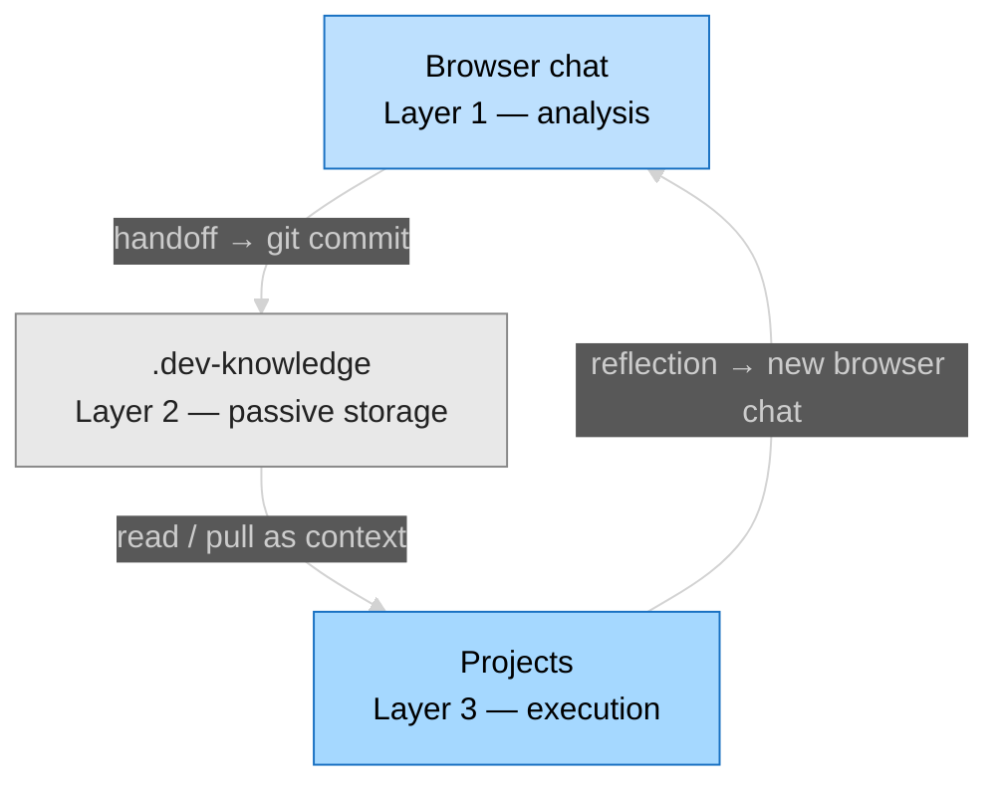
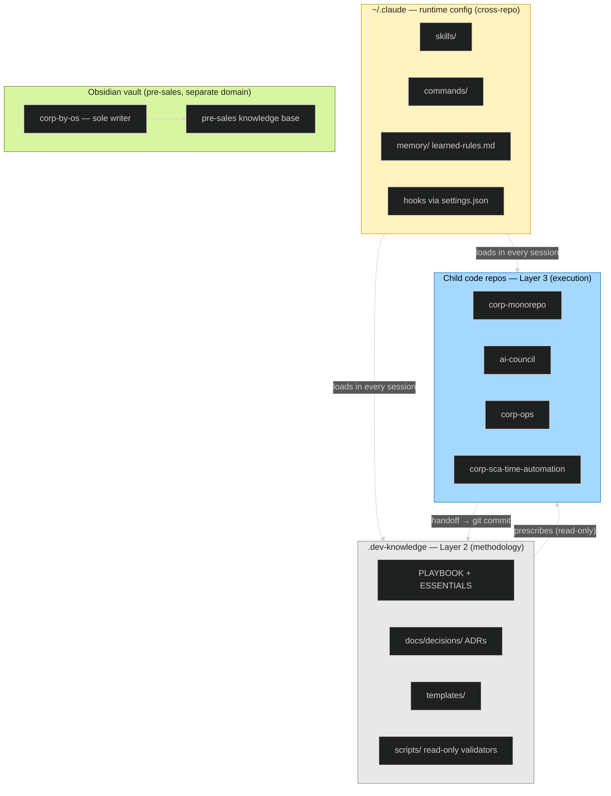
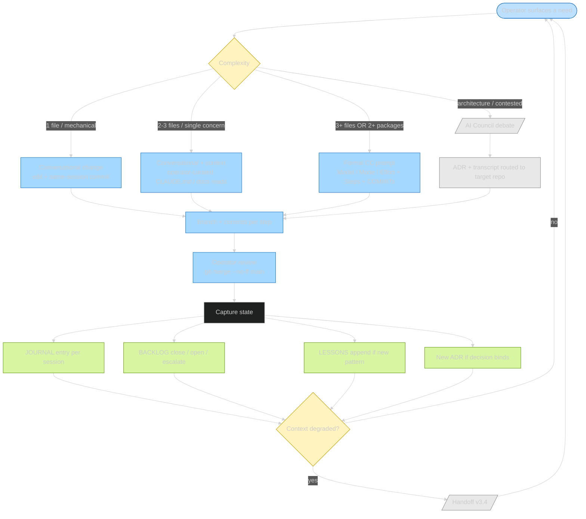
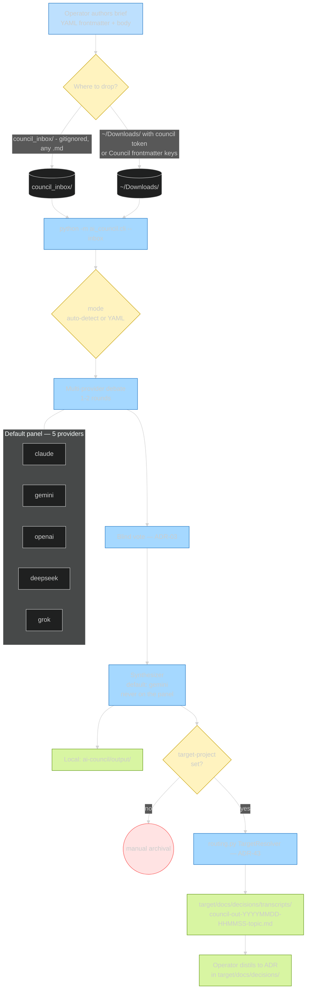

# Architecture — `.dev-knowledge`
<!-- scope: meta -->

> Living document. Updated after structural changes.
> Last updated: `2026-05-24` (self-audit residue cleanup; 2026-05-23 tier-deprecation reconciliation: removed `scale:` frontmatter + tier prose)

## Purpose [CORE]

`.dev-knowledge` is the universal LLM-driven development guide and methodology framework for all `Dev/` projects. It is **Layer 2** of the ADR-28 three-layer ecosystem model — passive storage and governance authority, not an execution engine. It holds operational protocols, ADRs, handoffs, templates, and read-only validators; it prescribes conventions that child repos (corp-monorepo, ai-council, etc.) must follow; it is consulted as context by Claude Code, Codex, Cursor, Aider, and other agents. Nothing in this repo executes orchestration; everything here is read, consulted, or passively validated.

---

## Codemap [CORE]

The codemap is the canonical artifact answering *"what exists and how does it relate?"*. Auto-generated by `python -m scripts.codemap.cli generate . --source-root scripts --write` per ADR-51 amendment 2026-05-22. Single-node diagram — only `scripts/codemap/` qualifies as a Python package in current structure; accurate representation of current state.

```mermaid
%%{init: {'theme':'dark'}}%%
flowchart TD
    codemap[codemap]:::orphan
    classDef foundation fill:#e8e8e8,stroke:#888
    classDef core fill:#bde0fe,stroke:#1971c2
    classDef orchestration fill:#a5d8ff,stroke:#1971c2
    classDef interface fill:#74c0fc,stroke:#1864ab
    classDef orphan fill:#fff5f5,stroke:#fa5252,stroke-dasharray:4 4
    classDef cycle stroke:#e03131,stroke-width:2px
    click codemap href "scripts/codemap/" "Open codemap"
```

<!-- CODEMAP:START -->

<!-- generated by codemap tool; do not edit by hand -->
<!-- CODEMAP:END -->

---

## Layer Boundaries & Invariants [CORE]

### Layer model

`.dev-knowledge` is **Layer 2** of the ADR-28 ecosystem-level three-layer model (layers listed highest to lowest):

**Enforcement tool:** advisory — the Layer 2 invariant is enforced by convention and the git-discipline rule.
**Config file:** `.claude/rules/git-discipline.md`
**Where enforced:** pre-commit (convention adherence); advisory in CLAUDE.md

### Module-to-layer assignment

| Ecosystem Layer | Role of this repo |
|----------------|-------------------|
| Layer 1 (Browser chat) | External — not in this repo |
| Layer 2 (`.dev-knowledge`) | **This repo** — passive storage, governance, prescription |
| Layer 3 (Projects) | External — corp-monorepo, ai-council, etc. |

Within Layer 2, directories by function:

| Function | Directories / files |
|----------|---------------------|
| Governance (living docs, protocols, templates) | `protocols/`, `templates/`, root `*.md` governance files |
| Record (dated artifacts, append-only logs) | `docs/`, `logs/`, `ecosystem/`, `JOURNAL.md`, `LESSONS.md` |
| Validators (read-only scripts + tests) | `scripts/`, `tests/` |
| Config | `config/`, `.claude/` |

Utility-exemption modules: none.

### Invariants

1. **Layer 2 never executes.** No script in `.dev-knowledge` orchestrates actions in other repos or drives state changes in Layer 3.
2. **Validators are read-only.** `scripts/` contains only passive inspection tools — they read, check, and report; they never write to other repos.
3. **`.dev-knowledge` is the prescriptive authority for all `Dev/` repos.** Prescriptions in PLAYBOOK and ADRs are binding on child repos; child repos may not override them locally.
4. **Append-only files are never edited.** `LESSONS.md` and `TOKEN-LOG.md` accept only appends — existing entries are never modified or deleted.
5. **Dated artifacts are immutable.** ADRs, transcripts, handoffs, and audits are superseded by new files or in-file markers, never edited in place.

→ Related decisions: `docs/decisions/ADR-28-three-layer-architecture.md`, `docs/decisions/ADR-39-file-lifecycle.md`

---

## Processes

Living diagrams of the ecosystem's core processes. Each diagram is grounded in the implementation file(s) cited under **Source**; if reality diverges from a diagram, fix the diagram. The static three-layer diagram already lives in `## Layer Boundaries & Invariants` above — these four are the *flow* views complementing it.

When freestanding Mermaid diagrams are added in child code repos, source files go under that repo's `docs/diagrams/` as `.mermaid` + `.svg` pairs per the template convention.

### Ecosystem layer model (extended)

Adds runtime config (`~/.claude`) and the Obsidian vault (pre-sales, separate domain) to the strict ADR-28 three-layer view above. Same model, broader picture.

**Source:** `VISION.md`; this file §Layer Boundaries; `protocols/PLAYBOOK.md` §System Architecture + §"Where Knowledge Lives"; ADR-28.

### Development workflow (complexity-routed)

How a need becomes a commit: complexity routing, execution, capture, and the handoff loop when context degrades.

**Source:** `protocols/PLAYBOOK.md` §"Project complexity bands", §"Writing prompts for Claude Code", §"Session boundaries"; `protocols/HANDOFF_PROCESS.md` v3.4; ADR-28 Layer-3 execution semantics.

### AI Council debate pipeline

End-to-end from question authoring to ADR. Grounded in the actual `ai-council` CLI + router, not in earlier mental sketches: question briefs are **ephemeral** (live in gitignored `council_inbox/` or `~/Downloads/`); the permanent record is the routed transcript + the ADR it informs. The earlier "committed `docs/council-questions/` folder" sketch was retired by the 2026-05-27 ADR-60 amendment — this diagram follows reality.

**Source:** `ai-council/docs/council-question-guide.md` (modes, panel, inbox detection); `ai-council/src/ai_council/{cli,inbox,orchestrator,routing,synthesis}.py` (real flow + 5 provider modules under `providers/`); `docs/decisions/ADR-43_cross_project_transcript_routing.md` (routing mechanism); ADR-03 (blind vote).

**Operational runbook (prose companion):** `protocols/AI_COUNCIL_PROCESS.md` — six-stage lifecycle (frame → author → route → debate → verdict → ADR → close), gate checks, troubleshooting.

### Handoff process v3.4

Three stages plus the receiver's applied-task gate. Grounded in `HANDOFF_PROCESS.md` v3.4 + ADRs 55/56/57/58 + ADR-42 Q5 amendment.

```mermaid
%%{init: {'theme':'dark'}}%%
flowchart TD
    trigger(["Operator: 'Make handoff for {repo}'"])
    trigger --> stage1

    subgraph stage1 [Stage 1 — Claude Code in .dev-knowledge]
        direction TB
        s1a[Capture target repo state<br/>HEAD SHA, branch, working tree]
        s1b[Generate stage1-question.md<br/>5 SBAR/I-PASS questions]
        s1c[Pre-create stage2-response.md placeholder]
        s1d[Single commit on feature branch]
        s1a --> s1b --> s1c --> s1d
    end

    stage1 --> stage2

    subgraph stage2 [Stage 2 — OLD browser chat - dying architect context]
        direction TB
        s2a[Operator pastes question block into OLD chat]
        s2b[OLD chat answers 5 sections<br/>OBJECTIVE / REALITY / RATIONALE / DIRECTIVES / BOUNDARIES]
        s2c[Operator declares next_session_scope<br/>from controlled vocabulary]
        s2d[Operator produces 11_CLAIMS.md<br/>cited or marked assumption]
        s2a --> s2b --> s2c --> s2d
    end

    stage2 --> stage3

    subgraph stage3 [Stage 3 — Claude Code in .dev-knowledge]
        direction TB
        s3a[Ancestor check: Stage 1 SHA ⊑ HEAD]
        s3b[Thinness pre-flight on 5 sections]
        s3c[Generate 13-file bundle<br/>governance floor + operational layer per scope]
        s3d[Draft 10_GATE_PROBE.md applied probe]
        s3e[Validate 11_CLAIMS.md citations]
        s3f[Compute SHA-256 + invariant hashes → 01_manifest.json]
        s3g[Move in-progress → archive/]
        s3a --> s3b --> s3c --> s3d --> s3e --> s3f --> s3g
    end

    stage3 --> recv

    subgraph recv [Receiver — NEW browser chat]
        direction TB
        s4a[Read bundle in order, governance floor first]
        s4b[State role + top-3 hard constraints with citations]
        s4c[Read 10_GATE_PROBE.md mini-scenario only<br/>not the operator answer key]
        s4d[Answer directed action + bundle location + preconditions]
        s4a --> s4b --> s4c --> s4d
    end

    recv --> ratify{Operator structured ratification}
    ratify -- "claims green + probe match + articulation match" --> work[NEW chat executes directives<br/>fills 09_EXECUTION_EVIDENCE.md]
    ratify -- "first fail" --> retry[Operator cites contradicted bundle location<br/>NEW chat retries probe once]
    retry --> ratify
    ratify -- "second fail" --> abort[Bundle inadequate<br/>regenerate Stage 2 upstream]

    classDef start fill:#bde0fe,stroke:#1971c2
    classDef stg fill:#e8e8e8,stroke:#888
    classDef decide fill:#fff3bf,stroke:#c79e00
    classDef work_ fill:#d8f5a2,stroke:#5c940d
    classDef warn fill:#ffe3e3,stroke:#fa5252

    class trigger start
    class stage1,stage2,stage3,recv stg
    class ratify decide
    class work work_
    class abort warn
```

**Source:** `protocols/HANDOFF_PROCESS.md` v3.4 (three-stage flow, applied-task gate, structured ratification, ancestor check, 13-file bundle); ADR-55 (applied-task gate), ADR-56 (Prompt Generation Card), ADR-57 (two-layer bundle), ADR-58 (structured claims), ADR-42 Q5 amendment (manifest invariant hashes + `next_session_scope`).

---

## Key conventions

- **Scope tags (ADR-27, informal).** `<!-- scope: X -->` tags (`dev | llm | hybrid | runtime | meta`) exist in living files as informal lightweight metadata. Enforcement withdrawn 2026-05-16 per ADR-48; existing tags remain in place. New sections do not need tags.
- **Append-only files.** LESSONS.md, TOKEN-LOG.md — never edit old entries. JOURNAL.md uses newest-first prepend.
- **Living files.** CLAUDE.md, PLAYBOOK, ESSENTIALS, ENVIRONMENT, VISION, ARCHITECTURE — updated in place when reality shifts. (Root `README.md` deleted 2026-05-23 — deprecated from the baseline per ADR-38 amendment A5; redundant with VISION + CLAUDE.md + ARCHITECTURE for this internal-only repo.)
- **Immutable dated artifacts.** ADRs, transcripts, handoffs, audits, research — supersession via new file or in-file marker, never edit.
- **Filename conventions.** `ADR-NN-topic.md` for decisions (per ADR-34); `DECISION_NN_snake_case.md` for legacy transcripts (grandfathered); Council CLI output uses `council-out-YYYYMMDD-HHMMSS-topic.md`; kebab-case + ISO date for dated artifacts; ALLCAPS for top-level governance markdown.

---

## Authority and governance

Per ADR-31. `.dev-knowledge` is the **binding source of cross-repo prescriptions** (Authority model 1B — Prescriptive with conformance audit).

- **Scale tier:** retired 2026-05-23 (repo-tier system deprecated ecosystem-wide; this repo declares no tier). `ARCHITECTURE.md` is now mandatory for every repo (ADR-51 as amended 2026-05-23), not a tier-specific artifact.
- **Enforcement:** out-of-band, centralized, read-only audit tool (`scripts/audit.py` — pending full implementation per ADR-31). Reads sibling repos via explicit manifest; emits audit report. Manual invocation; no commit gating in downstream repos.
- **Content layout:** prescriptions live in PLAYBOOK + ADRs; dedicated `cross-repo/` subfolder deferred until prescription count exceeds ~10 or navigation becomes painful.
- **Baseline rule (ADR-31):** audit tool must run green on first invocation. No known violations remain open. (Codex reviewer config is a global standard at `~/.codex/AGENTS.md`, canonical source at `codex/AGENTS.md` in this repo — ADR-54. Per-repo `AGENTS.md` carries only repo-specific review rules; it does not repeat the global config. Codex tool config is outside ADR-53's scope.)

---

## Validators and enforcement (executable, here)

Per ADR-28 invariant: `.dev-knowledge` may host **read-only** validators (Layer 2 does not orchestrate, but it may verify itself).

- `scripts/audit.py` — cross-repo conformance audit; manual invocation.
- `scripts/backlog_extract.py` — backlog extraction utility; read-only.
- `scripts/normalize_headers.py` — dated-log header normalization; invoked by pre-commit hook.
- `tests/` — pytest unit tests for validators. Run: `pytest -x --tb=short`.
- **Pre-commit:** ruff (`ruff check --fix`) + normalize_headers.py hook.

---

## Governing ADRs

- **ADR-27** — scope tagging architecture (vocabulary; enforcement retired ADR-48; tags survive as informal metadata)
- **ADR-28** — three-layer architecture (descriptive)
- **ADR-29** — LESSONS.md grandfathering under scope tagging; scope-tag mechanics now informal per ADR-48; append-only invariant remains binding via CLAUDE.md and ADR-39
- **ADR-30** — default branch = `main` for all repos
- **ADR-31** — authority model: Prescriptive with conformance audit (1B); ARCHITECTURE.md present
- **ADR-32** — handoff format: folder-based, 9-section HANDOFF.md, manifest.json, point-in-time governance copies
- **ADR-33** — VISION.md universalization: mandatory at ≥1 dependent; frontmatter per amended schema (Standard/Lite tiers + tier/scale fields removed 2026-05-23)
- **ADR-34** — file naming convention: UPPERCASE living docs, `ADR-NN-topic` for decisions, `YYYY-MM-DD-slug` for dated artifacts
- **ADR-35** — lessons base activation: push retrieval via SessionStart hook, pull via `lessons query`
- **ADR-36** — audit tool architecture: `.dev-knowledge` as ecosystem auditor; read-only, manually invoked
- **ADR-37** — session boundary protocol: two-phase handoff overlay (Current State + Future State)
- **ADR-38** — universal repo baseline: mandatory files for every repo (tier gating removed 2026-05-23, amendment A5)
- **ADR-39** — file lifecycle governance: 6-element pattern (purpose/trigger/owner/grooming/boundaries/enforcement)
- **ADR-40** — scale tier evaluation (DEPRECATED 2026-05-23): logarithmic Maintainability Index pattern; retired with the repo-tier system
- **ADR-41** — cross-session backlog architecture: BACKLOG.md mandate (universal post tier-deprecation; ADR-38 A5)
- **ADR-42** — handoff format v3: amends ADR-32; folder-based handoffs with invariant/session separation
- **ADR-43** — cross-project transcript routing: Council CLI dual-writes to `ai-council/output/` (operational) and `.dev-knowledge/docs/decisions/transcripts/` (curated)
- **ADR-46** — cross-repo dated-entries format: convention retained (demoted from audit-enforced 2026-05-16)
- **ADR-47** — cross-repo BACKLOG.md organization: convention retained (demoted from audit-enforced 2026-05-16)
- **ADR-48** — trim documentation governance: retired scope-tag and hybrid-ratio enforcement; structural enforcement only
- **ADR-49** — consolidate past-recording documentation files: governs record consolidation patterns
- **ADR-50** — machine-document encoding standard: governs how machine-written content is encoded and marked
- **ADR-51** — ARCHITECTURE.md convention: mandates this repo's ARCHITECTURE.md form and CORE sections
- **ADR-52** — AGENTS.md convention (superseded by ADR-53)
- **ADR-53** — CLAUDE.md as single canonical agent-instruction file: supersedes ADR-52
- **ADR-54** — Codex reviewer config as global standard: canonical source at `codex/AGENTS.md`, deployed to `~/.codex/AGENTS.md`; per-repo `AGENTS.md` only for repo-specific review rules

Reference `docs/decisions/README.md` for full index. Council debate transcripts in `docs/decisions/transcripts/`.

---

**Maintained by:** Rob
