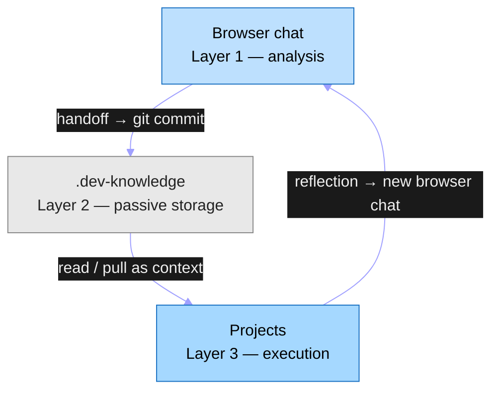
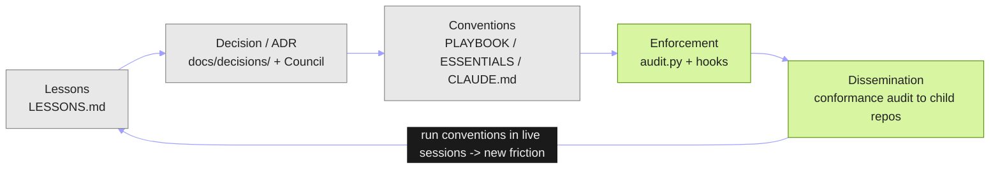
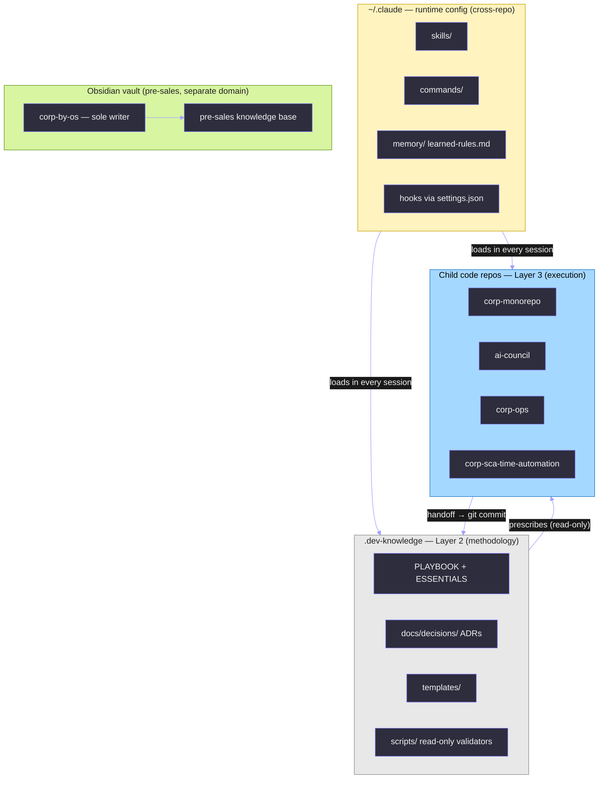
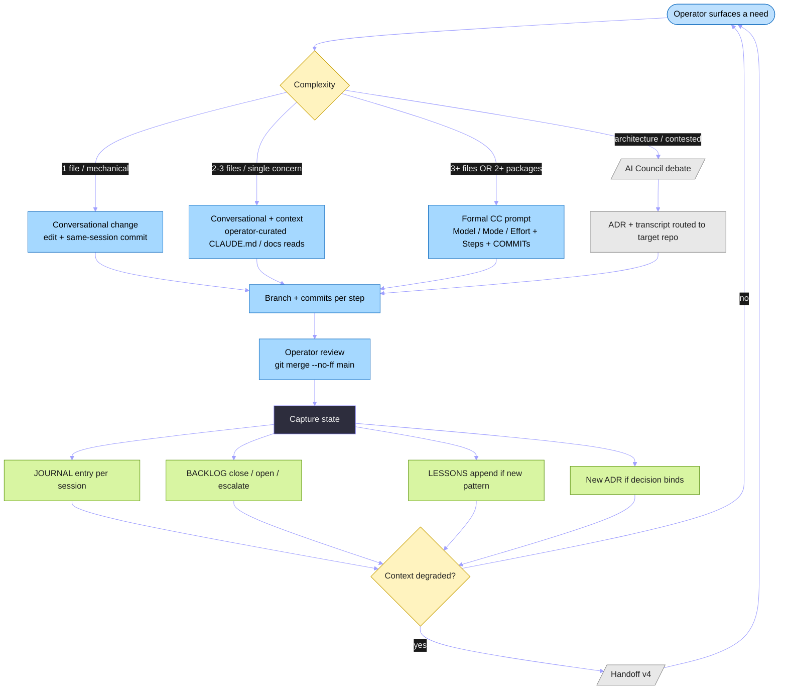
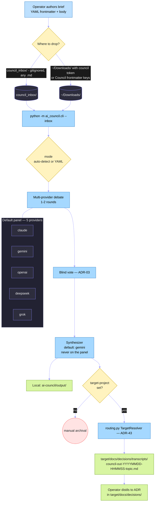
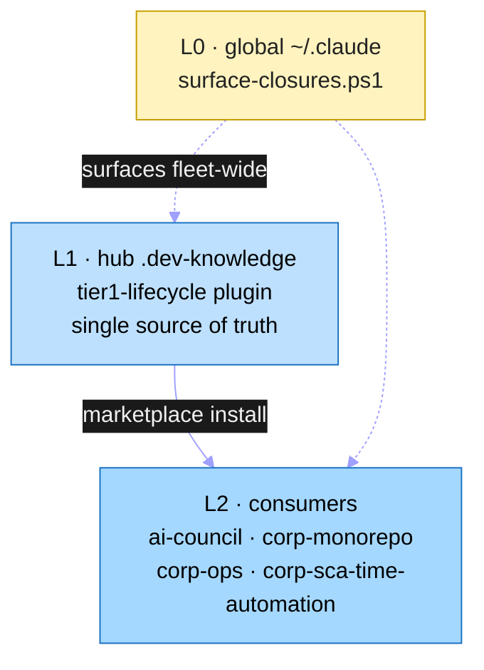

# Architecture — `.dev-knowledge`
<!-- scope: meta -->

> Living document. Updated after structural changes.
> Last updated: `2026-06-04` (genuine end-to-end re-read: fixed F1 — HANDOFF_PROCESS stamp `4.3.1, status stable` → `4.3.2, status live`; de-hardcoded the audit check count → points at `audit.py checks` [#78a]; corrected codemap prose `single-node` → two-node and added the `scripts/toc/` package; completed the pre-commit hook list (+`toc-freshness` ×2); added ADR-71 to Governing ADRs; closes [#78]; prior: 2026-06-03 added "Tier-1 self-enforcing lifecycle" section [ADR-70] + re-read corrected two false-state lines — ruff is wired [#13 closed], audit ships 12 checks not 10; 2026-06-01 "The methodology engine" feedback-loop section + canonical-freshness cadence)

<!-- TOC:START -->
- [Purpose](#purpose-core)
- [Codemap](#codemap-core)
- [Layer Boundaries & Invariants](#layer-boundaries--invariants-core)
  - [Layer model](#layer-model)
  - [Module-to-layer assignment](#module-to-layer-assignment)
  - [Invariants](#invariants)
- [The methodology engine (feedback loop)](#the-methodology-engine-feedback-loop)
- [Processes](#processes)
  - [Ecosystem layer model (extended)](#ecosystem-layer-model-extended)
  - [Development workflow (complexity-routed)](#development-workflow-complexity-routed)
  - [AI Council debate pipeline](#ai-council-debate-pipeline)
  - [Handoff process v4](#handoff-process-v4)
- [Key conventions](#key-conventions)
- [Authority and governance](#authority-and-governance)
- [Validators and enforcement (executable, here)](#validators-and-enforcement-executable-here)
- [Tier-1 self-enforcing lifecycle](#tier-1-self-enforcing-lifecycle)
- [Governing ADRs](#governing-adrs)
<!-- generated by toc tool; do not edit by hand -->
<!-- TOC:END -->

## Purpose [CORE]

`.dev-knowledge` is the universal LLM-driven development guide and methodology framework for all `Dev/` projects. It is **Layer 2** of the ADR-28 three-layer ecosystem model — passive storage and governance authority, not an execution engine. It holds operational protocols, ADRs, handoffs, templates, and read-only validators; it prescribes conventions that child repos (corp-monorepo, ai-council, etc.) must follow; it is consulted as context by Claude Code, Codex, Cursor, Aider, and other agents. Nothing in this repo executes orchestration; everything here is read, consulted, or passively validated.

---

## Codemap [CORE]

The codemap is the canonical artifact answering *"what exists and how does it relate?"*. Auto-generated by `python -m scripts.codemap.cli generate . --source-root scripts --write` per ADR-51 amendment 2026-05-22. Two-node diagram — `scripts/codemap/` and `scripts/toc/` both qualify as Python packages in current structure; accurate representation of current state.

```mermaid
%%{init: {'theme':'base', 'themeVariables': {'darkMode':true,'background':'#1a1a1a','primaryColor':'#2d2d3d','primaryTextColor':'#f0f0f0','primaryBorderColor':'#8a86ff','lineColor':'#a0a0ff','textColor':'#f0f0f0','mainBkg':'#2d2d3d','secondaryColor':'#3d2d3d','tertiaryColor':'#22323a','clusterBkg':'#222232','clusterBorder':'#555577','edgeLabelBackground':'#1a1a1a','titleColor':'#f0f0f0','nodeBorder':'#8a86ff'}}}%%
flowchart TD
    codemap[codemap]:::orphan
    toc[toc]:::orphan
    classDef foundation fill:#e8e8e8,stroke:#888,color:#222
    classDef core fill:#bde0fe,stroke:#1971c2,color:#000
    classDef orchestration fill:#a5d8ff,stroke:#1971c2,color:#000
    classDef interface fill:#74c0fc,stroke:#1864ab,color:#000
    classDef orphan fill:#fff5f5,stroke:#fa5252,stroke-dasharray:4 4,color:#222
    classDef cycle stroke:#e03131,stroke-width:2px
    click codemap href "scripts/codemap/" "Open codemap"
    click toc href "scripts/toc/" "Open toc"
```

<!-- CODEMAP:START -->

<!-- generated by codemap tool; do not edit by hand -->
<!-- CODEMAP:END -->

---

## Layer Boundaries & Invariants [CORE]

### Layer model

`.dev-knowledge` is **Layer 2** of the ADR-28 ecosystem-level three-layer model (layers listed highest to lowest):

**Enforcement tool:** advisory — the Layer 2 invariant is enforced by convention and the git-discipline rule.
**Config file:** `.claude/rules/git-discipline.md`
**Where enforced:** pre-commit (convention adherence); advisory in CLAUDE.md

### Module-to-layer assignment

| Ecosystem Layer | Role of this repo |
|----------------|-------------------|
| Layer 1 (Browser chat) | External — not in this repo |
| Layer 2 (`.dev-knowledge`) | **This repo** — passive storage, governance, prescription |
| Layer 3 (Projects) | External — corp-monorepo, ai-council, etc. |

Within Layer 2, directories by function:

| Function | Directories / files |
|----------|---------------------|
| Governance (living docs, protocols, templates) | `protocols/`, `templates/`, root `*.md` governance files |
| Record (dated artifacts, append-only logs) | `docs/`, `logs/`, `ecosystem/`, `JOURNAL.md`, `LESSONS.md` |
| Validators (read-only scripts + tests) | `scripts/`, `tests/` |
| Config | `config/`, `.claude/` |

Utility-exemption modules: none.

### Invariants

1. **Layer 2 never executes.** No script in `.dev-knowledge` orchestrates actions in other repos or drives state changes in Layer 3.
2. **Validators are read-only.** `scripts/` contains only passive inspection tools — they read, check, and report; they never write to other repos.
3. **`.dev-knowledge` is the prescriptive authority for all `Dev/` repos.** Prescriptions in PLAYBOOK and ADRs are binding on child repos; child repos may not override them locally.
4. **Append-only files are never edited.** `LESSONS.md` and `logs/TOKEN-LOG.md` accept only appends — existing entries are never modified or deleted.
5. **Dated artifacts are immutable.** ADRs, transcripts, handoffs, and audits are superseded by new files or in-file markers, never edited in place.

→ Related decisions: `docs/decisions/ADR-28-three-layer-architecture.md`, `docs/decisions/ADR-39-file-lifecycle.md`

---

## The methodology engine (feedback loop)

`.dev-knowledge` is not a static pile of governance documents — it is a **feedback engine** that turns lived experience into enforced, propagated standards, then runs those standards to generate the next round of experience. Each stage is the input to the next, and the loop closes: running the conventions in real sessions surfaces new friction, which becomes the next lesson. A library is read and forgotten; an engine reprocesses its own output.

The two frontier stages (Enforcement, Dissemination — green) are where active work concentrates; the recording stages (grey) feed them.

| Stage | What happens | Embodied in |
|-------|--------------|-------------|
| **Lessons** | Empirical patterns surface from real sessions — what worked, what drifted, what broke | `LESSONS.md` (append-only) |
| **Decision / ADR** | A lesson or a need is debated and recorded as a binding decision | `docs/decisions/ADR-NN-*.md`; AI Council debate -> routed transcripts |
| **Conventions** | An accepted decision becomes a standard agents must follow | `protocols/PLAYBOOK.md`, `protocols/ESSENTIALS.md`, `CLAUDE.md` |
| **Enforcement** | A convention is made real by a check or hook — not left to memory | `scripts/audit.py` checks (incl. canonical-freshness #10), `scripts/validate_backlog.py`, the `commit-msg [#id]` hook, pre-commit hooks |
| **Dissemination** | An enforced standard propagates to every child repo (universalization) | the read-only conformance audit prescribing to `corp-monorepo` / `ai-council` / etc.; portable checks dropped into child repos |
| **-> Lessons** | Running the conventions in live work surfaces the next friction | back to `LESSONS.md` — the loop closes |

The two frontier stages are where active work concentrates. **Phase 1 hardens Enforcement** — turning advisory conventions into checks and hooks (e.g. the canonical-freshness cadence: ADR-39 "grooming" made executable as `audit.py` check #10). **Phase 2 is Dissemination** — rolling those portable checks out across the ecosystem. A convention that never reaches Enforcement is advisory and silently drifts; one that never reaches Dissemination protects only this repo. The engine's value is the *closed* loop, not any single stage.

This is the architectural "why" behind the artifacts catalogued elsewhere in this file: `LESSONS` / `docs/decisions` / `protocols` / `scripts` are not parallel folders — they are consecutive stations on one loop. ESSENTIALS states the same loop tactically ("Feedback Loop", "Three Homes for Knowledge"); this section is its structural form.

**Source:** `VISION.md` (knowledge guardian -> methodology author -> auditor -> disseminator); `LESSONS.md`; `docs/decisions/`; `protocols/PLAYBOOK.md` + `ESSENTIALS.md`; `scripts/audit.py` + `.pre-commit-config.yaml`; ADR-28 (Layer 2 prescriptive authority), ADR-39 (file lifecycle / grooming).

---

## Processes

Living diagrams of the ecosystem's core processes. Each diagram is grounded in the implementation file(s) cited under **Source**; if reality diverges from a diagram, fix the diagram. The static three-layer diagram already lives in `## Layer Boundaries & Invariants` above — these four are the *flow* views complementing it.

When freestanding Mermaid diagrams are added in child code repos, source files go under that repo's `docs/diagrams/` as `.mermaid` + `.svg` pairs per the template convention.

### Ecosystem layer model (extended)

Adds runtime config (`~/.claude`) and the Obsidian vault (pre-sales, separate domain) to the strict ADR-28 three-layer view above. Same model, broader picture.

**Source:** `VISION.md`; this file §Layer Boundaries; `protocols/PLAYBOOK.md` §System Architecture + §"Where Knowledge Lives"; ADR-28.

### Development workflow (complexity-routed)

How a need becomes a commit: complexity routing, execution, capture, and the handoff loop when context degrades.

**Source:** `protocols/PLAYBOOK.md` §"Project complexity bands", §"Writing prompts for Claude Code", §"Session boundaries"; `protocols/HANDOFF_PROCESS.md` v4; ADR-28 Layer-3 execution semantics.

### AI Council debate pipeline

End-to-end from question authoring to ADR. Grounded in the actual `ai-council` CLI + router, not in earlier mental sketches: question briefs are **ephemeral** (live in gitignored `council_inbox/` or `~/Downloads/`); the permanent record is the routed transcript + the ADR it informs. The earlier "committed `docs/council-questions/` folder" sketch was retired by the 2026-05-27 ADR-60 amendment — this diagram follows reality.

**Source:** `ai-council/docs/council-question-guide.md` (modes, panel, inbox detection); `ai-council/src/ai_council/{cli,inbox,orchestrator,routing,synthesis}.py` (real flow + 5 provider modules under `providers/`); `docs/decisions/ADR-43_cross_project_transcript_routing.md` (routing mechanism); ADR-03 (blind vote).

**Operational runbook (prose companion):** `protocols/AI_COUNCIL_PROCESS.md` — six-stage lifecycle (frame → author → route → debate → verdict → ADR → close), gate checks, troubleshooting.

### Handoff process v4

Two phases — interview (Phase 1) then consolidate (Phase 2) — plus the apprentice's comprehension check before work. A handoff is onboarding a new chat (a teaching protocol), not a file transfer. Grounded in `HANDOFF_PROCESS.md` v4 (stamp 4.4, status live) + ADR-62 ratification; ADRs 55/56/57/58 describe the superseded v3.x design (where they conflict with v4, v4 wins).

```mermaid
%%{init: {'theme':'base', 'themeVariables': {'darkMode':true,'background':'#1a1a1a','primaryColor':'#2d2d3d','primaryTextColor':'#f0f0f0','primaryBorderColor':'#8a86ff','lineColor':'#a0a0ff','textColor':'#f0f0f0','mainBkg':'#2d2d3d','secondaryColor':'#3d2d3d','tertiaryColor':'#22323a','clusterBkg':'#222232','clusterBorder':'#555577','edgeLabelBackground':'#1a1a1a','titleColor':'#f0f0f0','nodeBorder':'#8a86ff'}}}%%
flowchart TD
    trigger(["Operator: 'please create handoff for {repo}'"])
    trigger --> phase1

    subgraph phase1 [Phase 1 — Interview · Claude Code in .dev-knowledge]
        direction TB
        p1a[Capture target repo state<br/>HEAD SHA, branch, working tree]
        p1b[Write _handoff-interview.md in in-progress/<br/>one sage-to-apprentice cluster of 5 questions:<br/>Past / Present / Future / Wisdom / Warnings]
        p1c[Append JOURNAL marker + commit on feature branch]
        p1a --> p1b --> p1c
    end

    phase1 --> between

    subgraph between [Operator — between phases]
        direction TB
        o1[Copy questions into the SENDER browser chat<br/>the dying chat that holds the lived context]
        o2[Paste narrative answers below the marker, save]
        o1 --> o2
    end

    between --> trigger2(["Operator: 'complete handoff for {repo}'"])
    trigger2 --> phase2

    subgraph phase2 [Phase 2 — Consolidate · Claude Code in .dev-knowledge]
        direction TB
        p2a[Read interview answers]
        p2b[Cross-check answers vs actual repo state<br/>drift surfaced to the operator]
        p2c[Generate flat bundle docs/handoffs/slug/<br/>README + 01_ROLE through 07_ASK_BACK, from source]
        p2d[Inline four-tag claims + load-bearing-facts table in 04_RECENT]
        p2e[Remove the in-progress folder + JOURNAL marker + commit]
        p2a --> p2b --> p2c --> p2d --> p2e
    end

    phase2 --> recv

    subgraph recv [Apprentice — NEW browser chat]
        direction TB
        s4a[Read 01 through 07 in order, governance floor first]
        s4b[Answer 06_QUESTIONS comprehension check]
        s4c[Raise up to 3 questions in 07_ASK_BACK]
        s4a --> s4b --> s4c
    end

    recv --> ratify{Operator ratification}
    ratify -- "comprehension + facts verified" --> work[NEW chat executes the work]
    ratify -- "gaps or drift found" --> amend["Operator flags; amend 04_RECENT by append<br/>bundle is living until the next handoff"]
    amend --> ratify

    classDef start fill:#bde0fe,stroke:#1971c2,color:#000
    classDef stg fill:#e8e8e8,stroke:#888,color:#222
    classDef decide fill:#fff3bf,stroke:#c79e00,color:#222
    classDef work_ fill:#d8f5a2,stroke:#5c940d,color:#222
    classDef warn fill:#ffe3e3,stroke:#fa5252,color:#222

    class trigger,trigger2 start
    class phase1,phase2,between,recv stg
    class ratify decide
    class work work_
    class amend warn
```

**Source:** `protocols/HANDOFF_PROCESS.md` v4 (stamp 4.4 — two-phase flow, sage→apprentice interview, eight flat bundle files [README + 01–07], generated-from-source principle, four-tag claims, load-bearing-facts verification table); ADR-62 (v4 ratification). ADRs 55/56/57/58 + ADR-42 Q5 describe the superseded v3.x design now folded into v4 (separate claims/scope/probe artifacts → inline narrative in the generated bundle).

---

## Key conventions

- **Scope tags (ADR-27, informal).** `<!-- scope: X -->` tags (`dev | llm | hybrid | runtime | meta`) exist in living files as informal lightweight metadata. Enforcement withdrawn 2026-05-16 per ADR-48; existing tags remain in place. New sections do not need tags.
- **Append-only files.** LESSONS.md, logs/TOKEN-LOG.md — never edit old entries. JOURNAL.md uses newest-first prepend.
- **Living files.** CLAUDE.md, PLAYBOOK, ESSENTIALS, ENVIRONMENT, VISION, ARCHITECTURE — updated in place when reality shifts. (Root `README.md` deleted 2026-05-23 — deprecated from the baseline per ADR-38 amendment A5; redundant with VISION + CLAUDE.md + ARCHITECTURE for this internal-only repo.)
- **Immutable dated artifacts.** ADRs, transcripts, handoffs, audits, research — supersession via new file or in-file marker, never edit.
- **Filename conventions.** `ADR-NN-topic.md` for decisions (per ADR-34); `DECISION_NN_snake_case.md` for legacy transcripts (grandfathered); Council CLI output uses `council-out-YYYYMMDD-HHMMSS-topic.md`; kebab-case + ISO date for dated artifacts; ALLCAPS for top-level governance markdown.

---

## Authority and governance

Per ADR-31. `.dev-knowledge` is the **binding source of cross-repo prescriptions** (Authority model 1B — Prescriptive with conformance audit).

- **Scale tier:** retired 2026-05-23 (repo-tier system deprecated ecosystem-wide; this repo declares no tier). `ARCHITECTURE.md` is now mandatory for every repo (ADR-51 as amended 2026-05-23), not a tier-specific artifact.
- **Enforcement:** out-of-band, centralized, read-only audit tool (`scripts/audit.py` — ships self-audit + cross-repo conformance checks per ADR-31/36; the current set is authoritative from `python scripts/audit.py checks`, not hardcoded here). Reads sibling repos via explicit manifest; emits audit report. The cross-repo `run` is manual invocation with no commit gating in downstream repos; the self-audit `health` runs as a local pre-commit gate in this repo ([#69]).
- **Content layout:** prescriptions live in PLAYBOOK + ADRs; dedicated `cross-repo/` subfolder deferred until prescription count exceeds ~10 or navigation becomes painful.
- **Baseline rule (ADR-31):** audit tool must run green on first invocation. No known violations remain open. (Codex reviewer config is a global standard at `~/.codex/AGENTS.md`, canonical source at `codex/AGENTS.md` in this repo — ADR-54. Per-repo `AGENTS.md` carries only repo-specific review rules; it does not repeat the global config. Codex tool config is outside ADR-53's scope.)

---

## Validators and enforcement (executable, here)

Per ADR-28 invariant: `.dev-knowledge` may host **read-only** validators (Layer 2 does not orchestrate, but it may verify itself).

- `scripts/audit.py` — cross-repo conformance + self-audit (run `python scripts/audit.py checks` for the live registry; incl. `canonical_freshness` — `last_reviewed` staleness cadence — `no_sibling_orphans`, `canonical_structure`); read-only. The ecosystem audit (`run`) is manual; the self-audit (`health`) runs as a **pre-commit gate** (FAIL blocks the commit, WARN informs).
- `scripts/normalize_headers.py` — dated-log header normalization; invoked by pre-commit hook.
- `scripts/validate_backlog.py` — BACKLOG.md story-map structure validator (ADR-66); pre-commit hook.
- `scripts/check_backlog_commit_msg.py` — commit-msg hook requiring `[#id]` on task removal.
- `scripts/codemap/` — ARCHITECTURE codemap generator + freshness check (pre-commit hook).
- `scripts/toc/` — auto-TOC generator + freshness check for ARCHITECTURE.md and PLAYBOOK.md (pre-commit hooks).
- `tests/` — pytest unit tests for validators. Run: `pytest -x --tb=short`.
- **Pre-commit hooks:** `normalize-dated-headers`, `codemap-freshness`, `toc-freshness` (ARCHITECTURE.md), `toc-freshness-playbook` (PLAYBOOK.md), `validate-backlog`, `audit-health` (self-conformance gate — `audit.py health`, FAIL blocks / WARN informs; [#69]), `ruff` (lint gate — `ruff check`, version-pinned >=0.15.5, blocks on violations; [#13] closed), `backlog-id-on-close` (commit-msg).

---

## Tier-1 self-enforcing lifecycle

The methodology enforces its own backlog/hygiene discipline through a three-layer lifecycle, distributed as a single plugin so every repo runs identical logic from one source.

- **L0 — global runtime (`~/.claude`):** a SessionStart hook (`surface-closures.ps1`) emits a one-line `[closures] N proposed` reminder in every repo. Surfacing lives here, not in the plugin: plugin SessionStart hooks register too late for the one-shot init event and never fire (verified 2026-06-02).
- **L1 — hub (`.dev-knowledge`):** the `tier1-lifecycle` plugin (marketplace `dev-knowledge-methodology`) is the single source of truth. Its scripts are copied from the canonical `scripts/` trio (`propose_closures.py`, `review_closures.py`, `validate_backlog.py`), which remain the source plus the test / pre-commit / command target.
- **L2 — consumers (`ai-council`, `corp-monorepo`, `corp-ops`, `corp-sca-time-automation`):** install the plugin via the marketplace and run the same loop with no per-repo copies.

The loop: a `Stop` hook runs `propose_closures.py`, which scans git for commits that closed backlog items and writes a `logs/PROPOSALS-*.md` candidate list (STRONG = a `closes [#id]` commit landed but the item is still open; WEAK = weaker signal). The L0 hook surfaces the count at next session start; `/review-closures` confirms and updates `BACKLOG.md`. Plugin-host repos must gitignore the ephemeral `logs/PROPOSALS-*.md` (blanket `logs/` where nothing else is tracked there; a specific pattern where `logs/` holds tracked files).

```mermaid
%%{init: {'theme':'base', 'themeVariables': {'darkMode':true,'background':'#1a1a1a','primaryColor':'#2d2d3d','primaryTextColor':'#f0f0f0','primaryBorderColor':'#8a86ff','lineColor':'#a0a0ff','textColor':'#f0f0f0','mainBkg':'#2d2d3d','secondaryColor':'#3d2d3d','tertiaryColor':'#22323a','clusterBkg':'#222232','clusterBorder':'#555577','edgeLabelBackground':'#1a1a1a','titleColor':'#f0f0f0','nodeBorder':'#8a86ff'}}}%%
flowchart LR
    C["commit closes [#id]"] --> S["Stop hook<br/>propose_closures.py"]
    S --> P["logs/PROPOSALS-*.md<br/>STRONG / WEAK"]
    P --> SS["next SessionStart<br/>L0 surfaces [closures]"]
    SS --> R["/review-closures"]
    R --> B["BACKLOG.md updated"]
    B -.->|repeats each session| C

    classDef commit fill:#d8f5a2,stroke:#5c940d,color:#222
    classDef step fill:#bde0fe,stroke:#1971c2,color:#000

    class C,B commit
    class S,P,SS,R step
```

Decision record: [ADR-70](docs/decisions/ADR-70-three-tier-process-automation.md) (three-tier process automation) + its 2026-06-02 shipped-reality addendum; full decision history in the [ADR index](docs/decisions/README.md). The hub itself was converged onto the plugin (its duplicate hook wiring removed) in the 5c step — see `JOURNAL.md`.

---

## Governing ADRs

- **ADR-27** — scope tagging architecture (vocabulary; enforcement retired ADR-48; tags survive as informal metadata)
- **ADR-28** — three-layer architecture (descriptive)
- **ADR-29** — LESSONS.md grandfathering under scope tagging; scope-tag mechanics now informal per ADR-48; append-only invariant remains binding via CLAUDE.md and ADR-39
- **ADR-30** — default branch = `main` for all repos
- **ADR-31** — authority model: Prescriptive with conformance audit (1B); ARCHITECTURE.md present
- **ADR-32** — handoff format: folder-based, 9-section HANDOFF.md, manifest.json, point-in-time governance copies
- **ADR-33** — VISION.md universalization: mandatory at ≥1 dependent; frontmatter per amended schema (Standard/Lite tiers + tier/scale fields removed 2026-05-23)
- **ADR-34** — file naming convention: UPPERCASE living docs, `ADR-NN-topic` for decisions, `YYYY-MM-DD-slug` for dated artifacts
- **ADR-35** — lessons base activation: push retrieval via SessionStart hook, pull via `lessons query`
- **ADR-36** — audit tool architecture: `.dev-knowledge` as ecosystem auditor; read-only, manually invoked
- **ADR-37** — session boundary protocol: two-phase handoff overlay (Current State + Future State)
- **ADR-38** — universal repo baseline: mandatory files for every repo (tier gating removed 2026-05-23, amendment A5)
- **ADR-39** — file lifecycle governance: 6-element pattern (purpose/trigger/owner/grooming/boundaries/enforcement)
- **ADR-40** — scale tier evaluation (DEPRECATED 2026-05-23): logarithmic Maintainability Index pattern; retired with the repo-tier system
- **ADR-41** — cross-session backlog architecture: BACKLOG.md mandate (universal post tier-deprecation; ADR-38 A5)
- **ADR-42** — handoff format v3: amends ADR-32; folder-based handoffs with invariant/session separation
- **ADR-43** — cross-project transcript routing: Council CLI writes canonical `ai-council/output/` (always, required) and best-effort mirrors to the **target project's** `docs/decisions/transcripts/` — target named per-invocation (`target-project:` / `--target-project`), path resolved `<dev_root>/<name>/docs/decisions/transcripts/` via `TargetResolver` (not hardcoded to `.dev-knowledge`)
- **ADR-46** — cross-repo dated-entries format: convention retained (demoted from audit-enforced 2026-05-16)
- **ADR-47** — cross-repo BACKLOG.md organization: convention retained (demoted from audit-enforced 2026-05-16)
- **ADR-48** — trim documentation governance: retired scope-tag and hybrid-ratio enforcement; structural enforcement only
- **ADR-49** — consolidate past-recording documentation files: governs record consolidation patterns
- **ADR-50** — machine-document encoding standard: governs how machine-written content is encoded and marked
- **ADR-51** — ARCHITECTURE.md convention: mandates this repo's ARCHITECTURE.md form and CORE sections
- **ADR-52** — AGENTS.md convention (superseded by ADR-53)
- **ADR-53** — CLAUDE.md as single canonical agent-instruction file: supersedes ADR-52
- **ADR-54** — Codex reviewer config as global standard: canonical source at `codex/AGENTS.md`, deployed to `~/.codex/AGENTS.md`; per-repo `AGENTS.md` only for repo-specific review rules
- **ADR-55** — applied-task internalization gate: role+constraints citations + one applied probe + one bounded retry (replaces the 4-item paraphrase gate)
- **ADR-56** — inline Prompt Generation Card: self-contained card in the bundle entry; authority stays in browser chat
- **ADR-57** — two-layer bundle contract: unconditional governance floor + scoped operational layer via `next_session_scope`; extends ADR-42
- **ADR-58** — structured claims + symmetric verification: cited load-bearing claims + executor locatability check + operator ratification
- **ADR-59** — universal visual repository pattern: dot-prefix configs + ALL-CAPS canonical roots + workspace sort settings; enforced via `audit.py` checks #4–#6
- **ADR-60** — docs/ folder taxonomy: one semantic role per subfolder (two variants — `.dev-knowledge` vs child code repos)
- **ADR-61** — git worktree for parallel CC sessions: same-repo parallel requires `git worktree`; cross-repo parallel safe without
- **ADR-62** — v4 handoff process ratification: ratifies HANDOFF_PROCESS v4/v4.2/v4.3/v4.3.1 as canonical (Path A); disambiguates the v4 naming collision with ADR-45 (explored-not-adopted)
- **ADR-63** — scrum-master review authority: asymmetric review-authority (cross-repo strażnik review + operator→architect intra-session); Option E hybrid
- **ADR-64** — BACKLOG.md architecture: lean active file + status-and-priority taxonomy + per-repo routing + read-only schema validator
- **ADR-65** — BACKLOG done-item disposition: git = technical record, JOURNAL = per-session business record; refines ADR-64 Decision 1
- **ADR-66** — BACKLOG story-map hierarchy: Big Picture → Theme → User Story → Task; supersedes ADR-64 Decision 2 (flat layout)
- **ADR-67** — AI-Council process operationalization: six-step gated loop (Frame→Generate→Gate→Run→Verdict→Return); `/council-question`; amends `AI_COUNCIL_PROCESS.md` v1.0
- **ADR-68** — autonomous overnight review agent: local Task Scheduler → headless read-only review → morning briefing; ephemeral read-only worktrees (ADR-61); self-contained in `~/.claude/night-agent/`. **[REFUTED — historical]** the local night-agent it specifies was **never registered** as a scheduled task; in reality the recurring unattended review ships as a **cloud Routine + spec-orchestration** (the nightly-conformance arc), not the local design — see the staleness-audit ARCHITECTURE row (`docs/audits/2026-06-05-living-doc-staleness.md`), the PLAYBOOK "Routine/night deployment standard" section, and the 06-05 records (JOURNAL/LESSONS 2026-06-05; `docs/audits/2026-06-05-conformance-nightly-digest.md`). The unbuilt local track survives as BACKLOG #85; the full ARCHITECTURE night/cloud rewrite is tracked as #91. (ADR-68 itself is immutable — superseded-in-reality, noted here, not edited.)
- **ADR-69** — cross-repo audit reach model: `audit.py` reaches child repos via a Layer-2 read-only cross-repo runner (`run` over the `ecosystem/` registry, reads each read-only, writes only into `.dev-knowledge`); commit-time enforcement stays self-only (the #72 residual)
- **ADR-70** — three-tier self-enforcing process layer: Tier-1 always-on lifecycle (native primitives bundled as the `tier1-lifecycle` plugin), Tier-2 scheduled `audit.py run` → fleet-health digest, Tier-3 explicit/scoped Dynamic Workflows; git `closes [#id]` is the capture backbone (no custom ledger); + 2026-06-02 shipped-reality addendum (L0 surfacing relocation + forward `closes` rule)
- **ADR-71** — doc-tooling distribution via the pre-commit hook source-repo pattern: fleet-wide codemap + TOC freshness hooks consumed from the hub's portable `.pre-commit-hooks.yaml` (TOC consumption validated via the corp-monorepo pilot; codemap deployment gated on a layout finding)

Reference `docs/decisions/README.md` for full index. Council debate transcripts in `docs/decisions/transcripts/`.

---

**Maintained by:** Rob
