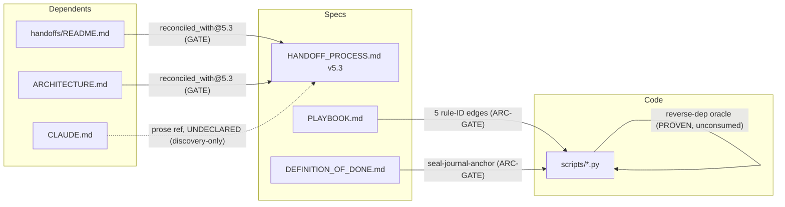

# Dependency-architecture + test-coverage audit — `.dev-knowledge`

**Date:** 2026-06-25
**Type:** read-only audit (Audit A — dependency legibility). No source/spec/code/test/config/doc was modified; this report is the only artifact.
**Auditor:** Claude Code (Opus), 5 parallel read-only investigation agents + direct verification of `audit.py`, the ship-gate, and live command runs.
**Branch at audit time:** `docs/c2-probe-consolidate-shipgate-readback` (HEAD `c5dd4f5`).

---

## 0. Headline verdict

The dependency-legibility system **works, is well-tested where it is wired, and is honest about its own boundaries** — but it is **complete only for two of its four edge-types**. The two *declared-edge* mechanisms (spec→dependent `reconciled_with`, doc→code rule-IDs) are LIVE, gated, and proven with genuine negative controls. The two *computed/discovery* edge-types are the holes: the **code↔code import graph among the modules that actually inter-depend is effectively unenforced**, and the **undeclared-edge discovery is real-but-never-gated** (8+ live undeclared edges sit unflagged at ship).

Empirically observed this session (not assumed):
- `audit.py health` → **OK, exit 0** (18/26 findings pass; 8 non-pass are 2 `n/a` + 6 WARN, no FAIL).
- `audit.py ship-gate` → **GREEN, exit 0** (6 live WARNs, all 6 dispositioned by the register).
- Full test suite → **817 passed, 1 skipped** (818 collected), exit 0.
- `reverse_dep_oracle` → fired live, **122 reverse-dependents** for `Finding` via vendored Pyright 1.1.410.
- `doc_code_edge` → **5/5 edges resolved**, none broken/ambiguous/orphaned.
- `reconciled_versions` → **2/2 edges match** live spec `handoff-process@5.3`.

**Proven (genuine test or observed firing): ~90% of wired mechanisms. Assumed (logic looks right, untested path): the code↔code boundary's real value, the carrier-twin parity, the coverage auto-enumeration backstop, and the prose-semantic verdict (unenforceable by design).**

---

## 1. The dependency MATRIX (headline deliverable)

Every dependency relationship the system declares or enforces, one row per relationship, grouped by edge-type. **Gate semantics have three tiers in this repo** (precise definitions in §1.6):

- **HARD-GATE** = blocks the git operation (pre-commit / pre-push / commit-msg) or is a FAIL-class `ALL_CHECKS` organ (blocks `audit-health` commit gate *and* ship-gate).
- **ARC-GATE** = WARN-class `ALL_CHECKS` organ: informs at commit, **blocks `/ship`** unless dispositioned in `ecosystem/disposition-register.yaml`.
- **ADVISORY** = standalone awareness CLI / non-blocking hook: never gates anything (exit 0 by contract).

### 1.1 Edge-type A — spec → dependent (`reconciled_with`, freshness, version-coupling)

| Source | → Target | Edge type | Mechanism (script:function) | What it catches | Gate? | Test verdict |
|---|---|---|---|---|---|---|
| `docs/handoffs/README.md` (`@5.3`) | `protocols/HANDOFF_PROCESS.md` (`Version: 5.3`) | declared `reconciled_with` | `validate_reconciliation.reconcile` → `audit.check_reconciled_versions` (audit.py:1503, ALL_CHECKS #20) | dependent's declared version lags the live spec version | **HARD-GATE** (FAIL on mismatch) | **solid** |
| `ARCHITECTURE.md` (`@5.3`) | `protocols/HANDOFF_PROCESS.md` | declared `reconciled_with` | same | same | **HARD-GATE** | **solid** (added 2026-06-24, closed AR-A/#172) |
| any dependent w/ malformed/unknown `reconciled_with` | (registry) | own-input error | same | frontmatter not `<id>@<ver>`, or spec-id absent from `_SPEC_REGISTRY` | ADVISORY (WARN, fail-open) | **solid** |
| a flagged stale edge | the dependent's reference sites (sections/walkthrough/diagrams/commands) | site enumeration | `coherence_enumerator.enumerate_repo/extract_sites` | over-extracts every candidate site so the LLM verdict misses none | ADVISORY (skill-invoked, exit 0) | **solid** |
| a registered spec | the spec itself (vs git HEAD) | content-changed-without-version-bump | `coherence_nudge.process` (pre-commit `coherence-nudge`) | spec body differs from HEAD but numeric `Version` unchanged (the checker's false-negative) | ADVISORY (non-blocking, exit 0, logs only) | **solid** |
| 6 canonical living docs (`VISION/ARCHITECTURE/CLAUDE/CONTRIBUTING/docs/handoffs/README/ESSENTIALS`) | their own `last_reviewed` ↔ git edit date | freshness cadence | `audit.check_canonical_freshness` (audit.py:779, #10) | A2: `last_reviewed` predates last commit (edited-but-not-re-reviewed) → FAIL; A1: >30d → WARN | **HARD-GATE** (A2 FAIL) / ARC-GATE (A1 WARN) | **solid** |
| `ARCHITECTURE.md`, `CONTRIBUTING.md` `stamp vX.Y` | `protocols/HANDOFF_PROCESS.md` `Version:` | version-stamp coupling | `audit.check_handoff_version_stamp` (audit.py:1013, #13) | a stamp's version ≠ canonical spec version | **HARD-GATE** (FAIL) | **solid** (8 tests) |
| `CLAUDE.md`, `.claude/commands/handoff.md` (`vN` major) | `protocols/HANDOFF_PROCESS.md` `Version:` major | coupled-version set (`_COUPLED_VERSION_SETS`) | `audit.check_amendment_coherence` (audit.py:1116, #14) | a coupled surface left at a stale major (a version "straggler") | **HARD-GATE** (FAIL on straggler) | **solid** (8 tests + gate-blocks-health) |

### 1.2 Edge-type B — doc → code (rule-IDs)

| Source (doc) | → Target (code) | Edge type | Mechanism | What it catches | Gate? | Test verdict |
|---|---|---|---|---|---|---|
| `DEFINITION_OF_DONE.md` `<!-- rule: seal-journal-anchor -->` | `session_end_backpressure.py` `# rule:` | rule-ID identity (move-safe, content-resolved) | `validate_doc_code_edge.resolve_edge` → `audit.check_doc_code_edge` (audit.py:1589, #23) | `broken_edge` (a side resolves to nothing) / `ambiguous` (dup ID) / `code_orphan` | ARC-GATE (WARN; never FAIL — advisory-first per ADR-89 OQ3) | **solid** |
| `PLAYBOOK.md` `canonical-freshness` | `audit.py:778` | same | same | impl drift / lost annotation | ARC-GATE | **solid** |
| `PLAYBOOK.md` `coherence-spec-reconciled` | `validate_reconciliation.py:206` | same | same | same | ARC-GATE | **solid** |
| `PLAYBOOK.md` `coherence-amendment` | `audit.py:1115` | same | same | same | ARC-GATE | **solid** |
| `PLAYBOOK.md` `governance-backlog-schema` | `validate_backlog.py:271` | same | same | same | ARC-GATE | **solid** |

Edge set is **content-derived** (no per-edge manifest; `build_edge_index` rebuilds from source each call, ADR-88 P3). `ecosystem/doc-code-edge.yaml` declares the *scan scope* (`declaration_docs` = 2 docs) + the `coverage_scope` (5 in-scope rule-IDs). Live: doc-IDs and code-IDs are **identical 5-element sets** → 100% of cohort-1 resolved, zero orphans. **Deferred (documented, not silent):** the dual-organ trio (#201), the Tier-3 quartet (#202), the auto-enumeration drift-guard (#203) — see §4.

### 1.3 Edge-type C — code ↔ code (computed)

| Source | → Target | Edge type | Mechanism | What it catches | Gate? | Test verdict |
|---|---|---|---|---|---|---|
| any `scripts/*.py` symbol | its referencers across `scripts/` | reverse-dependency (computed, Pyright LSP) | `reverse_dep_oracle.run_oracle` (ADR-89) | callers/reverse-deps of a def/class (static, repo-scoped) | **ADVISORY — standalone query tool, NO gate** | **solid** (real-Pyright integration) |
| `scripts/<pkg>` package | `scripts/<pkg>` package | intra-source import edge (AST) | `codemap.ast_walker.analyze_repo` → `check.check_codemap` (pre-commit `codemap-freshness`) | drift between ARCHITECTURE.md's mermaid codemap and a fresh regen | **HARD-GATE** (pre-commit, exit 1 on drift) | **solid** (tests) / **see GAP-1 (near-inert)** |
| (the real import graph among flat `scripts/*.py`) | (each other) | import dependency / cycle | **UNDECLARED — no mechanism** | nothing | — | **NONE** |

### 1.4 Edge-type D — undeclared-edge discovery (referential currency)

| Source | → Target | Edge type | Mechanism | What it catches | Gate? | Test verdict |
|---|---|---|---|---|---|---|
| any repo `*.md` (prose) | a registered spec (`_SPEC_REGISTRY`) | doc→spec edge that *should* be declared but isn't | `scan_undeclared_edges.scan` | a doc prose-references a spec but carries no `reconciled_with` (ADR-88 FC2) | **ADVISORY — awareness CLI, NO gate, NO auto-declare, exit 0** | **solid** |
| `# rule:` code annotation | (declaration docs) | code-side orphan | `validate_doc_code_edge.scan_structural_integrity` (`code_orphan`), surfaced via #23 | a `# rule:` declared in no declaration doc | ARC-GATE (WARN) | **solid** |

### 1.5 Edge-type E — supporting gate organs (git↔doc / prose↔state / git-spine / schema)

| Source | → Target | Edge type | Mechanism | What it catches | Gate? | Test verdict |
|---|---|---|---|---|---|---|
| git history (`closes [#id]`, `--first-parent`) | `BACKLOG.md` open ids | git↔backlog drift (dir. a) | `validate_git_backlog.reconcile` → `check_git_backlog_drift` (audit.py:1255, #16) | a closed-id commit whose id is still open (ADR-65 done-items-leave) | ARC-GATE (WARN per id) | **solid** |
| 4 living-doc prose claims | repo ground truth | prose↔state | `validate_doc_claims.reconcile` → `check_doc_claims` (audit.py:1293, #17) | check-count, gate-count, CLAUDE §9 roster, pytest-collected count drift | ARC-GATE (WARN; claim-3 off-gate) | **solid** |
| latest v5 `PROBES.md` rows | live repo state (files/anchors/exes) | probe-teeth | `verify_handoff_probes.verify` → `check_handoff_probes` (audit.py:1443, #19) | toothless/malformed/ghost-source probe | **HARD-GATE** (FAIL-class) | **solid** / **see GAP-4** |
| git first-parent spine | core-invariant #5 | git-spine (detect) | `validate_no_ff.find_violations` → `check_no_ff_merges` (audit.py:1405, #18) | a non-merge commit on main since `BASELINE_DATE` | ARC-GATE (WARN per violation) | **solid** |
| `git push` → `refs/heads/main` | core-invariant #5 | git-spine (prevent) | `block_ff_push.main` (pre-push `block-ff-push`) | a push that would FF/direct-add to main | **HARD-GATE** (pre-push, exit 1) | **solid** (both halves tested jointly) |
| living-doc size / BACKLOG inline history | condense thresholds (ADR-49/65/41/88-FC4) | history-accretion | `validate_doc_rot.scan` → `check_doc_rot` (audit.py:1331, #21) | 4 sub-detectors: backlog accretion, section-history, file-budget, grooming cadence | ARC-GATE (WARN per locus) | **solid** |
| methodology-doc prose shape | numbering/header/ToC integrity | prose-structure | `validate_doc_structure.scan` → `check_doc_structure` (audit.py:1368, #22) | 5 sub-detectors: numbering, header-scheme, ToC, dangling-allow, Ch/§ scheme | ARC-GATE (WARN per locus) | **solid** |
| `BACKLOG.md` edits | ADR-66 schema + #156 task-graph + #167 serialize-group | story-map schema | `validate_backlog.validate` (pre-commit `validate-backlog`) | missing band/Done-when, dup/orphan id, done-marker-left, `depends-on` dangling/cycle | **HARD-GATE** (pre-commit, exit 1) | **solid** / **see GAP-2 (twin)** |
| child `CLAUDE-FLOOR.md` | its `.sha256` sidecar + named `*.md` | floor integrity | `audit.check_floor_integrity` (audit.py:1195, #15) | hash drift / F5 self-containment leak / broken pointer | **HARD-GATE** (FAIL-class; `n/a` on hub) | **solid** (6 tests) |
| `BACKLOG.md` `depends-on` / `serialize-group` clauses | other backlog task ids / shared resources | task-graph edges | `validate_backlog` (`_check_dep_*`, `serialize_groups`) | dangling dep id, dep cycle (direct/indirect/self); serialize ordering | **HARD-GATE** (cycle/dangling = FAIL) | **solid** | 

### 1.6 The meta-gate: ship-gate + disposition register

| Source | → Target | Edge type | Mechanism | What it catches | Gate? | Test verdict |
|---|---|---|---|---|---|---|
| all 23 `ALL_CHECKS` Findings | the feature arc at `/ship` | verification-organ gate | `audit.cmd_ship_gate` (audit.py:2226) + `_match_disposition` + `ecosystem/disposition-register.yaml` | any FAIL **or** any undispositioned WARN → RED (reads `Finding.status`, never exit codes) | **HARD-GATE** at `/ship` | **solid** (11 tests, `test_ship_gate.py`) |
| all 4 edge oracles | "registered + operational + fires-on-break" | conformance meta-test | `tests/test_legibility_graph_conformance.py` | a dead/unregistered edge oracle | (test only) | **solid** |

### 1.7 Visual dependency graph

Solid arrows = gated edges. Dotted arrows = real-but-unenforced edges (the holes).

---

## 2. Per-mechanism verification

Status legend: **LIVE+wired+firing** / wired-but-dormant / orphaned (intentional) / broken.

| Mechanism | Wiring | Fires? (evidence) | Claim-vs-impl | Status |
|---|---|---|---|---|
| `check_reconciled_versions` | ALL_CHECKS #20; health + ship-gate | ✅ "2 edges match handoff-process@5.3" (live) | matches | **LIVE+wired+firing** |
| `coherence_enumerator` | skill `check-against-spec` + integration test | ✅ enumerates live README sites | matches; advisory by design | **LIVE, advisory** |
| `coherence_nudge` | pre-commit (non-blocking) | ✅ tested fires+logs; not run (would write log) | matches | **LIVE, advisory** |
| `check_canonical_freshness` | ALL_CHECKS #10 | ✅ "6 files fresh" (live) | matches | **LIVE+wired+firing** |
| `check_handoff_version_stamp` | ALL_CHECKS #13 | ✅ "all stamps match v5.3" (live) | matches | **LIVE+wired+firing** |
| `check_amendment_coherence` | ALL_CHECKS #14 | ✅ "2 coupled mentions coherent" (live) | matches | **LIVE+wired+firing** |
| `check_floor_integrity` | ALL_CHECKS #15 | ✅ `n/a` on hub (no floor); fires on child via `audit repo` | matches | **LIVE+wired** (n/a on hub) |
| `check_doc_code_edge` | ALL_CHECKS #23; ship-gate WARN | ✅ "5 edges resolved; none broken" (live) | matches | **LIVE+wired+firing** |
| `reverse_dep_oracle` | **standalone CLI only** | ✅ 122 reverse-deps for `Finding` (live, Pyright 1.1.410 vendored) | **ADR-89 "no tooling wired" is REFUTED** (tool is built+fires; only the *gate-consumer* is deferred) | **LIVE+firing, orphaned (no gate)** |
| `codemap` / `codemap-freshness` | pre-commit hook | ✅ exit 0 clean; warns "orphan modules: codemap, toc" | **near-inert** — only 2 packages, 0 edges; flat `scripts/*.py` invisible; tach fixture-only | **LIVE+wired+firing, but polices an ~empty graph (GAP-1)** |
| `scan_undeclared_edges` | **standalone CLI only** | ✅ "11 candidates, 4 weak" (live) | matches; awareness-only by design | **LIVE+firing, orphaned (no gate)** |
| `check_git_backlog_drift` | ALL_CHECKS #16 | ✅ flags `#77` (live, dispositioned) | matches; dir.(b) deferred #90b | **LIVE+wired+firing** |
| `check_doc_claims` | ALL_CHECKS #17 | ✅ "3 match" (gate-mode) / "4 match" (ship, incl. pytest=818) | matches; 4-row hardcoded registry (GAP-6) | **LIVE+wired+firing** |
| `check_handoff_probes` | ALL_CHECKS #19 (FAIL-class) | ✅ "10 probes bind" (live) | overstates "binds to live state" for `live git` zero-token probes (GAP-4) | **LIVE+wired+firing** |
| `check_no_ff_merges` (detect) | ALL_CHECKS #18 | ✅ flags 2 commits (live, dispositioned) | adapter docstring stale (names removed allowlist); behavior+tests correct | **LIVE+wired+firing** |
| `block_ff_push` (prevent) | pre-push hook | ✅ `.git/hooks/pre-push` installed + pre-commit-managed; E2E refuse/pass | matches | **LIVE+wired+firing** |
| `check_doc_rot` | ALL_CHECKS #21 | ✅ flags #164/#77/#134 (live, dispositioned) | matches | **LIVE+wired+firing** |
| `check_doc_structure` | ALL_CHECKS #22 | ✅ "no structural rot" (live, genuinely clean) | matches | **LIVE+wired+firing** |
| `validate_backlog` | pre-commit `validate-backlog` | ✅ "7 themes, 22 stories, 85 tasks, 0 warnings" (live) | matches | **LIVE+wired+firing** |
| `cmd_ship_gate` + dispositions | `/ship` wiring | ✅ GREEN, 6 WARN dispositioned (live) | matches | **LIVE+wired+firing** |

**No mechanism is dormant, orphaned-by-accident, or broken.** The two "orphaned" entries (oracle, undeclared-scan) are *intentionally* awareness-only. 3 of the awareness organs are actively surfacing real (dispositioned) findings against today's tree.

**Incidental robustness finding (not dependency-specific):** `python scripts/audit.py checks` **crashes mid-listing on a Windows cp1252 console** — it prints checks 1–22 then a `UnicodeEncodeError` traceback when echoing check #23's docstring (`check_doc_code_edge`'s first line contains `→` U+2192, outside cp1252). The `health`/`ship-gate` commands are unaffected because they emit ASCII-sanitized `Finding.evidence` (`->`), but the self-documenting `checks` command — meant to be the drift-proof inventory — is broken on the repo's own platform. Low severity (count line is correct; the list is the docstrings). Filed here as an observation, not fixed.

---

## 3. Test-coverage assessment

| Feature / mechanism | Has test? | Kind | Genuinely exercises? | Verdict |
|---|---|---|---|---|
| spec→dependent reconciliation | yes | unit + adapter + e2e | ✅ injects `@old` vs live, asserts mismatch→FAIL; constant-fail guard | **solid** |
| coherence enumerator | yes | unit + completeness proof | ✅ mutation surfaces stale walkthrough+diagram as discrete sites | **solid** |
| coherence nudge | yes | unit + real-git | ✅ symmetric fire/silent; numeric-not-raw regression | **solid** |
| canonical freshness (A2/A1) | yes | unit + real-git | ✅ committed-stale FAILs, equal-date passes | **solid** |
| handoff version stamp | yes | unit | ✅ mismatch + multi-mismatch FAIL | **solid** |
| amendment coherence | yes | unit + gate | ✅ straggler fires, aligned passes, gate-blocks-health | **solid** |
| floor integrity | yes | unit | ✅ tamper/missing-sidecar/F5-leak/broken-pointer all FAIL | **solid** |
| doc→code edge resolver | yes | unit + graph integration | ✅ break/dup/string-literal/move-safety + permanent coverage guard | **solid** |
| reverse-dep oracle | yes | unit + **real-Pyright integration** | ✅ integration drives the langserver (not a mock); dual fail-soft controls | **solid** |
| codemap import-edge tool | yes | unit + CLI subprocess | ✅ every module + drift/clean/error exit codes | **solid (of a near-inert mechanism — see note)** |
| undeclared-edge scan | yes | unit (29) | ✅ rich positive+negative+prune controls; mutates-nothing assert | **solid** |
| git↔backlog drift | yes | real-git + adapter + e2e | ✅ inject closed-but-present; every precision lever has fire+no-fire | **solid** |
| doc-claims prose↔state | yes | unit + adapter + e2e | ✅ count/roster mismatch; **anti-vacuous: rejects #141 skip-pass** | **solid** |
| handoff probe-teeth | yes | unit + adapter + e2e | ✅ ghost-source/malformed/no-backtick FAIL; containment hardening | **solid** (one untested PASS path → GAP-4) |
| no-ff detect | yes | pure + real-git + e2e | ✅ FF-merge flagged, `--no-ff` not (neg. control) | **solid** |
| no-ff prevent (`block_ff_push`) | yes | pure + 10 E2E bare-remote | ✅ direct/FF refused, `--no-ff` passes; shares-one-scan w/ detector | **solid** |
| doc-rot (4 sub-detectors) | yes | per-detector unit + e2e | ✅ each sub-detector fire+no-fire | **solid** |
| doc-structure (5 sub-detectors) | yes | per-detector unit + live-oracle | ✅ each sub-detector fire+neg-control + 3 live-doc oracles | **solid** |
| validate_backlog schema/task-graph | yes | unit (45) | ✅ every rule fire+neg-control incl. cycle paths | **solid** |
| ship-gate + dispositions | yes | unit (11) | ✅ seeded-fail blocks, undispositioned-WARN blocks, sha-specific, failsoft, partial-aggregate blocks | **solid** |
| legibility-graph conformance | yes | meta-integration | ✅ all 4 oracles fire through real entry points | **solid** |
| **code↔code import graph (flat modules)** | **no** | — | n/a — no mechanism exists | **NONE (GAP-1)** |
| **validate_backlog hub↔plugin twin parity** | **no** | — | mirrored "by hand", no parity test | **NONE (GAP-2)** |
| **coverage_scope auto-enumeration (#203)** | **partial** | — | guard asserts the 5 listed resolve, but a *new* enforced rule escaping the list is unguarded | **weak (GAP-3)** |
| **handoff_probes `live git` zero-token PASS** | **no** | — | no test covers a source cell with no file tokens reaching PASS | **weak (GAP-4)** |
| **doc_claims registry extensibility** | **partial** | — | 4 claims tested; new claims need a hardcoded row | **weak (GAP-6)** |
| **doc_rot `scan_file_budget` via live constant** | **partial** | unit (explicit arg) | detector tested w/ `budget=200` arg; `_FILE_SIZE_BUDGETS` wiring untested through `scan()` | **weak (GAP-7)** |
| **prose-coherence verdict (the skill ran / prose corrected)** | **no** | — | unenforceable by design (deterministic/semantic split) | **NONE (by design — §5)** |

**No mechanism's test is vacuous/false-green.** The classic trap (`test passes without the behavior`) was *actively guarded against*: `test_reconcile_evaluates_test_count_when_expensive` asserts `status != "skipped"` (rejecting the #141 vacuous-skip bug), and `test_coverage_all_in_scope_rules_resolve` asserts the scope is non-empty before asserting resolution. The honest distinction is **coverage-of-the-mechanism vs value-of-the-mechanism**: `codemap`'s tests are solid, but the mechanism polices a 2-node/0-edge graph in production — a well-tested near-no-op (GAP-1).

---

## 4. Ranked test-gap backlog (designs only — do NOT write here)

Ranked by leverage (how load-bearing the uncovered edge is). Each design uses a **disposable scratch/temp copy** for its negative control — never the real tracked files.

### GAP-1 — code↔code import-graph boundary/cycle check *(highest leverage)*
**Hole:** the entire code↔code edge-type is unenforced over the modules that actually inter-depend. `codemap` only walks `scripts/` *packages* (`codemap/`, `toc/` — 0 edges between them); the ~30 flat `scripts/*.py` with real interdependencies (`audit.py` imports 8 validators; `scan_undeclared_edges`→`coherence_enumerator`+`validate_reconciliation`; `validate_doc_code_edge`→`reverse_dep_oracle`) are invisible. No cycle/layering gate exists.
**Test to design:** a unit test over a scratch package mirroring the flat-module import graph that asserts (a) the graph is extracted at module granularity (not just package), and (b) an introduced import cycle is reported.
**Negative control:** in a tmp copy, add `import audit` into a leaf validator that `audit` imports (a cycle) → assert the check returns non-zero / a cycle finding. Confirm a clean graph returns zero.
**Note:** this is a *mechanism* gap first — the test presupposes extending `ast_walker` to flat modules (or a standalone import-cycle check). Belongs in a gated build, not a test-only PR.

### GAP-2 — `validate_backlog` hub↔plugin carrier-twin parity *(high)*
**Hole:** `scripts/validate_backlog.py:120-123` documents that the #156 dependency machinery is mirrored **verbatim** into `plugins/tier1-lifecycle/scripts/validate_backlog.py` and "kept in sync by hand". No test asserts the two agree → the distributed fleet copy can silently drift.
**Test to design:** import both modules; run `validate(*parse(corpus))` on a shared fixture set covering dep-cycle, dangling-dep, serialize-group, done-marker; assert identical findings. (Or assert the mirrored function-source blocks are byte-identical.)
**Negative control:** in a tmp copy of the plugin file, weaken `_DEPENDS_CLAUSE_RE` → assert the parity test fails. Confirm the unmodified pair passes.

### GAP-3 — `coverage_scope` auto-enumeration drift-guard (#203) *(high)*
**Hole:** the doc→code coverage test only checks the 5 *curated* rule-IDs resolve. A newly-added enforced rule that nobody appends to `coverage_scope` silently escapes coverage (the yaml admits this at L36-37).
**Test to design:** enumerate the enforcement universe (every `ALL_CHECKS` member + standalone validators + the pre-commit/commit-msg/pre-push hooks + the seal Stop-hook) and assert each is classified in exactly one of `coverage_scope` / the deferred lists (#201/#202) / the EXEMPT list.
**Negative control:** add a scratch enforced check absent from all three lists → assert flagged. Confirm the current corpus passes.

### GAP-4 — `handoff_probes` `live git` zero-token teeth *(medium)*
**Hole:** `verify_handoff_probes._classify` only resolves files when the source cell yields file tokens. A probe sourced `live git` with command `` `git rev-parse` `` passes on "git is on PATH" alone — the same PASS a probe asserting nothing would get. The gate's "binds to live state" claim is overstated for non-file probes, and **no test covers this PASS path**.
**Test to design:** a `PROBES.md` row with source `live git`, no file/anchor token, trivial command → assert it does **not** silent-PASS (should be WARN/`skipped` or require an anchor token).
**Negative control:** the same row with a real `#`-anchor or file token → assert PASS. (Also covers GAP-companion: command-target resolution uses first-backtick-span only, so a broken path in a later span is invisible — `verify_handoff_probes.py:263`.)
**Note:** mechanism change required (tighten `_classify`); the test is the spec for it.

### GAP-6 — `doc_claims` registry extensibility *(medium-low)*
**Hole:** `_CLAIMS` is a hardcoded 4-row registry; other deterministically-checkable living-doc claims (e.g. CLAUDE §9's own prose hook-count) are unenforced. The roster claim is set-equality only.
**Test to design:** a test asserting every `_CLAIMS` row has a working deriver + an "anchor still present" guard, so a doc reword degrades to `anchor-missing` (already partly covered) — then extend `_CLAIMS` data-driven and assert the extension is auto-tested.
**Negative control:** add a claim row whose deriver returns a known value, inject a wrong doc number in a tmp copy → assert mismatch.

### GAP-7 — `doc_rot` file-budget live-constant path *(low)*
**Hole:** `scan_file_budget` is tested with an explicit `budget=200` arg, but the orchestration `scan()` reading `_FILE_SIZE_BUDGETS={"CLAUDE.md":200}` is only exercised indirectly. (This exact failure mode fired historically — CLAUDE.md §12 v2.22.)
**Test to design:** seed a tmp repo with a 201-line `CLAUDE.md`, run `scan()` (no explicit budget), assert the budget locus fires.
**Negative control:** a 199-line `CLAUDE.md` → assert no fire.

### Non-test backlog items surfaced (content/mechanism, for completeness)
- **8+ undeclared `reconciled_with` edges** (`CLAUDE.md`, `PLAYBOOK.md`, `VISION.md`, `CONTRIBUTING.md`, `ESSENTIALS.md`, `AI_COUNCIL_PROCESS.md`, `HANDOFF_BOOT.md`, `BACKLOG.md` all prose-reference HANDOFF_PROCESS but declare no edge). `scan_undeclared_edges` surfaces them (11 candidates) but never gates → a spec bump won't flag these as stale. Promotion to declared edges is a human-gated content task.
- **`reverse_dep_oracle` is built+proven but consumed by no gate** (the safe-removal gate #195 is unbuilt; the `::symbol` leg in `validate_doc_code_edge` is deferred). Capability exists, unused.
- **`_SPEC_REGISTRY` holds one spec.** Spec-shaped docs (`AI_COUNCIL_PROCESS`, `PLAYBOOK`, `DEFINITION_OF_DONE`) have no reconciliation authority — their dependents are invisible to the spine.
- **ADR-89 text drift:** "doctrine only, no tooling wired (Track A)" is stale — the oracle tool is real and fires; only its gate-consumer is deferred. The script docstrings carry the honest version.

---

## 5. Honest verdict

**Does it work?** Yes. Every wired mechanism is LIVE and firing; I observed the full mesh run GREEN at both gate points (commit `health` and `/ship`), with 817/818 tests passing and the awareness organs correctly surfacing — and dispositioning — real drift.

**Is it complete?** **For declared edges, yes; for computed/discovery edges, no.**
- **Edge-type A (spec→dependent)** and **Edge-type B (doc→code)** are complete and gated for their declared cohort: 2 reconciliation edges + 5 rule-ID edges, all resolving, all with FAIL-class or ARC-gate teeth.
- **Edge-type C (code↔code)** is the weakest: the `codemap` gate is live but polices an essentially empty package graph, and the proven Pyright oracle is consumed by nothing. The real import graph among the modules that matter is **unenforced** (GAP-1).
- **Edge-type D (undeclared discovery)** is real but **never gated** — by design (ADR-88 FC2 "filed"), yet 8+ live undeclared edges sit unflagged at ship.

**Is it tested?** Yes, and unusually honestly. **What is PROVEN** (genuine negative control or observed firing): all 7 declared edges, all 8 supporting gate organs, the ship-gate disposition logic, the no-ff detect/prevent split (tested jointly), the Pyright oracle (real integration, not mocked), and the conformance meta-test. The tests guard against the very "fake-green" trap the methodology names (the #141 skip-pass is explicitly rejected; coverage guards assert non-empty scope).

**What is ASSUMED (logic right, path untested):**
1. The code↔code boundary's *value* — well-tested tool, near-no-op in production (GAP-1).
2. Hub↔plugin `validate_backlog` parity — mirrored by hand, no parity test (GAP-2).
3. The coverage-scope completeness backstop — curated list, no auto-enumeration (GAP-3).
4. That every `handoff_probes` PASS means a probe with teeth — false for `live git` zero-token probes (GAP-4).

**Edges that have never been exercised against a real violation:** none among the *gated* mechanisms — every gate has an inject-and-confirm negative control. The unexercised paths are all in the *gaps* above (GAP-1/2/3/4/7), which are either mechanism-absent or untested-secondary-paths.

**Closure on the hard metric vs the easy one.** The easy metric ("the system exists / tests pass") is met (817/818 green). The hard metric ("the system *demonstrably catches drift*") is met **for the declared edges** — I watched it flag #77, two no-ff commits, and three doc-rot loci, and the test suite injects-and-catches each class. It is **not yet met for code↔code** (no mechanism to catch an import cycle among the real modules) and is **deliberately out of scope for the prose-semantic verdict** (no machine can verify a dependent was correctly re-reasoned when a spec advanced — only that its version number was bumped; the `check-against-spec` skill + LLM own that, ungated).

**Bottom line:** a genuinely strong, self-honest dependency-legibility system whose declared-edge half is production-grade and whose computed/discovery half is the real frontier — exactly the two places (GAP-1 code↔code, the undeclared-edge promotion) where the next leverage lies.

---

## Appendix — live evidence (read-only runs, 2026-06-25)

- `audit.py checks` → "23 registered checks" (then cp1252 console crash on #23's `→`; count + list 1–22 correct).
- `audit.py health` → exit 0, "health: OK", 18/26 pass (2 n/a + 6 WARN, 0 FAIL).
- `audit.py ship-gate` → exit 0, "GREEN — 6 WARN dispositioned" (git_backlog #77; no_ff 3a894eeb5 + d0f9ead67; doc_rot #164/#77/#134).
- `pytest -q` → 817 passed, 1 skipped (818 collected), exit 0, 278s.
- `validate_reconciliation.py` → "2 edges, 0 mismatches" (README.md@5.3, ARCHITECTURE.md@5.3 vs live 5.3).
- `validate_doc_code_edge` (via health) → "5 doc->code edges resolved; none broken/ambiguous/orphaned".
- `reverse_dep_oracle.py Finding --json` → 122 reverse-dependents, completeness=complete, Pyright 1.1.410 (vendored `node_modules/pyright/`).
- `scan_undeclared_edges.py` → "11 candidates, 4 weak signals".
- `validate_no_ff` → 2 live violations (2026-06-19 direct-to-main). `validate_doc_rot` → 3 loci. `validate_doc_structure` → clean. `validate_backlog` → "7 themes, 22 stories, 85 tasks, 0 warnings".
