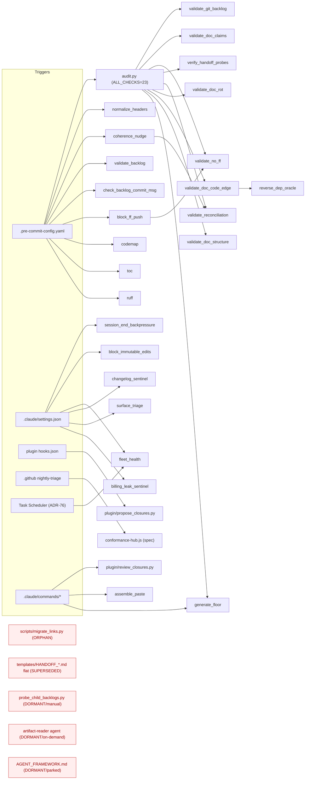

<!-- scope: meta -->

# Corpus graph + justify-or-retire audit — 2026-06-26

> **READ-ONLY.** This is a register of *candidates* for Rob's decision, not an edit. No file
> was moved, edited, or deleted (core-invariant #3; no-delete-without-asking). Removal is a
> separate, human-gated step — Rob decides per candidate. Companion of the #134 BACKLOG-grooming
> loop, applied to the *file* corpus instead of backlog tasks (the Lifeline-2 coherence capability
> applied holistically — controlling repository rot).

## Headline

**1003 tracked files · 786 archive-by-design (excluded from rot scope) · 217 operational nodes
→ 1 orphan · 3 obsolete/superseded · 3 dormant → 4 confident retire/archive candidates (+3 low-confidence "review, lean keep").**

The corpus is overwhelmingly *append-only institutional record* (786 of 1003 files: ADRs,
transcripts, audits, handoffs, dated history). Those are LIVE-by-policy — kept on purpose, never
rot (CLAUDE.md §4 immutability). Real rot lives in the **217 operational nodes** (root canon,
protocols, `.claude/`, plugins, templates, scripts, tests, configs), and the operational corpus is
**remarkably clean** — the methodology's coherence machinery (audit.py's 23 checks, the twin-parity
test, the ADR-83/60 archive conventions, the #134 groom) is visibly working. The findings below are
a short tail, not a pile.

---

## Scope & method

**Edge types resolved per node** (a node is only ORPHAN if it misses *all* of them — per the audit's
"don't classify on a single edge-type miss" rule):

- **invocation** — hook→script (`.pre-commit-config.yaml`, `.claude/settings.json`,
  `plugins/tier1-lifecycle/hooks/hooks.json`), command→script (`.claude/commands/*`, plugin commands),
  CI→script (`.github/workflows/`), scheduler→script (ADR-76 Task Scheduler).
- **import** — Python module imports (audit.py's `ALL_CHECKS` wiring + lazy imports; `block_ff_push`
  → `validate_no_ff`; `coherence_nudge` → `validate_reconciliation._SPEC_REGISTRY`).
- **doc→doc** — prose pointers (`ADR-NN`, `PLAYBOOK §X`), `reconciled_with` / declaration-doc edges.
- **test** — a `tests/test_*.py` that loads the module as its subject-under-test.
- **supersession** — `ARCHIVED`/`superseded`/`retired`/`deprecated`/`v3`/`v4` tombstones and the
  ADR-83 (protocols) / ADR-60 (docs) archive conventions.

**Composed, not reinvented** (per instruction): `.pre-commit-config.yaml` + `.claude/settings.json`
+ plugin `hooks.json` (invocation map), `audit.py::ALL_CHECKS` + its import block (the live validator
set), `git grep` over tracked files (doc/test refs — the `scan_undeclared_edges` reference-scan
substrate), `git log` (dormancy dating), `diff` of hub↔plugin twins. The reverse-dep oracle
(`reverse_dep_oracle.py`, ADR-89) is the standing tool that computes code→code edges; this audit used
its inputs (imports + `ALL_CHECKS`) directly rather than spinning up Pyright for a one-shot read.

**Archive-by-design = excluded from rot scope (786 files).** These are append-only by CLAUDE.md §4 +
ADR-60/83; their "growth without removal" is the design, not the disease:

| Category | Count | Policy |
|---|---|---|
| `docs/handoffs/**` | 416 | Immutable session bundles (ADR-82); already has an `archive/` lane |
| `docs/audits/**` | 173 | Immutable audit record (this file joins it) |
| `docs/decisions/ADR-*.md` | 62 | Immutable decisions (supersede-by-new-file) |
| `docs/decisions/transcripts/**` | 49 | Immutable Council transcripts (ADR-77 edit-guard enforces) |
| `ecosystem/*/history/**` | 72 | Generated dated history (ADR-80 nightly) |
| `docs/archive/**` | 10 | Explicitly archived research notes (ADR-60) |
| `protocols/archive/**` | 2 | Tombstoned superseded protocols (ADR-83) — v3.4, v4.4 |
| `templates/archive/**` | 1 | Archived `AGENTS-md-template` (ADR-53 AGENTS.md retirement) |
| `docs/decisions/README.md` | 1 | Live index (kept) |

> **One latent question for the archive class, not a per-file candidate:** `docs/handoffs/**` at 416
> files is the single largest growth vector. It is correct that they are immutable, but whether a
> *retention/rollup* policy should compress bundles older than N (the way ADR-49/65 condenses doc
> section-history) is a standing-policy question worth a future ticket. Out of scope for this
> read-only pass; flagged so it isn't lost.

---

## Retire / archive candidates

Ranked by confidence. Only orphan/obsolete/dormant nodes appear here.

### 1. `scripts/migrate_links.py` — ORPHAN/OBSOLETE — **retire** (HIGH confidence)

- **What:** A one-shot link-migration script. Its own docstring: *"K1.7 link migration script —
  one-shot, safe to re-run."* It rewrites the old underscore ADR filenames
  (`ADR-27_scope-tagging` → `ADR-27-scope-tagging`, etc.) to the ADR-34 hyphen convention.
- **Evidence (all edge types checked):**
  - **invocation:** none — no hook, command, CI, or scheduler invokes it.
  - **import:** none — no module imports it.
  - **test:** none — it is the only script in `scripts/` with no `tests/test_*.py`.
  - **doc→doc:** none functional. Every mention is in **immutable record only** — `JOURNAL.md`,
    seven `docs/audits/*` files, and `docs/handoffs/*/08_TREE.txt` snapshots that merely *list* the
    file. Zero live consumer.
  - **supersession:** the migration it performs is complete — every ADR on disk is already
    hyphen-named (ADR-34 convention is in force).
  - **last touched:** 2026-05-20.
- **Verdict:** **retire.** Its job is done and unrepeatable; the rename target no longer exists. The
  textbook orphan — a finished one-shot tool left in the tree.

### 2–4. The flat handoff templates — OBSOLETE/SUPERSEDED — **archive** (MED-HIGH confidence)

`templates/HANDOFF_TEMPLATE.md`, `templates/HANDOFF_FOLDER_TEMPLATE.md`,
`templates/HANDOFF_QUESTION_TEMPLATE.md`

- **What:** The flat, single-file handoff templates from the v3/v4 two-phase handoff era
  (`HANDOFF_TEMPLATE` = the old monolithic bundle; `HANDOFF_QUESTION_TEMPLATE` = "Stage 1 Question";
  `HANDOFF_FOLDER_TEMPLATE` = "Stage 3 output structure").
- **Evidence:**
  - **superseded-by:** the live v5 handoff process (ADR-82) uses the **structured folder**
    `templates/handoff/` (`README` + `01_ROLE`…`07_ASK_BACK`) and `templates/handoff/v5/`. The live
    command `.claude/commands/handoff.md` (L226) and `protocols/HANDOFF_PROCESS.md` reference
    `templates/handoff/**` — **never** the three flat files.
  - **doc→doc:** every referrer is **immutable or non-live** — historical ADRs (37/39/41/42/55/56/57),
    `protocols/archive/HANDOFF_PROCESS_v3.4.md`, `docs/archive/*`, old `ecosystem/*/history/*`, and one
    test fixture (`test_scan_undeclared_edges.py` uses `HANDOFF_TEMPLATE` as a known-edge sample). **No
    live protocol, command, or PLAYBOOK reference.**
  - **last touched:** `HANDOFF_TEMPLATE` 2026-04-28, the other two 2026-05-29 — all *before* the v5
    flip; untouched since.
- **Verdict:** **archive** to `templates/archive/` carrying a tombstone, mirroring the ADR-83
  protocols-archive convention (and ADR-60 for docs). Note `templates/archive/` already exists and is
  the established destination. (See coherence observation B — `HANDOFF_PROCESS.md` already *claims*
  the v4 handoff templates were archived; this is the unfinished other half of that flip.)

### 5. `protocols/AGENT_FRAMEWORK.md` — DORMANT (parked stub) — **architect decision** (LOW confidence)

- **What:** A v0.1, not-implemented stub deliberately parked to hold a structural signal.
- **Evidence:** **ADR-83 already adjudicates this file** — "Live — intentional anchor (NOT dead): a
  v0.1 not-implemented stub deliberately parked… referenced by BACKLOG #1. Archiving it would lose a
  live forward-pointer," and under *Borderline*: "**`AGENT_FRAMEWORK.md` fate** (promote to a real
  spec vs retire)… left to a future architect session." doc→doc edges: BACKLOG #1 + ADR-62/63/83.
- **Verdict:** **keep-with-reason** *or* retire — an architect call, already flagged by ADR-83. Listed
  here only so the standing decision isn't forgotten; do not retire as housekeeping.

### 6. `scripts/probe_child_backlogs.py` — DORMANT-by-design — **keep-with-reason** (LOW confidence)

- **What:** The #120 child-BACKLOG schema-conformance readiness gate — answers "is this child's
  `BACKLOG.md` already conformant before we turn the `validate-backlog` hook on?"
- **Evidence:** **invocation:** none (no hook/command/CI) — a *manual* CLI by design. **test:**
  `test_probe_child_backlogs.py`. **import/doc:** reads `ecosystem/index.yaml`; mirrors the floor
  artifact. **last touched:** 2026-06-19 (#186 floor sync — actively kept in lockstep). Not in
  ARCHITECTURE/PLAYBOOK prose.
- **Verdict:** **keep-with-reason** — a manual onboarding gate with a clear, recurring purpose and a
  passing test. Revisit only if child-repo onboarding is declared complete. Surfaced for completeness;
  not a rot candidate.

### 7. `.claude/agents/artifact-reader.md` — DORMANT (on-demand) — **keep-with-reason** (LOW confidence)

- **What:** A read-only subagent for reading >20k-token artifacts (#97).
- **Evidence:** **organ-mapped** in `ARCHITECTURE.md` (L207: trigger = "reading a >20k-token
  artifact"; read-only Read/Grep/Glob). It is an on-demand agent — invoked by need, not wired to a
  trigger — so, like `/override` historically, it may never have fired.
- **Verdict:** **keep-with-reason** — organ-mapped, cheap, read-only. If a future pass wants to prune
  never-fired capabilities, verify whether it has ever been dispatched since #97; until then, keep.

---

## Coherence observations (rot-adjacent, NOT retire-candidates)

These are *drift* signals, not files to remove — surfaced because controlling rot is the audit's point.

- **A. Hub↔plugin closure-script divergence (no parity guard).** `scripts/propose_closures.py` and
  `scripts/review_closures.py` are the **tested canonical source** (their `tests/test_*` load the
  `scripts/` copies; `propose_closures` got a real feature edit 2026-06-09), and the
  `plugins/tier1-lifecycle/scripts/` copies are the distributed carriers that actually *run* (plugin
  Stop-hook + `/review-closures` command, in the hub and children). **But** unlike
  `validate_backlog.py` — which has `test_validate_backlog_twin_parity.py` (#206/GAP-2) pinning the
  hub↔plugin twin — propose/review have **no parity test and have diverged**. That is exactly the
  hand-mirror drift the parity test was built to prevent, on two siblings it doesn't cover. *Not a
  retire candidate* (both sides are justified); recommend either a parity test extension or a
  single-source generator for the carrier copies.

- **B. `HANDOFF_PROCESS.md` claims an archival that didn't happen.** L227 states the v5 flip
  "archived `templates/handoff/*` to `templates/archive/handoff-v4/`." That directory **does not
  exist** on disk, and `templates/handoff/{README,01–07}.md.tmpl` (one labeled "HANDOFF v4 bundle
  template") are still live and read by the v5 command. So either the doc overstates a completed step
  or the move is pending. This is the same incomplete-flip that strands candidates 2–4. A dangling
  doc-claim → `doc_claims`-style drift.

---

## In-flight — noted, deliberately NOT headlined

Per the audit brief, these are expected and already being handled by the concurrent `two-lifelines`
CC stream — listed so a reader doesn't double-count them, not as new findings:

- **`protocols/ESSENTIALS.md` retirement** + the §2/§8/ESSENTIALS-Roles **role-duplication
  pointerization** — in flight on the `two-lifelines` stream (it edits PLAYBOOK/ESSENTIALS).
- **Already resolved (not re-flagged):** the `dev-knowledge-138` orphan (removed) and
  `check-against-spec` (got its trigger, #205) — both confirmed clean in this pass.

---

## LIVE set (count + node list, not per-file prose)

**213 of 217 operational nodes are LIVE** (217 minus the 4 confident candidates; the 3
low-confidence items are counted live/keep-leaning). Grouped:

- **Root canon (8):** `VISION.md`, `ARCHITECTURE.md`, `CLAUDE.md`, `BACKLOG.md`, `CONTRIBUTING.md`,
  `JOURNAL.md`, `LESSONS.md`, `logs/TOKEN-LOG.md`.
- **Root config (9):** `pyproject.toml`, `package.json` (+`package-lock.json`), `.ruff.toml`,
  `.pre-commit-config.yaml`, `.pre-commit-hooks.yaml` (ADR-71 exported hook source), `.gitignore`,
  `.gitattributes`, `.worktreeinclude`, `.dev-knowledge.code-workspace`.
- **protocols/ live (9):** `PLAYBOOK`, `ESSENTIALS` (*in-flight*), `HANDOFF_PROCESS` (v5),
  `HANDOFF_BOOT`, `AI_COUNCIL_PROCESS`, `DEFINITION_OF_DONE`, `ENVIRONMENT`, `SESSION_SETUP`,
  `AGENT_FRAMEWORK` (*candidate #5*).
- **.claude/ (11):** `commands/{handoff,save,changelog-review,override}.md`, `rules/git-discipline.md`,
  `settings.json`, `settings.local.json`, `skills/verify/{SKILL.md,verify.py}`,
  `skills/check-against-spec/SKILL.md`, `workflows/conformance-hub.js` (the cloud nightly spec, ADR-72/84),
  `agents/artifact-reader.md` (*candidate #7*).
- **plugins/tier1-lifecycle/ (11):** plugin.json, INSTALL.md, `commands/{review-closures,ship}.md`,
  `hooks/hooks.json`, `scripts/{propose_closures,review_closures,validate_backlog}.py`,
  `assets/ruff-pre-commit.yaml`, `tests/{test_plugin_paths,test_validate_backlog_floor}.py`.
- **templates/ live (21):** the `handoff/**` v5 set, `ADR-template`, `ARCHITECTURE-template`,
  `CLAUDE-md-template`, `prompt-template`, `child-methodology-floor.md.tmpl`(+`.sha256`),
  `codex-review-config-template`, `scrum-master-cover-letter`, the three `workspace-{S,M,L}` —
  minus the 3 flat handoff candidates.
- **scripts/ (41 live):** audit.py + the 8 `validate_*`/`verify_*` it wires into `ALL_CHECKS`;
  `block_ff_push`, `block_immutable_edits`, `session_end_backpressure`, `fleet_health`,
  `changelog_sentinel`, `surface_triage.ps1`, `billing_leak_sentinel.ps1` (session/CI organs);
  `normalize_headers`, `coherence_nudge`, `check_backlog_commit_msg`, `codemap/**`, `codemap_hook`,
  `toc/**`, `toc_hook` (pre-commit + exported); `scan_undeclared_edges`, `coherence_enumerator`,
  `reverse_dep_oracle`, `generate_floor`, `assemble_paste`, `setup-fleet-scheduler.ps1` +
  `fleet-baseline.task.xml` (ADR-76 Tier-2 scheduler); `propose_closures`, `review_closures` (see
  obs. A) — minus `migrate_links` (*candidate #1*) and `probe_child_backlogs` (*candidate #6*).
- **tests/ (92):** all live — each pairs to a script or a behavior (incl. `test_ship_gate`,
  `test_nightly_triage_parser`, `test_legibility_graph_conformance`, the twin-parity test).
- **ecosystem/ yaml (4):** `index.yaml`, `tool-versions.yaml`, `doc-code-edge.yaml`,
  `disposition-register.yaml` — all read by live scripts (audit.py / changelog_sentinel /
  validate_doc_code_edge / probe).
- **other (5):** `codex/AGENTS.md` (ADR-54 Codex standard), `config/requirements-dev.txt`,
  `.github/workflows/nightly-conformance-triage.yml`, `.vscode/settings.json`,
  `.claude-plugin/marketplace.json`.

---

## Graph byproduct

Emitted so a future standing tool could reuse the node/edge data — **but not building that tool**
(the "magistrala" standing graph + path-walker is explicitly out of scope until this audit justifies
it). Two artifacts: a candidate-subgraph JSON, and a Mermaid of the operational invocation spine.

### Candidate subgraph (JSON)

```json
{
  "generated": "2026-06-26",
  "scope": "operational corpus (217 nodes); archive-by-design (786) excluded",
  "edge_types": ["invocation", "import", "doc", "test", "supersession"],
  "candidates": [
    {"node": "scripts/migrate_links.py", "class": "orphan",
     "inbound": {"invocation": 0, "import": 0, "test": 0, "doc_live": 0, "doc_immutable": 24},
     "last_touched": "2026-05-20", "verdict": "retire", "confidence": "high"},
    {"node": "templates/HANDOFF_TEMPLATE.md", "class": "superseded",
     "inbound": {"invocation": 0, "doc_live": 0, "doc_immutable": 5, "test": 1},
     "superseded_by": "templates/handoff/** (v5, ADR-82)",
     "last_touched": "2026-04-28", "verdict": "archive", "confidence": "med-high"},
    {"node": "templates/HANDOFF_FOLDER_TEMPLATE.md", "class": "superseded",
     "inbound": {"invocation": 0, "doc_live": 0, "doc_immutable": 8},
     "superseded_by": "templates/handoff/** (v5, ADR-82)",
     "last_touched": "2026-05-29", "verdict": "archive", "confidence": "med-high"},
    {"node": "templates/HANDOFF_QUESTION_TEMPLATE.md", "class": "superseded",
     "inbound": {"invocation": 0, "doc_live": 0, "doc_immutable": 4},
     "superseded_by": "templates/handoff/v5/SUPPLEMENT.md.tmpl (ADR-82)",
     "last_touched": "2026-05-29", "verdict": "archive", "confidence": "med-high"},
    {"node": "protocols/AGENT_FRAMEWORK.md", "class": "dormant",
     "inbound": {"invocation": 0, "doc_live": 1, "doc_immutable": 4},
     "note": "ADR-83 parked stub; promote-vs-retire is an architect decision",
     "verdict": "architect-decision", "confidence": "low"},
    {"node": "scripts/probe_child_backlogs.py", "class": "dormant",
     "inbound": {"invocation": 0, "import": 1, "test": 1, "doc_live": 0},
     "note": "#120 manual readiness gate; tested; synced 2026-06-19",
     "verdict": "keep-with-reason", "confidence": "low"},
    {"node": ".claude/agents/artifact-reader.md", "class": "dormant",
     "inbound": {"invocation": 0, "doc_live": 1},
     "note": "organ-mapped (#97); on-demand agent, may never have fired",
     "verdict": "keep-with-reason", "confidence": "low"}
  ],
  "coherence_observations": [
    {"id": "A", "kind": "twin-divergence-no-guard",
     "nodes": ["scripts/propose_closures.py", "scripts/review_closures.py"],
     "detail": "diverged from plugin carriers; no parity test (cf. validate_backlog twin test #206)"},
    {"id": "B", "kind": "dangling-doc-claim",
     "node": "protocols/HANDOFF_PROCESS.md",
     "detail": "claims templates archived to templates/archive/handoff-v4/ — dir absent on disk"}
  ]
}
```

### Operational invocation spine (Mermaid)



---

## Bottom line for Rob (act per-candidate)

1. **`scripts/migrate_links.py`** — retire. Finished one-shot, zero functional edges. *(high)*
2. **`templates/HANDOFF_{TEMPLATE,FOLDER_TEMPLATE,QUESTION_TEMPLATE}.md`** — archive to
   `templates/archive/` with a tombstone; this also closes the unfinished half of the v5 flip that
   obs. B exposes. *(med-high)*
3. **`protocols/AGENT_FRAMEWORK.md`** — make the promote-vs-retire call ADR-83 deferred to you.
   *(low — judgment, not housekeeping)*
4. **`probe_child_backlogs.py` / `artifact-reader.md`** — keep unless you're pruning never-fired
   capabilities; both are cheap, tested/organ-mapped, and purpose-clear. *(low — lean keep)*
5. **Coherence, no removal:** add a parity guard (or single-source) for the propose/review closure
   twins (obs. A); reconcile the `HANDOFF_PROCESS.md` archival claim with disk (obs. B).

**Written but uncommitted** — left for you to branch + `--no-ff` (core-invariant #5), since a
`two-lifelines` CC stream is concurrently editing `protocols/`.
