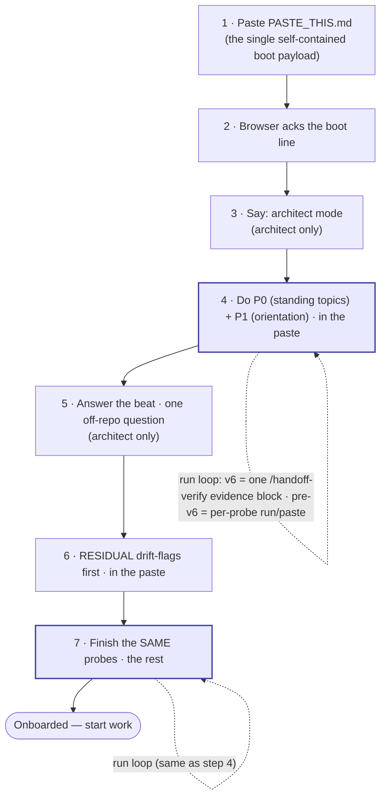

# Lane k — [#293] cross-repo consumer seeding — execution packet

T_start: this dispatch's first tool call (2026-08-16), operator confirmation via three
AskUserQuestion rounds in-session: (1) materialize the missing contract and proceed with
/lane-boot, (2) proceed with all 8 ADR-104 consumer repos including corp-monorepo, (3) the
ADR-60 remediation ruling below (architect: close all 7 PRs, preserve content, block the row).

## OWNED-FILES manifest, as executed

Hub side (per contract): `tasks/293-consumer-runbook-fan-out.md` (this update),
`docs/audits/2026-08-16-technical-k-293-cross-repo-seeding-lane-contract.md` (step 0),
`docs/audits/README.md` (regen), this packet, `BACKLOG.md` (regen via
`gen_task_tree.py --emit-source`). Consumer side: exactly `docs/handoffs/README.md` in each
of the 8 ADR-104 non-hub members, written only inside a per-repo worktree/branch created for
this act (RULING-W shape), never the live checkout — **subsequently reverted in full** (see
"Why 7 were reverted" below); no consumer repo carries any trace of this lane's work at close.

## Step 0 — COMMIT

Contract of record committed per I-D3 (docs(audits) commit, byte-identical diff verified
against `~/Downloads/CONTRACT-K-293-SEEDING.md`, materialized this session from
`PHASE2-MAX-PACK.md` §C's "LANE k (OPTIONAL — operator word)" block since Position 0 had
excluded lane k from the 12-lane split pending that word).

## Row read (row-is-the-spec)

`tasks/293-consumer-runbook-fan-out.md`: denominator is 8 (ADR-104 non-hub members, R6);
"Seeding stays OPERATOR-GATED, not executed" as of lane Q's prior STOP (`82d128f8`). This
lane's contract explicitly authorizes the cross-repo write lane Q's contract did not. **What
neither this lane's contract, the row's own text, nor lane Q's prior STOP packet surfaced:**
BACKLOG `[#303]` (open, kill-candidate of `#293`, verified-real by a later JOURNAL re-audit —
not a phantom citation) — see below.

## Mechanism used (RULING-W, quoted)

`protocols/ESSENTIALS.md` / `docs/decisions/ADR-41-cross-session-backlog-architecture.md`
2026-07-18 entry: *"The hub MAY and SHOULD write into a consumer repo for
methodology/cleanup work. The only sanctioned write shape is: consumer worktree/branch →
report — the hub creates a separate git worktree/branch inside the consumer, makes its
edits there, then reports. Hard bounds: never a direct push into a live consumer checkout;
re-witness the consumer live before any edit."* Executed per repo as: `git fetch origin` →
`git worktree add <repo>/.worktrees/seed-handoffs-runbook -b docs/seed-handoffs-runbook
origin/main` → `scripts/seed_runbook.py --target-root <that worktree>` → commit → push →
`gh pr create` (never merged) → `git worktree remove` (no leftovers). This shape was
followed correctly throughout — the defect found is in the **destination path**
(`docs/handoffs/`), not the write mechanism.

## Results — 7 of 8 seeded-then-REVERTED, 1 STOP-and-report (native)

| Repo | Seed status | PR (closed, not merged) | Final state |
|---|---|---|---|
| demo-prep | seeded, then reverted | ~~rdwornik/demo-prep#1~~ closed | branch deleted, remote clean |
| corp-monorepo | seeded, then reverted | ~~rdwornik/corp-monorepo#54~~ closed | branch deleted, remote clean |
| corp-ops | seeded, then reverted | ~~rdwornik/corp-ops#1~~ closed | branch deleted, remote clean |
| corp-sca-time-automation | seeded, then reverted | ~~rdwornik/corp-sca-time-automation#1~~ closed | branch deleted, remote clean |
| life-architect | seeded, then reverted | ~~rdwornik/life-architect#1~~ closed | branch deleted, remote clean |
| terminal-setup | seeded, then reverted | ~~rdwornik/terminal-setup#1~~ closed | branch deleted, remote clean |
| win-tooling | seeded, then reverted | ~~rdwornik/win-tooling#1~~ closed | branch deleted, remote clean |
| ai-council | STOP-and-report (native) | none opened | untouched throughout |

**No consumer repo carries any change from this lane at close.** Every PR was closed (never
merged — RULING-W's "consumer's own merge discipline governs integration" bound held even
before the revert), every pushed branch deleted, every local scratch branch deleted, every
scratch worktree removed.

## Why 7 were reverted — the ADR-60 conflict (found post-execution, self-reported)

While drafting this packet's hub-side update, `BACKLOG.md` line 132 surfaced `[#303]`
(open), which names the exact defect this lane just demonstrated:

> `[#303]` ... the leg-b seeder (`scripts/seed_runbook.py`, #164 leg b) unconditionally
> writes `<target>/docs/handoffs/README.md`, but **ADR-36 children (corp-monorepo, and the
> class the #293 fan-out will hit) carry NO local docs/handoffs/ by contract** — a literal
> seed creates the exact dir ADR-36 forbids ... kill-candidates: #293 (the deferred fan-out
> this de-risks)

Verified directly against the cited architecture, not taken on the row's paraphrase:

- **ADR-60** (docs/ folder taxonomy), verbatim: *"Child code repos (ai-council, corp-ops,
  corp-sca-time-automation, corp-monorepo, future repos) — taxonomy: ... do **not** carry
  `handoffs/`, `research/`, or `council-questions/`. Handoffs centralize in
  `.dev-knowledge`."*
- **`docs/audits/2026-07-08-census-amendment-docs-handoffs-ruling.md`** (architect-ratified,
  2026-07-08 — one day before `#293` was filed): *"Child repos do **NOT** create a local
  `docs/handoffs/`. Handoffs are centralized in `.dev-knowledge` — this is **intended
  divergence, not drift**. ... Any runbook / onboarding surface that names `docs/handoffs`
  as a child-repo target is **stale** and must read `docs/intake`-only."*
- **JOURNAL 2026-07-31** independently re-verified `[#303]`'s citations as real (not the
  `[#359]` phantom-citation class briefly suspected) — the row's substance stands.

`#293`'s own row text — "seed each consumer repo's `docs/handoffs/README.md`" — is exactly
the stale target the 2026-07-08 ruling warns against, and `seed_runbook.py`'s own design
(unconditional `<target>/docs/handoffs/README.md`) is exactly what `[#303]` flags as unfixed.
`[#303]` was filed as a **kill-candidate prerequisite** for `#293` and was never resolved
before this lane's contract authorized execution. Neither `PHASE2-MAX-PACK.md`'s LANE k
block, nor this lane's own pre-execution survey, cross-checked `#303` or ADR-60 before
dispatch — that is the gap, self-reported rather than discovered externally.

**ai-council's native STOP (`validate-docs-registry` refusing a new unregistered
`docs/handoffs/` directory) independently caught the identical defect** via its own local
governance, before the ADR-60 cross-check was made explicit here. Two independent
mechanisms — the fleet-level ADR-60 taxonomy and ai-council's own repo-local registry gate
— agree on the same answer.

## Remediation executed (architect ruling, this session)

Per explicit architect ruling: *"ADR-60 wins — a task row's stated path never overrides a
canonical governance rule."* Executed in full:

1. **Preserved** every seeded `docs/handoffs/README.md` body verbatim before touching
   anything — see Appendix below. The seeded content itself is not judged wrong (it is the
   hub's own canonical, generic operator runbook, unmodified by `seed_runbook.py` beyond the
   per-repo H1 swap) — only the **destination path** was wrong.
2. **Closed all 7 PRs** (`gh pr close`, never merged), each with a comment citing ADR-60,
   the 2026-07-08 census-amendment ruling, and `#303`, and pointing back at this packet for
   the preserved content.
3. **Deleted all 7 pushed branches** (`git push origin --delete docs/seed-handoffs-runbook`)
   and all 7 leftover local branches. Verified via `git worktree list` on a sample that no
   worktree or branch residue remains in any of the 7 repos.
4. **Row updated to BLOCKED-ON-RULING** (see `tasks/293-consumer-runbook-fan-out.md`) rather
   than recorded as progress — see Done-when below.

## Adjudication item for the architect (candidates only — not decided here)

Per the OWNED-FILES discipline ("zero invented paths... QUOTE the source for each home"),
this lane does not choose a corrected destination. Two candidates are already named in
existing governance, quoted rather than invented:

- **(a) `docs/intake/`** — ADR-60's own declared child-repo target: *"The child-repo `docs/`
  universal target is `docs/{decisions,audits,archive}` + `docs/intake/` ... not
  `docs/handoffs/`."* This would mean seeding intake **guidance** (pointing back at the hub's
  centralized runbook), not the runbook body itself — matching `[#303]`'s own Done-when
  option (a): *"seed intake guidance instead."*
- **(b) Skip entirely** — `[#303]`'s Done-when option (b): *"skip + emit a documented
  'hub-handoff-only, nothing to seed' status, so the deferred fan-out (ADR-41) cannot
  silently create forbidden dirs."* Under this reading, `#293`'s Done-when itself may need
  re-scoping (a per-repo runbook copy may not be the right unit of "onboarded" at all, if
  handoffs stay hub-only by design).

Both routes require `[#303]` to land first (it is `#293`'s own named prerequisite) — a code
change to `scripts/seed_runbook.py` (or a contract fix at the caller) plus a test, per
`[#303]`'s Done-when. Neither is executed here.

## Why ai-council STOPs (quoted, not assumed)

Its own pre-commit hook `validate-docs-registry` refused the commit:

> `validate_docs_registry: refused -- unregistered new docs/ directory (#68): 'docs/handoffs/'
> is a new directory under docs/ that is neither a sanctioned taxonomy folder nor a registered
> live corpus (registries live in docs/audits/README.md). To register a live corpus: add an
> essence markdown at the parent root AND a row to the 'Live corpora' table in
> docs/audits/README.md naming the path, what it is, the ruling that keeps it there, its
> essence markdown, and its exit condition.`

This fired for the same underlying reason the other 7 needed a manual revert: ai-council's
own registry independently refuses exactly what ADR-60 forbids at the fleet level. No further
action needed here — ai-council was never modified.

## Decision budget (V-2), reported

- Escalation used: three AskUserQuestion rounds before/during execution — (a) the contract
  file itself was missing (Position 0 had excluded lane k pending operator word) and needed
  to be materialized from `PHASE2-MAX-PACK.md` before it could be "read and executed"; (b)
  full 8-repo scope including corp-monorepo (ADR-104-flagged employer/pre-sales content)
  confirmed explicitly rather than assumed from the contract text alone; (c) the ADR-60
  conflict, found post-execution — remediation shape (close+preserve+block, vs leave-open,
  vs partial) was genuinely the operator's/architect's call, not a routine in-contract
  decision.
- ai-council's STOP was decided per contract default (the contract's own line names this
  exact outcome for governance-refused writes) — not batched as a question.
- Environmental findings, recorded not disposed: this worktree's branch
  (`worktree-lane-k-293-seeding` provisioned as `worktree-worktree-lane-k-293-seeding`) and
  all 11 sibling batch-6 lanes carry the same double `worktree-worktree-` prefix, failing the
  grammar gate Position 0 validated against the intended names. Also: `journal_spine_anchor`
  initially FAILed on this worktree's stale JOURNAL.md (branched before main's D-1v2 merge
  `43cd1cee` landed); resolved by a plain fast-forward sync to main (verified main's own
  JOURNAL.md already anchors it correctly first — lane tree-lag, not a real gap; no `SKIP=`
  used). Also: 12 concurrent batch-6 lane sessions running simultaneously on this machine
  made the hub's own `audit-health` pre-commit gate extremely slow (multiple 10-minute
  timeouts) — not wrong, just contended; retried to completion each time, never `SKIP=`,
  never `--no-verify`.

## Targeted checks

Hub side: `audit-index-freshness` and `audit-health` fired at the step-0 commit (heavy
concurrent load from all 12 batch-6 lanes running simultaneously made both gates slow, not
wrong — no `SKIP=`, no `--no-verify`, retried to completion). Consumer side: each repo's own
commit hooks fired natively on the (now-reverted) seed commits; 7 passed at commit time, 1
(ai-council) correctly refused per its own gate. Post-revert: `gh pr list --head
docs/seed-handoffs-runbook` returns empty on all 7; `git worktree list` clean on all 7
(spot-checked demo-prep, corp-monorepo, corp-ops).

## Done-when, clause by clause vs delivered

Row's Done-when: "each onboarded consumer carries the seeded runbook (per-repo tracked,
n≥1 recorded)."

- Delivered: **0/8**, unchanged from phase-1 integration. The 7/8 that were briefly seeded
  were fully reverted on the ADR-60 conflict — nothing landed in any consumer's tree. Row
  status is **BLOCKED-ON-RULING**, not advanced, pending `[#303]`'s resolution and an
  architect decision between the two candidates above (or a third the architect names).

## Deviations self-reported

- The ADR-60 conflict itself is the deviation: this lane executed a cross-repo write that a
  standing, ratified architecture decision forbids, because neither the contract nor this
  lane's own pre-execution survey checked `[#303]` or ADR-60 before dispatch. Caught and
  fully reverted within the same session, before any PR merged.
- Everything after discovery (preserve → close → delete → block-the-row → report) follows
  the architect's explicit remediation ruling verbatim; no further deviation.

STOPPED.

---

## Appendix — seeded content, preserved verbatim

All 7 repos received byte-identical bodies (confirmed via `diff`) — `seed_runbook.py`
generalizes the hub's own `docs/handoffs/README.md` and swaps only the H1's repo-name token.
Full content below once (`demo-prep`); the other 6 differ from it at **exactly one line** —
their own H1 — quoted individually rather than repeating 243 lines six more times.

### demo-prep (full body)

```markdown
<!-- scope: meta -->
<!-- CANONICAL OPERATOR RUNBOOK for HANDOFF_PROCESS v6 bundles (v5 bundles too — see the
     pre-v6 note under "The run loop").
     This is the ONE place the stable operator boilerplate lives — the file-roles, the
     walkthrough, the run loop, the diagram, the rationale. v5 bundles deliberately carry NO
     per-bundle README; each bundle's session-specific header (slug + purpose + mode) lives in
     its own HANDOFF_BOOT.md, which points back here for the process. A fresh operator who knows
     nothing about teeth/probes must be able to follow this top-to-bottom and boot a session.
     Per-repo: every repo gets this same runbook (it is generic across repos of the same handoff
     version). This file is the canonical SOURCE `scripts/seed_runbook.py` generalizes from;
     seed/update a repo's copy idempotently with `python scripts/seed_runbook.py --target-root
     <repo>` (#164 leg b — the hub-side seeder; the cross-repo consumer fan-out runs per-repo in
     the Wave-1/Wave-2 onboarding arcs, ADR-41, so the hub never writes a consumer's tree). -->

# Handoffs — operator runbook (`demo-prep`)

> **Read this top to bottom.** Together with a bundle's own `HANDOFF_BOOT.md` (which names *this*
> session's slug, purpose, and mode), it is everything you need to boot a fresh browser (Claude.ai)
> session for any v5 or v6 handoff. **Start at the bundle's `HANDOFF_BOOT.md`** — it sends you here for
> the process and tells you which file to paste first.

> **To *generate* a handoff** (which mode, what exactly to type): **PLAYBOOK §8 "How to hand
> off"** is the single invocation runbook. **This file is the other half** — how to *consume* a
> generated bundle (boot a fresh browser from it).

A v5/v6 handoff is a small folder under `docs/handoffs/{YYYY-MM-DD}-{slug}/` with **four** files —
`HANDOFF_BOOT.md`, `RESIDUAL.md`, `PROBES.md`, and `PASTE_THIS.md` (architect-mode bundles also carry a
`SUPPLEMENT.md` — always generated, fillable; see *The strategic supplement* below; current bundles also
carry a `PLAN.md` — the operator-ratified session plan, #301, CC-authored, never pasted) — plus this runbook
one level up. There is no per-bundle README; this is it.

## Who each file is for

**You paste exactly one file — `PASTE_THIS.md` — into the browser.** It is the assembled boot payload:
the resident browser role file (`protocols/HANDOFF_BOOT.md`), the residual, the probes, and (architect
mode) the supplement's **answers** when it carries any, concatenated in order by
`scripts/assemble_paste.py`. The other bundle files are
its **sources** and your **reference** — you do not paste them separately.

| File | For | Role |
|---|---|---|
| `PASTE_THIS.md` | **The browser** | **The one you paste.** Self-contained boot payload — role + residual + probes + supplement inline. One paste; the browser receives everything. Generated by `scripts/assemble_paste.py`; never hand-edited. |
| `docs/handoffs/README.md` (this) | **You** | The runbook. Generic, never pasted. |
| the bundle's `HANDOFF_BOOT.md` | **You** | The bundle's "start here": names slug · purpose · mode, points at this runbook + `PASTE_THIS.md`, and carries the resident **Operator-facing forms** card — dispatch · worktree entry · `/lane-integrate` · the teardown four-step (HANDOFF_PROCESS v6.2.0). Never pasted. |
| `RESIDUAL.md` | source | Assembled into `PASTE_THIS.md`. Your reference — do not paste separately. |
| `PROBES.md` | source | Assembled into `PASTE_THIS.md`. Your reference — do not paste separately. |
| `SUPPLEMENT.md` *(architect)* | **You (fill it)** | Always generated. Paste its QUESTIONS to the outgoing architect chat; paste the answers back. Its **ANSWERS** (only) fold into the next session's `PASTE_THIS`. See *The strategic supplement* below. |
| `PLAN.md` | **You / CC** | The operator-ratified session plan (#301) — CC-authored, carried in the bundle for the session's own use. Generic reference; **never pasted** into the browser. |

> ⚠️ **Same-name collision (read this once).** The bundle contains a file **named** `HANDOFF_BOOT.md`,
> and the repo contains the resident role file `protocols/HANDOFF_BOOT.md`. **You paste neither** — the
> role file is already inlined into `PASTE_THIS.md`. Paste **only `PASTE_THIS.md`**.

## What you do (in order)

Steps marked **[architect only]** are skipped in **execution** mode (the lean default). The bundle's
`HANDOFF_BOOT.md` tells you which mode this session is.

1. **Paste the boot payload.** Open a fresh Claude.ai chat and paste the full contents of
   **`PASTE_THIS.md`** (the one file — it inlines the role file, residual, probes, and supplement).
2. **Wait for the acknowledgment.** The browser replies with one boot line
   (`Booted as the Layer-1 browser under HANDOFF_PROCESS v6. Ready for CC's handoff.`). If it
   can't produce that line, your paste was incomplete — re-paste.
3. **Say "architect mode."** *[architect only]* Tell the browser this is an architect-mode session,
   so it plans and decomposes rather than just reacting. (It can also read this off `RESIDUAL.md`,
   but say it.)
4. **Do P0 + P1 (standing topics, then orientation).** `PASTE_THIS.md` already contains `PROBES.md`.
   **P0** (v6 bundles) reconciles the standing authorities — the active epic themes and the accepted
   intakes — and checks this bundle's own Purpose against them. **P1** is the **orientation** probe
   (the two lines that say what this project is and where the work sits). This uses **the run loop**
   (below).
5. **Answer the beat.** *[architect only]* The browser asks you **one** question about *off-repo*
   context — what you're trying to do this session, priorities, anything not written down in the
   repo, decisions that changed. Answer it, then continue. (This is the one thing the handoff itself
   can't carry, because it's built only from the repo.)
6. **Work the drift-flags.** Direct the browser to the **`RESIDUAL.md`** section (already in the
   paste). Its **drift-flags come first** — read those; they are where reality and the written record
   disagree.
7. **Finish the remaining probes.** Work the rest of the **same** `PROBES.md` section from step 4 —
   again via the run loop. When every probe passes, the browser is **onboarded** and you start work.
   **Any FAIL blocks onboarding** — do not start work around a failing probe.

> **Everything is in the single paste.** Because `PASTE_THIS.md` inlines every section, you do not
> hand files one at a time — you walk the browser through the sequence (orient → beat → residual →
> finish probes), directing it to each inlined section in turn. `PROBES.md` is **one** section worked
> in two parts: the **P0/P1** opening (standing topics, then orientation) first, then the remaining
> probes after the beat and residual — there is no second probes file. (Execution mode works the probes
> straight through — no separate orientation half.)

## The strategic supplement (architect mode) — capture this session's "why"

Architect bundles always include a `SUPPLEMENT.md`: a self-documenting, fillable file for the
**outgoing** architect's strategic *why* (intent, tensions weighed, options rejected) — the one thing a
repo-derived handoff structurally cannot carry. It is **advisory** and optional to fill. Three steps:

1. **Open** `docs/handoffs/<slug>/SUPPLEMENT.md` and copy its **QUESTIONS** into the **outgoing**
   architect chat (the chat that did this session's work — the only place this session's deliberation
   still lives).
2. **Paste the answers back** into the **ANSWERS** section at the bottom of the file (combine more than
   one chat if needed).
3. **Tell CC `supplement filled`** — CC commits the file on the handoff branch and folds the answers
   into the next session's `PASTE_THIS.md`.

**No outgoing chat (a cold / cleared handoff)?** Leave ANSWERS **empty** — that is the defined
disposition, not a missing deliverable. The empty file is still committed (a record that this session
carried no transmissible live "why"), nothing is folded, and the next session's architect picks up the
off-repo context live via its one operator-context question. Full mechanism:
`protocols/HANDOFF_PROCESS.md` §13 "Architect strategic supplement".

## The run loop (how steps 4 and 7 actually work)

The browser has **no access to the repo**, so it cannot read a file for any probe. Since **v6**
(the one-round-trip boot) that no longer costs you a round trip per probe: you ask CC to run
**`/handoff-verify`**, it runs the *whole* gate against live state in one pass, and it emits **one
evidence block**. You paste that block **once**, and the browser reads the table.

Each row carries its source locator, the check performed, PASS/FAIL, and the live evidence. **Any
FAIL blocks onboarding**; a missing required row is not a pass; degraded coverage (a tool absent, a
moved anchor) is reported rather than counted as a pass.

> **Verify resolves to the active bundle — you never need to know the suffix ([#473]).** A day with
> more than one handoff produces `<slug>`, `<slug>-2`, … siblings; that is normal. Name **any**
> member and the gate runs against the **active** one (newest by git-add date), printing one line —
> `resolved '<requested>' -> '<active>' (active-bundle rule)`. Pass **`--exact`** to verify exactly
> the bundle you named instead — deliberate archaeology on a superseded one, which then reports its
> supersession rather than staying silent about it.

**Why it's built this way:** the bundle deliberately ships **no answers** — only each probe's
question and the command that produces the answer. The only way to answer is to read **live**
repo/git state, so a stale summary can't bluff its way through. v6 changes the **transport count**,
never the proof threshold: the answers are still re-derived live at check-time, they are just
gathered once instead of ferried one at a time. (Full rationale below.)

> **Pre-v6 bundles.** A bundle generated before the v6 cut has no `Destination` row and no P0 legs,
> and its probes were built for the per-probe ferry. Run it the old way — the browser replies
> **`run <command>`** and you paste each result back. Bundles are immutable artifacts; they are
> judged by the era they were cut in, never retro-fitted.

## The sequence at a glance

<!-- Human-facing operator-onboarding diagram, intentionally retained. This runbook is a
     NON-canonical living doc; the ADR-51 amendment 2026-07-05 (Mermaid leaves canonical docs)
     re-scopes Mermaid to exactly this human-facing visualization surface — it does not remove it here. -->


The two shaded boxes (steps 4 and 7) are the **same `PROBES.md`**; the dashed self-loops are the
**run loop**. The beat (5) and residual (6) are sandwiched between the two halves of that file. In
execution mode, steps 3 and 5 drop and step 4 is a single straight-through pass.

---

## Why it works this way (rationale — read only if curious)

The whole bundle is built so the browser **cannot fake understanding from a summary**:

- **No answers ship.** Each probe carries only a question + the command that yields the answer
  (`HANDOFF_PROCESS.md` §5). The answers — the orienting lines, the check count, the HEAD sha,
  drifted ids — are kept out of the bundle on purpose, so the only path to an answer is reading live
  state. A summary can't bluff a forced live read; that is the point ("teeth").
- **Generated copy, kept honest by the teeth.** The file-less browser must *receive* the role file
  and context as text, so `PASTE_THIS.md` is an assembled copy of its sources — but a *machine-generated*
  one (`scripts/assemble_paste.py`, never hand-edited; regenerate each handoff), not a hand-copy that
  silently rots. A copy can still fall behind its sources, which is exactly why the **probes ship no
  answers**: orienting lines, counts, and shas are obtained by live reads at boot, so a stale paste
  cannot bluff them. The copy carries the *role + context*; the **live state** is always re-derived.
  This runbook itself still lives in **one** place, not copied into every bundle.
- **Orientation + beat (architect mode).** P1 forces the browser to surface what the project is
  and where this work sits (read live, never paraphrased); the beat is the one channel for
  *off-repo* context the repo-derived residual structurally can't carry — `HANDOFF_PROCESS.md`
  §13(c)/(d).

Full mechanics: `protocols/HANDOFF_PROCESS.md` §5 (teeth) and §13 (modes).

---

## Other bundle shapes (epic · developer · functional)

The walkthrough above is the **architect | execution** flow (§13). Three further mode flags
exist; each produces its own single paste and **skips this walkthrough entirely**:

- **Epic (`--mode epic`)** — the §14a epic-lane scope-contract: paste the bundle's
  `EPIC_BOOT.md` + `PROBES.md` into the fresh epic chat. No `PASTE_THIS.md` is assembled —
  the boot IS the paste (its own closing operator note says exactly this).
- **Developer (`--mode developer`)** — an **additive alias** of epic (ADR-98): same bundle,
  byte-identical. **The bundle header still renders `epic`** — expected, not a bug; the
  naming flip to `developer` is deferred to the alias-deprecation arc
  (`protocols/HANDOFF_PROCESS.md` §14).
- **Functional (`--mode functional`)** — the §16 intake-capture boot: ONE file,
  `FUNCTIONAL_BOOT.md`, pasted alone into a fresh functional-architect chat. No probes, no
  run loop, no beat — the chat captures requirements into an intake doc
  (`docs/intake/README.md`; ADR-98). Boot ack line: "Functional architect booted — intake
  capture only."

---

## Format eras & navigation

The bundle shape changed over time. Current bundles are **v6**; **v5** is the immediately prior
era (same four files — v6 reshapes the transport, not the bundle shape); older eras are archived,
not deleted.

- **v6 (canonical, 2026-07-31 → )** — the v5 four-file shape plus the `Destination` boot-header
  row and the P0 standing-topic legs; consumed via ONE `/handoff-verify` evidence block.
- **v5 (prior era, 2026-06-11 → 2026-07-31)** — `HANDOFF_BOOT.md` + `RESIDUAL.md` + `PROBES.md` + `PASTE_THIS.md`
  (no per-bundle README; this runbook serves them all). The operator pastes the single assembled
  `PASTE_THIS.md`. Spec: `protocols/HANDOFF_PROCESS.md` (§13 bundle shape).
- **v4 (2026-05-29 → 2026-06-10)** — eight-file teaching sequence (`01_ROLE`…`07_ASK_BACK` + a
  per-bundle README). **Still live for cross-repo handoffs** (corp-monorepo and any v4 repo) per
  ADR-83; the v4 templates under `templates/handoff/` are intentionally retained.
- **v3.2 (2026-05-09 → 2026-05-25, ADR-42)** — twelve-file flat folder. Historical.
- **Pre-v3.2 (legacy)** — single-file `.md` and folder-v2 formats under `archive/legacy/`.

Find the current session — **by git-add date, not by name** ([#473] / [#372]):

```powershell
git log --diff-filter=A --format="%ad %f" --date=short --name-only -- docs/handoffs/ |
  Select-String 'HANDOFF_BOOT|EPIC_BOOT|FUNCTIONAL_BOOT' | Select-Object -First 5
```

A name sort is **not** the rule and has twice picked the wrong bundle: `…-architect-arc5` sorts
after `…-architect` yet was added a day earlier ([#372]), and `<slug>` sorts before `<slug>-2`
while the suffixed sibling is the newer one ([#473]). You rarely need this command at all —
`/handoff-verify` resolves the active bundle for you.

### References
- `protocols/HANDOFF_PROCESS.md` — the operational spec (§5 teeth, §13 modes + bundle shape,
  §14 epic lanes + developer alias, §16 functional/intake)
- `protocols/HANDOFF_BOOT.md` — the resident browser role file (inlined into `PASTE_THIS.md`)
- `scripts/assemble_paste.py` — assembles `PASTE_THIS.md` from the bundle sources
- `docs/decisions/ADR-42-handoff-format-v3.md` — the historical v3.2 format spec
```

### corp-monorepo, corp-ops, corp-sca-time-automation, life-architect, terminal-setup, win-tooling

Byte-identical to the `demo-prep` body above except line 15 (the H1), respectively:

- corp-monorepo: `# Handoffs — operator runbook (`corp-monorepo`)`
- corp-ops: `# Handoffs — operator runbook (`corp-ops`)`
- corp-sca-time-automation: `# Handoffs — operator runbook (`corp-sca-time-automation`)`
- life-architect: `# Handoffs — operator runbook (`life-architect`)`
- terminal-setup: `# Handoffs — operator runbook (`terminal-setup`)`
- win-tooling: `# Handoffs — operator runbook (`win-tooling`)`
