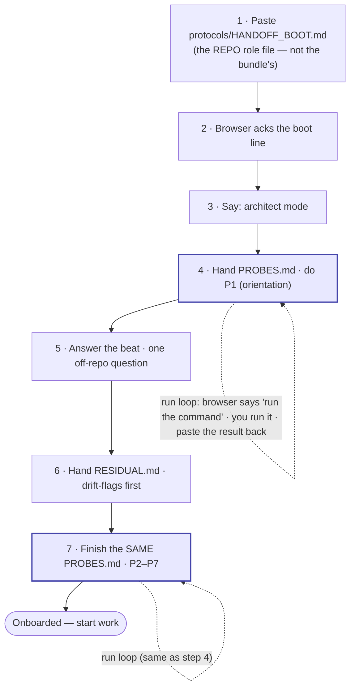

<!-- scope: meta -->
<!-- REGENERATED READABLE REFERENCE — not the committed bundle file.
     The committed bundle README at
       docs/handoffs/2026-06-12-dev-knowledge-session-2/README.md
     is IMMUTABLE (handoffs are immutable per CLAUDE.md §4) and is left exactly as-is.
     This sibling file renders the operator-first v5 README template
     (templates/handoff/v5/README.md.tmpl) filled for that same session, so the operator has a
     readable runbook to boot the cold session now. It supersedes nothing; it duplicates the
     bundle's intent in the operator-first shape. -->

# Handoff — 2026-06-12-dev-knowledge-session-2 — operator runbook

> **Read this top to bottom.** It is the only thing you need to boot a fresh browser (Claude.ai)
> session for this handoff. Mode: **architect** (a planning session that reshapes the way of
> working — so the browser plans and decomposes, it doesn't just react).
> What this session is for: **finishing the v5 handoff machinery deferred at the #149 flip** —
> and its new thread, the **v4-template-restoration arc** (un-doing the flip's premature archival
> of the still-live v4 cross-repo templates), which sharpens #164 into a repo-parameterized
> cross-repo generator.

## Who each file is for

You hand different files to different places. **Two are for you; two you paste to the browser:**

| File | For | When |
|---|---|---|
| `README.md` (this) | **You** | This runbook. Never pasted. |
| `HANDOFF_BOOT.md` | **You** | A short pointer telling you which file to paste first. Never pasted. |
| `RESIDUAL.md` | **The browser** | You hand it in at step 6. |
| `PROBES.md` | **The browser** | You hand it in **once** (step 4); it is worked in two parts. |

**The first thing you paste is a 5th file — and it lives in the repo, not in this bundle:**
**`protocols/HANDOFF_BOOT.md`**.

> ⚠️ **Same-name collision (read this once).** This bundle *also* contains a file **named**
> `HANDOFF_BOOT.md`, but that one only *points at* the repo file. **Paste the repo's
> `protocols/HANDOFF_BOOT.md` — not the bundle's `HANDOFF_BOOT.md`.**

## What you do (in order)

1. **Paste the role file.** Open a fresh Claude.ai chat and paste the full contents of
   **`protocols/HANDOFF_BOOT.md`** (the repo file — see the collision note above).
2. **Wait for the acknowledgment.** The browser replies with one boot line
   (`Booted as the Layer-1 browser under HANDOFF_PROCESS v5. Ready for CC's handoff.`). If it
   can't produce that line, your paste was incomplete — re-paste.
3. **Say "architect mode."** Tell the browser this is an architect-mode session, so it plans and
   decomposes rather than just reacting. (It can also read this off `RESIDUAL.md`, but say it.)
4. **Hand `PROBES.md` and do P1.** Give the browser `PROBES.md`. It starts with **P1**
   (orientation — it surfaces the two lines that say what `.dev-knowledge` is and where this work
   sits, Layer 2 of the three-layer model). This uses **the run loop** (below).
5. **Answer the beat.** The browser asks you **one** question about *off-repo* context — what
   you're trying to do this planning session, priorities, anything not written down in the repo,
   decisions that changed. Answer it, then continue. (This is the one thing the handoff itself
   can't carry, because it's built only from the repo.)
6. **Hand `RESIDUAL.md`.** Give the browser `RESIDUAL.md`. Its **drift-flags come first** — read
   those; they are where reality and the written record disagree (this session: a backlog-drift
   flag and a new `no_ff_merges` warning).
7. **Finish `PROBES.md` (P2–P7).** Work the rest of the **same** `PROBES.md` from step 4 — again
   via the run loop. When every probe passes, the browser is **onboarded** and you start work.

> **`PROBES.md` is one file, handed once.** You do **P1** at step 4; then the beat (step 5) and the
> residual (step 6) happen; then you come back to the **same file** for **P2–P7** at step 7. There
> is no second probes file.

## The run loop (how steps 4 and 7 actually work)

The browser has **no access to the repo**, so for each probe it can't read a file — it replies
**`run <command>`** (e.g. `run python scripts/audit.py checks`). You (or CC) run that command,
paste the result back, and the browser checks the answer against it.

**Why it's built this way:** the bundle deliberately ships **no answers** — only each probe's
question and the command that produces the answer. The only way to answer is to read **live**
repo/git state, so a stale summary can't bluff its way through. (Full rationale below.)

## The sequence at a glance

The two shaded boxes (steps 4 and 7) are the **same `PROBES.md`**; the dashed self-loops are the
**run loop**. The beat (5) and residual (6) are sandwiched between the two halves of that file.

---

## Why it works this way (rationale — read only if curious)

The whole bundle is built so the browser **cannot fake understanding from a summary**:

- **No answers ship.** Each probe carries only a question + the command that yields the answer
  (`HANDOFF_PROCESS.md` §5). The answers — the orienting lines, the check count, the HEAD sha,
  drifted ids, the `no_ff_merges` sha — are kept out of the bundle on purpose, so the only path to
  an answer is reading live state. A summary can't bluff a forced live read; that is the point
  ("teeth").
- **Pointers, not copies.** The bundle points at repo files (e.g. `protocols/HANDOFF_BOOT.md`)
  rather than copying them, because a hand-copy drifts from its source. That is exactly why the
  bundle's `HANDOFF_BOOT.md` only *points* — and why you paste the repo file, not the bundle one.
- **Orientation + beat (architect mode).** P1 forces the browser to surface what the project is
  and where this work sits (read live, never paraphrased); the beat is the one channel for
  *off-repo* context the repo-derived residual structurally can't carry — `HANDOFF_PROCESS.md`
  §13(c)/(d).

Full mechanics: `protocols/HANDOFF_PROCESS.md` §5 (teeth) and §13 (modes).

## Process / status note

v5 is canonical; this bundle was **hand-assembled** by CC following the v5 spec. The dedicated
v5-shape teeth validator (`scripts/verify_handoff_probes.py`, #163) and the v5 `/handoff`
generator (#164) are deferred — until they land, the **manual probe-gate** (`PROBES.md` +
`HANDOFF_PROCESS.md` §5) covers verification. The fact that CC hand-assembled this bundle is
itself a live argument for landing #164.
