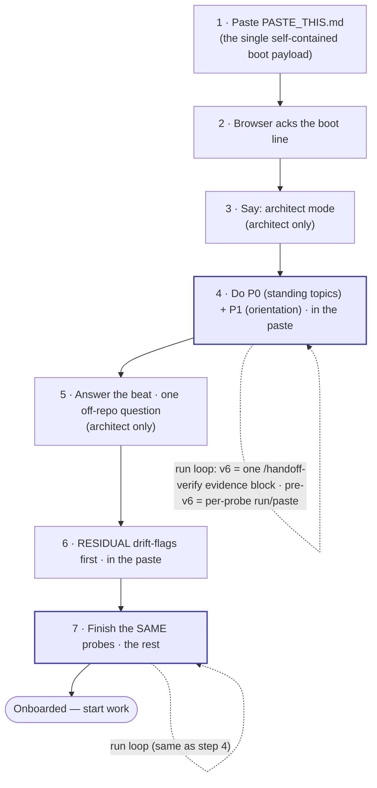

<!-- scope: meta -->
<!-- CANONICAL OPERATOR RUNBOOK for HANDOFF_PROCESS v6 bundles (v5 bundles too — see the
     pre-v6 note under "The run loop").
     This is the ONE place the stable operator boilerplate lives — the file-roles, the
     walkthrough, the run loop, the diagram, the rationale. v5 bundles deliberately carry NO
     per-bundle README; each bundle's session-specific header (slug + purpose + mode) lives in
     its own HANDOFF_BOOT.md, which points back here for the process. A fresh operator who knows
     nothing about teeth/probes must be able to follow this top-to-bottom and boot a session.
     Per-repo: every repo gets this same runbook (it is generic across repos of the same handoff
     version). This file is the canonical SOURCE `scripts/seed_runbook.py` generalizes from;
     seed/update a repo's copy idempotently with `python scripts/seed_runbook.py --target-root
     <repo>` (#164 leg b — the hub-side seeder; the cross-repo consumer fan-out runs per-repo in
     the Wave-1/Wave-2 onboarding arcs, ADR-41, so the hub never writes a consumer's tree). -->

# Handoffs — operator runbook (`.dev-knowledge`)

> **Read this top to bottom.** Together with a bundle's own `HANDOFF_BOOT.md` (which names *this*
> session's slug, purpose, and mode), it is everything you need to boot a fresh browser (Claude.ai)
> session for any v5 or v6 handoff. **Start at the bundle's `HANDOFF_BOOT.md`** — it sends you here for
> the process and tells you which file to paste first.

> **To *generate* a handoff** (which mode, what exactly to type): **PLAYBOOK §8 "How to hand
> off"** is the single invocation runbook. **This file is the other half** — how to *consume* a
> generated bundle (boot a fresh browser from it).

A v5/v6 handoff is a small folder under `docs/handoffs/{YYYY-MM-DD}-{slug}/` with **four** files —
`HANDOFF_BOOT.md`, `RESIDUAL.md`, `PROBES.md`, and `PASTE_THIS.md` (architect-mode bundles also carry a
`SUPPLEMENT.md` — always generated, fillable; see *The strategic supplement* below; current bundles also
carry a `PLAN.md` — the operator-ratified session plan, #301, CC-authored, never pasted) — plus this runbook
one level up. There is no per-bundle README; this is it.

## Who each file is for

**You paste exactly one file — `PASTE_THIS.md` — into the browser.** It is the assembled boot payload:
the resident browser role file (`protocols/HANDOFF_BOOT.md`), the residual, the probes, and (architect
mode) the supplement's **answers** when it carries any, concatenated in order by
`scripts/assemble_paste.py`. The other bundle files are
its **sources** and your **reference** — you do not paste them separately.

| File | For | Role |
|---|---|---|
| `PASTE_THIS.md` | **The browser** | **The one you paste.** Self-contained boot payload — role + residual + probes + supplement inline. One paste; the browser receives everything. Generated by `scripts/assemble_paste.py`; never hand-edited. |
| `docs/handoffs/README.md` (this) | **You** | The runbook. Generic, never pasted. |
| the bundle's `HANDOFF_BOOT.md` | **You** | The bundle's "start here": names slug · purpose · mode, and points at this runbook + `PASTE_THIS.md`. Never pasted. |
| `RESIDUAL.md` | source | Assembled into `PASTE_THIS.md`. Your reference — do not paste separately. |
| `PROBES.md` | source | Assembled into `PASTE_THIS.md`. Your reference — do not paste separately. |
| `SUPPLEMENT.md` *(architect)* | **You (fill it)** | Always generated. Paste its QUESTIONS to the outgoing architect chat; paste the answers back. Its **ANSWERS** (only) fold into the next session's `PASTE_THIS`. See *The strategic supplement* below. |
| `PLAN.md` | **You / CC** | The operator-ratified session plan (#301) — CC-authored, carried in the bundle for the session's own use. Generic reference; **never pasted** into the browser. |

> ⚠️ **Same-name collision (read this once).** The bundle contains a file **named** `HANDOFF_BOOT.md`,
> and the repo contains the resident role file `protocols/HANDOFF_BOOT.md`. **You paste neither** — the
> role file is already inlined into `PASTE_THIS.md`. Paste **only `PASTE_THIS.md`**.

## What you do (in order)

Steps marked **[architect only]** are skipped in **execution** mode (the lean default). The bundle's
`HANDOFF_BOOT.md` tells you which mode this session is.

1. **Paste the boot payload.** Open a fresh Claude.ai chat and paste the full contents of
   **`PASTE_THIS.md`** (the one file — it inlines the role file, residual, probes, and supplement).
2. **Wait for the acknowledgment.** The browser replies with one boot line
   (`Booted as the Layer-1 browser under HANDOFF_PROCESS v6. Ready for CC's handoff.`). If it
   can't produce that line, your paste was incomplete — re-paste.
3. **Say "architect mode."** *[architect only]* Tell the browser this is an architect-mode session,
   so it plans and decomposes rather than just reacting. (It can also read this off `RESIDUAL.md`,
   but say it.)
4. **Do P0 + P1 (standing topics, then orientation).** `PASTE_THIS.md` already contains `PROBES.md`.
   **P0** (v6 bundles) reconciles the standing authorities — the active epic themes and the accepted
   intakes — and checks this bundle's own Purpose against them. **P1** is the **orientation** probe
   (the two lines that say what this project is and where the work sits). This uses **the run loop**
   (below).
5. **Answer the beat.** *[architect only]* The browser asks you **one** question about *off-repo*
   context — what you're trying to do this session, priorities, anything not written down in the
   repo, decisions that changed. Answer it, then continue. (This is the one thing the handoff itself
   can't carry, because it's built only from the repo.)
6. **Work the drift-flags.** Direct the browser to the **`RESIDUAL.md`** section (already in the
   paste). Its **drift-flags come first** — read those; they are where reality and the written record
   disagree.
7. **Finish the remaining probes.** Work the rest of the **same** `PROBES.md` section from step 4 —
   again via the run loop. When every probe passes, the browser is **onboarded** and you start work.
   **Any FAIL blocks onboarding** — do not start work around a failing probe.

> **Everything is in the single paste.** Because `PASTE_THIS.md` inlines every section, you do not
> hand files one at a time — you walk the browser through the sequence (orient → beat → residual →
> finish probes), directing it to each inlined section in turn. `PROBES.md` is **one** section worked
> in two parts: the **P0/P1** opening (standing topics, then orientation) first, then the remaining
> probes after the beat and residual — there is no second probes file. (Execution mode works the probes
> straight through — no separate orientation half.)

## The strategic supplement (architect mode) — capture this session's "why"

Architect bundles always include a `SUPPLEMENT.md`: a self-documenting, fillable file for the
**outgoing** architect's strategic *why* (intent, tensions weighed, options rejected) — the one thing a
repo-derived handoff structurally cannot carry. It is **advisory** and optional to fill. Three steps:

1. **Open** `docs/handoffs/<slug>/SUPPLEMENT.md` and copy its **QUESTIONS** into the **outgoing**
   architect chat (the chat that did this session's work — the only place this session's deliberation
   still lives).
2. **Paste the answers back** into the **ANSWERS** section at the bottom of the file (combine more than
   one chat if needed).
3. **Tell CC `supplement filled`** — CC commits the file on the handoff branch and folds the answers
   into the next session's `PASTE_THIS.md`.

**No outgoing chat (a cold / cleared handoff)?** Leave ANSWERS **empty** — that is the defined
disposition, not a missing deliverable. The empty file is still committed (a record that this session
carried no transmissible live "why"), nothing is folded, and the next session's architect picks up the
off-repo context live via its one operator-context question. Full mechanism:
`protocols/HANDOFF_PROCESS.md` §13 "Architect strategic supplement".

## The run loop (how steps 4 and 7 actually work)

The browser has **no access to the repo**, so it cannot read a file for any probe. Since **v6**
(the one-round-trip boot) that no longer costs you a round trip per probe: you ask CC to run
**`/handoff-verify`**, it runs the *whole* gate against live state in one pass, and it emits **one
evidence block**. You paste that block **once**, and the browser reads the table.

Each row carries its source locator, the check performed, PASS/FAIL, and the live evidence. **Any
FAIL blocks onboarding**; a missing required row is not a pass; degraded coverage (a tool absent, a
moved anchor) is reported rather than counted as a pass.

> **Verify resolves to the active bundle — you never need to know the suffix ([#473]).** A day with
> more than one handoff produces `<slug>`, `<slug>-2`, … siblings; that is normal. Name **any**
> member and the gate runs against the **active** one (newest by git-add date), printing one line —
> `resolved '<requested>' -> '<active>' (active-bundle rule)`. Pass **`--exact`** to verify exactly
> the bundle you named instead — deliberate archaeology on a superseded one, which then reports its
> supersession rather than staying silent about it.

**Why it's built this way:** the bundle deliberately ships **no answers** — only each probe's
question and the command that produces the answer. The only way to answer is to read **live**
repo/git state, so a stale summary can't bluff its way through. v6 changes the **transport count**,
never the proof threshold: the answers are still re-derived live at check-time, they are just
gathered once instead of ferried one at a time. (Full rationale below.)

> **Pre-v6 bundles.** A bundle generated before the v6 cut has no `Destination` row and no P0 legs,
> and its probes were built for the per-probe ferry. Run it the old way — the browser replies
> **`run <command>`** and you paste each result back. Bundles are immutable artifacts; they are
> judged by the era they were cut in, never retro-fitted.

## The sequence at a glance

<!-- Human-facing operator-onboarding diagram, intentionally retained. This runbook is a
     NON-canonical living doc; the ADR-51 amendment 2026-07-05 (Mermaid leaves canonical docs)
     re-scopes Mermaid to exactly this human-facing visualization surface — it does not remove it here. -->


The two shaded boxes (steps 4 and 7) are the **same `PROBES.md`**; the dashed self-loops are the
**run loop**. The beat (5) and residual (6) are sandwiched between the two halves of that file. In
execution mode, steps 3 and 5 drop and step 4 is a single straight-through pass.

---

## Why it works this way (rationale — read only if curious)

The whole bundle is built so the browser **cannot fake understanding from a summary**:

- **No answers ship.** Each probe carries only a question + the command that yields the answer
  (`HANDOFF_PROCESS.md` §5). The answers — the orienting lines, the check count, the HEAD sha,
  drifted ids — are kept out of the bundle on purpose, so the only path to an answer is reading live
  state. A summary can't bluff a forced live read; that is the point ("teeth").
- **Generated copy, kept honest by the teeth.** The file-less browser must *receive* the role file
  and context as text, so `PASTE_THIS.md` is an assembled copy of its sources — but a *machine-generated*
  one (`scripts/assemble_paste.py`, never hand-edited; regenerate each handoff), not a hand-copy that
  silently rots. A copy can still fall behind its sources, which is exactly why the **probes ship no
  answers**: orienting lines, counts, and shas are obtained by live reads at boot, so a stale paste
  cannot bluff them. The copy carries the *role + context*; the **live state** is always re-derived.
  This runbook itself still lives in **one** place, not copied into every bundle.
- **Orientation + beat (architect mode).** P1 forces the browser to surface what the project is
  and where this work sits (read live, never paraphrased); the beat is the one channel for
  *off-repo* context the repo-derived residual structurally can't carry — `HANDOFF_PROCESS.md`
  §13(c)/(d).

Full mechanics: `protocols/HANDOFF_PROCESS.md` §5 (teeth) and §13 (modes).

---

## Other bundle shapes (epic · developer · functional)

The walkthrough above is the **architect | execution** flow (§13). Three further mode flags
exist; each produces its own single paste and **skips this walkthrough entirely**:

- **Epic (`--mode epic`)** — the §14a epic-lane scope-contract: paste the bundle's
  `EPIC_BOOT.md` + `PROBES.md` into the fresh epic chat. No `PASTE_THIS.md` is assembled —
  the boot IS the paste (its own closing operator note says exactly this).
- **Developer (`--mode developer`)** — an **additive alias** of epic (ADR-98): same bundle,
  byte-identical. **The bundle header still renders `epic`** — expected, not a bug; the
  naming flip to `developer` is deferred to the alias-deprecation arc
  (`protocols/HANDOFF_PROCESS.md` §14).
- **Functional (`--mode functional`)** — the §16 intake-capture boot: ONE file,
  `FUNCTIONAL_BOOT.md`, pasted alone into a fresh functional-architect chat. No probes, no
  run loop, no beat — the chat captures requirements into an intake doc
  (`docs/intake/README.md`; ADR-98). Boot ack line: "Functional architect booted — intake
  capture only."

---

## Format eras & navigation

The bundle shape changed over time. Current bundles are **v6**; **v5** is the immediately prior
era (same four files — v6 reshapes the transport, not the bundle shape); older eras are archived,
not deleted.

- **v6 (canonical, 2026-07-31 → )** — the v5 four-file shape plus the `Destination` boot-header
  row and the P0 standing-topic legs; consumed via ONE `/handoff-verify` evidence block.
- **v5 (prior era, 2026-06-11 → 2026-07-31)** — `HANDOFF_BOOT.md` + `RESIDUAL.md` + `PROBES.md` + `PASTE_THIS.md`
  (no per-bundle README; this runbook serves them all). The operator pastes the single assembled
  `PASTE_THIS.md`. Spec: `protocols/HANDOFF_PROCESS.md` (§13 bundle shape).
- **v4 (2026-05-29 → 2026-06-10)** — eight-file teaching sequence (`01_ROLE`…`07_ASK_BACK` + a
  per-bundle README). **Still live for cross-repo handoffs** (corp-monorepo and any v4 repo) per
  ADR-83; the v4 templates under `templates/handoff/` are intentionally retained.
- **v3.2 (2026-05-09 → 2026-05-25, ADR-42)** — twelve-file flat folder. Historical.
- **Pre-v3.2 (legacy)** — single-file `.md` and folder-v2 formats under `archive/legacy/`.

Find the current session — **by git-add date, not by name** ([#473] / [#372]):

```powershell
git log --diff-filter=A --format="%ad %f" --date=short --name-only -- docs/handoffs/ |
  Select-String 'HANDOFF_BOOT|EPIC_BOOT|FUNCTIONAL_BOOT' | Select-Object -First 5
```

A name sort is **not** the rule and has twice picked the wrong bundle: `…-architect-arc5` sorts
after `…-architect` yet was added a day earlier ([#372]), and `<slug>` sorts before `<slug>-2`
while the suffixed sibling is the newer one ([#473]). You rarely need this command at all —
`/handoff-verify` resolves the active bundle for you.

### References
- `protocols/HANDOFF_PROCESS.md` — the operational spec (§5 teeth, §13 modes + bundle shape,
  §14 epic lanes + developer alias, §16 functional/intake)
- `protocols/HANDOFF_BOOT.md` — the resident browser role file (inlined into `PASTE_THIS.md`)
- `scripts/assemble_paste.py` — assembles `PASTE_THIS.md` from the bundle sources
- `docs/decisions/ADR-42-handoff-format-v3.md` — the historical v3.2 format spec
