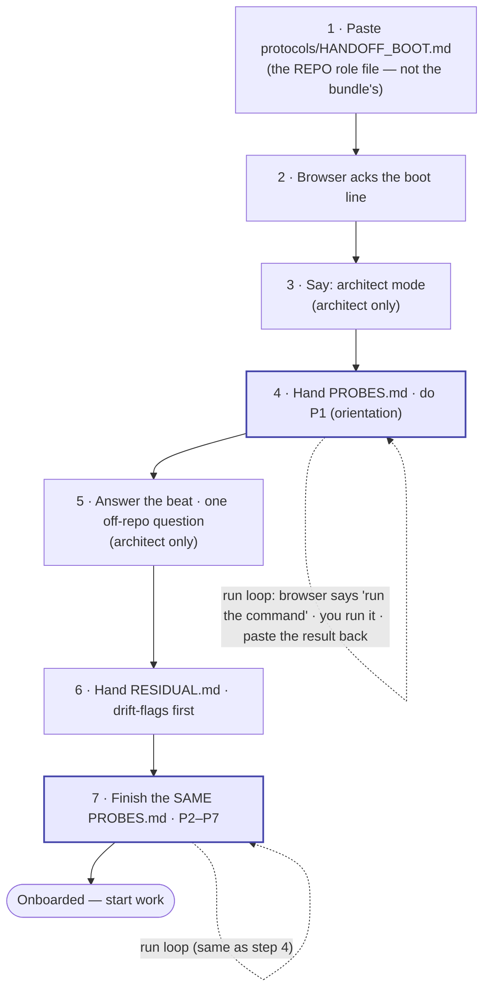

<!-- scope: meta -->
<!-- CANONICAL OPERATOR RUNBOOK for HANDOFF_PROCESS v5 bundles.
     This is the ONE place the stable operator boilerplate lives — the file-roles, the
     walkthrough, the run loop, the diagram, the rationale. v5 bundles deliberately carry NO
     per-bundle README; each bundle's session-specific header (slug + purpose + mode) lives in
     its own HANDOFF_BOOT.md, which points back here for the process. A fresh operator who knows
     nothing about teeth/probes must be able to follow this top-to-bottom and boot a session.
     Per-repo: every repo gets this same runbook (it is generic across repos of the same handoff
     version); #164 will seed/update each repo's copy idempotently from one source. -->

# Handoffs — operator runbook (`.dev-knowledge`)

> **Read this top to bottom.** Together with a bundle's own `HANDOFF_BOOT.md` (which names *this*
> session's slug, purpose, and mode), it is everything you need to boot a fresh browser (Claude.ai)
> session for any v5 handoff. **Start at the bundle's `HANDOFF_BOOT.md`** — it sends you here for
> the process and tells you which file to paste first.

A v5 handoff is a small folder under `docs/handoffs/{YYYY-MM-DD}-{slug}/` with **three** files —
`HANDOFF_BOOT.md`, `RESIDUAL.md`, `PROBES.md` — plus this runbook one level up. There is no
per-bundle README; this is it.

## Who each file is for

You hand different files to different places. **Two are for you; two go to the browser:**

| File | For | When |
|---|---|---|
| `docs/handoffs/README.md` (this) | **You** | The runbook. Generic, never pasted. |
| the bundle's `HANDOFF_BOOT.md` | **You** | The bundle's "start here": names slug · purpose · mode, and points at this runbook + the file to paste. Never pasted to the browser. |
| `RESIDUAL.md` | **The browser** | You hand it in at step 6. |
| `PROBES.md` | **The browser** | You hand it in **once** (step 4); it is worked in two parts. |

**The first thing you paste is a 5th file — and it lives in the repo, not in the bundle:**
**`protocols/HANDOFF_BOOT.md`** (the resident browser role file).

> ⚠️ **Same-name collision (read this once).** The bundle *also* contains a file **named**
> `HANDOFF_BOOT.md`, but that one is for **you** — it only *points at* the repo file. **Paste the
> repo's `protocols/HANDOFF_BOOT.md` — not the bundle's `HANDOFF_BOOT.md`.**

## What you do (in order)

Steps marked **[architect only]** are skipped in **execution** mode (the lean default). The bundle's
`HANDOFF_BOOT.md` tells you which mode this session is.

1. **Paste the role file.** Open a fresh Claude.ai chat and paste the full contents of
   **`protocols/HANDOFF_BOOT.md`** (the repo file — see the collision note above).
2. **Wait for the acknowledgment.** The browser replies with one boot line
   (`Booted as the Layer-1 browser under HANDOFF_PROCESS v5. Ready for CC's handoff.`). If it
   can't produce that line, your paste was incomplete — re-paste.
3. **Say "architect mode."** *[architect only]* Tell the browser this is an architect-mode session,
   so it plans and decomposes rather than just reacting. (It can also read this off `RESIDUAL.md`,
   but say it.)
4. **Hand `PROBES.md` and do P1.** Give the browser `PROBES.md`. It starts with **P1** —
   in architect mode that's the **orientation** probe (it surfaces the two lines that say what this
   project is and where the work sits). This uses **the run loop** (below).
5. **Answer the beat.** *[architect only]* The browser asks you **one** question about *off-repo*
   context — what you're trying to do this session, priorities, anything not written down in the
   repo, decisions that changed. Answer it, then continue. (This is the one thing the handoff itself
   can't carry, because it's built only from the repo.)
6. **Hand `RESIDUAL.md`.** Give the browser `RESIDUAL.md`. Its **drift-flags come first** — read
   those; they are where reality and the written record disagree.
7. **Finish `PROBES.md` (P2–P7).** Work the rest of the **same** `PROBES.md` from step 4 — again
   via the run loop. When every probe passes, the browser is **onboarded** and you start work.

> **`PROBES.md` is one file, handed once.** You do **P1** at step 4; then the beat (step 5) and the
> residual (step 6) happen; then you come back to the **same file** for **P2–P7** at step 7. There
> is no second probes file. (Execution mode hands `PROBES.md` once and works it straight through —
> no separate orientation half.)

## The run loop (how steps 4 and 7 actually work)

The browser has **no access to the repo**, so for each probe it can't read a file — it replies
**`run <command>`** (e.g. `run python scripts/audit.py checks`). You (or CC) run that command, paste
the result back, and the browser checks the answer against it.

**Why it's built this way:** the bundle deliberately ships **no answers** — only each probe's
question and the command that produces the answer. The only way to answer is to read **live**
repo/git state, so a stale summary can't bluff its way through. (Full rationale below.)

## The sequence at a glance



The two shaded boxes (steps 4 and 7) are the **same `PROBES.md`**; the dashed self-loops are the
**run loop**. The beat (5) and residual (6) are sandwiched between the two halves of that file. In
execution mode, steps 3 and 5 drop and step 4 is a single straight-through pass.

---

## Why it works this way (rationale — read only if curious)

The whole bundle is built so the browser **cannot fake understanding from a summary**:

- **No answers ship.** Each probe carries only a question + the command that yields the answer
  (`HANDOFF_PROCESS.md` §5). The answers — the orienting lines, the check count, the HEAD sha,
  drifted ids — are kept out of the bundle on purpose, so the only path to an answer is reading live
  state. A summary can't bluff a forced live read; that is the point ("teeth").
- **Pointers, not copies.** The bundle points at repo files (e.g. `protocols/HANDOFF_BOOT.md`)
  rather than copying them, because a hand-copy drifts from its source. That is exactly why the
  bundle's `HANDOFF_BOOT.md` only *points* — and why you paste the repo file, not the bundle one —
  and why this runbook lives in **one** place instead of being copied into every bundle.
- **Orientation + beat (architect mode).** P1 forces the browser to surface what the project is
  and where this work sits (read live, never paraphrased); the beat is the one channel for
  *off-repo* context the repo-derived residual structurally can't carry — `HANDOFF_PROCESS.md`
  §13(c)/(d).

Full mechanics: `protocols/HANDOFF_PROCESS.md` §5 (teeth) and §13 (modes).

---

## Format eras & navigation

The bundle shape changed over time. Current bundles are **v5**; older eras are archived, not
deleted.

- **v5 (canonical, 2026-06-11 → )** — `HANDOFF_BOOT.md` + `RESIDUAL.md` + `PROBES.md` (no per-bundle
  README; this runbook serves them all). Spec: `protocols/HANDOFF_PROCESS.md` (§13 bundle shape).
- **v4 (2026-05-29 → 2026-06-10)** — eight-file teaching sequence (`01_ROLE`…`07_ASK_BACK` + a
  per-bundle README). **Still live for cross-repo handoffs** (corp-monorepo and any v4 repo) per
  ADR-83; the v4 templates under `templates/handoff/` are intentionally retained.
- **v3.2 (2026-05-09 → 2026-05-25, ADR-42)** — twelve-file flat folder. Historical.
- **Pre-v3.2 (legacy)** — single-file `.md` and folder-v2 formats under `archive/legacy/`.

Find the current session:

```powershell
Get-ChildItem docs/handoffs/ | Sort-Object Name | Select-Object -Last 5
```

### References
- `protocols/HANDOFF_PROCESS.md` — the operational spec (§5 teeth, §13 modes + bundle shape)
- `protocols/HANDOFF_BOOT.md` — the resident browser role file (the one you paste)
- `docs/decisions/ADR-42-handoff-format-v3.md` — the historical v3.2 format spec
