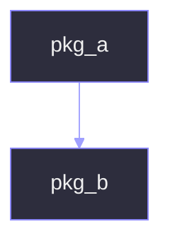

# Architecture

<!-- CODEMAP:START -->

```mermaid
%%{init: {'theme':'base', 'themeVariables': {'darkMode':true,'background':'#1a1a1a','primaryColor':'#2d2d3d','primaryTextColor':'#f0f0f0','primaryBorderColor':'#8a86ff','lineColor':'#a0a0ff','textColor':'#f0f0f0','mainBkg':'#2d2d3d','secondaryColor':'#3d2d3d','tertiaryColor':'#22323a','clusterBkg':'#222232','clusterBorder':'#555577','edgeLabelBackground':'#1a1a1a','titleColor':'#f0f0f0','nodeBorder':'#8a86ff'}}}%%
flowchart TD
    pkg_a[pkg_a]
    pkg_b[pkg_b]
    pkg_a --> pkg_b
    classDef foundation fill:#e8e8e8,stroke:#888,color:#222
    classDef core fill:#bde0fe,stroke:#1971c2,color:#000
    classDef orchestration fill:#a5d8ff,stroke:#1971c2,color:#000
    classDef interface fill:#74c0fc,stroke:#1864ab,color:#000
    classDef orphan fill:#fff5f5,stroke:#fa5252,stroke-dasharray:4 4,color:#222
    classDef cycle stroke:#e03131,stroke-width:2px
    click pkg_a href "src/pkg_a/" "Open pkg_a"
    click pkg_b href "src/pkg_b/" "Open pkg_b"
```
<!-- generated by codemap tool; do not edit by hand -->
<!-- CODEMAP:END -->
