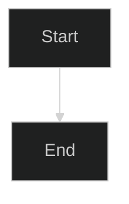
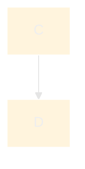

# Architecture — mermaid theme FAIL fixture

Block 1: bare 'dark' theme (violates rule 1):

```mermaid
%%{init: {'theme':'dark'}}%%
graph TD
    A[Start] --> B[End]
```

Block 2: correct directive but classDef fill without color (violates rule 2):

```mermaid
%%{init: {'theme':'base', 'themeVariables': {'darkMode':true,'background':'#1a1a1a'}}}%%
graph TD
    C --> D
    classDef badStyle fill:#bde0fe,stroke:#1971c2
```
