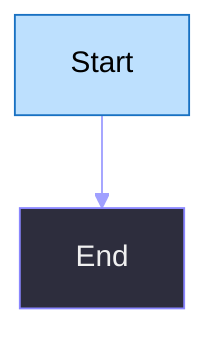
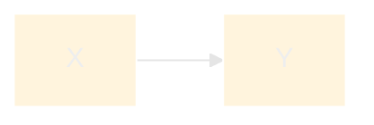

# Architecture — mermaid theme PASS fixture

```mermaid
%%{init: {'theme':'base', 'themeVariables': {'darkMode':true,'background':'#1a1a1a','primaryColor':'#2d2d3d','primaryTextColor':'#f0f0f0','primaryBorderColor':'#8a86ff','lineColor':'#a0a0ff','textColor':'#f0f0f0','mainBkg':'#2d2d3d'}}}%%
graph TD
    A[Start] --> B[End]
    classDef myStyle fill:#bde0fe,stroke:#1971c2,color:#000
    class A myStyle
```

A second block to verify multiple blocks all pass:

```mermaid
%%{init: {'theme':'base', 'themeVariables': {'darkMode':true,'background':'#1a1a1a'}}}%%
flowchart LR
    X --> Y
    classDef soft fill:#e8e8e8,stroke:#888,color:#222
```
